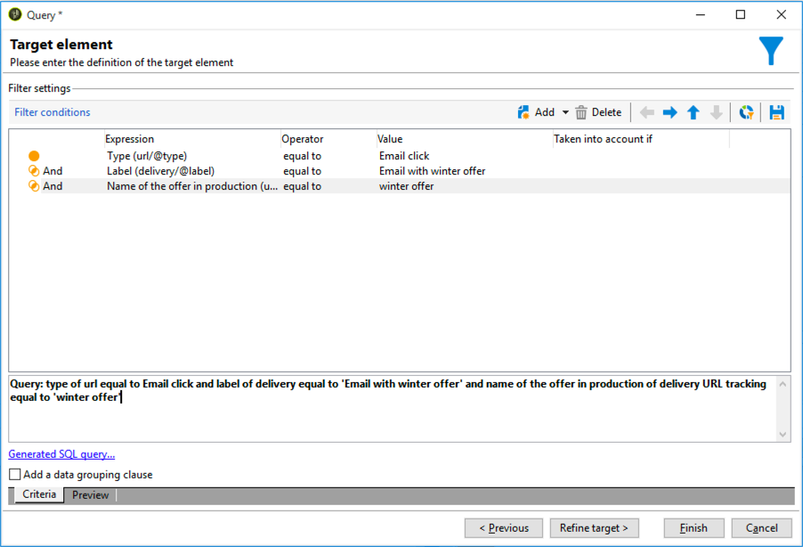

# 크로스 채널 전달 워크플로우{#cross-channel-delivery-workflow}

이 사용 사례는 크로스 채널 전달 워크플로우와 관련된 예를 보여줍니다. 크로스 채널 전달에 대한 일반적인 개념은 [이 섹션에](../../workflow/using/cross-channel-deliveries.md)설명되어 있습니다.

목표는 그룹에 이메일을 보내고 다른 그룹에 SMS 메시지를 보내기 위해 데이터베이스의 수신자의 대상을 다른 그룹으로 나누는 것입니다.

이 사용 사례에 대한 기본 구현 단계는 다음과 같습니다.

1. 대상을 타깃팅할 **[!UICONTROL Query]** 활동 만들기.
1. 오퍼에 대한 링크가 포함된 **[!UICONTROL Email delivery]** 활동 만들기.
1. 활동을 사용하여 **[!UICONTROL Split]** 다음을 수행할 수 있습니다.

   * 첫 번째 이메일을 열지 않은 수신자에게 다른 이메일을 보냅니다.
   * 이메일을 열었지만 오퍼에 대한 링크를 클릭하지 않은 수신자에게 SMS를 보냅니다.
   * 이메일을 열고 링크를 클릭한 받는 사람을 데이터베이스에 추가합니다.

## 1단계:대상 타깃팅 {#step-1--targeting-the-audience}

대상을 정의하려면 받는 사람을 식별하는 쿼리를 만듭니다.

1. 캠페인을 만듭니다. For more on this, refer to [this section](../../campaign/using/setting-up-marketing-campaigns.md#creating-a-campaign).
1. 캠페인의 **[!UICONTROL Targeting and workflows]** 탭에서 워크플로우에 **쿼리** 활동을 추가합니다. 이 활동 사용에 대한 자세한 내용은 [이 섹션을](../../workflow/using/query.md)참조하십시오.
1. 배달을 받을 수신자를 정의합니다. 예를 들어 &#39;Gold&#39; 멤버를 대상 차원으로 선택합니다.
1. 쿼리에 필터링 조건을 추가합니다. 이 예에서는 이메일 주소와 모바일 번호가 있는 수신자를 선택합니다.

   

1. 변경 내용을 저장합니다.

## 2단계:오퍼를 포함하는 이메일 만들기 {#step-2--creating-an-email-including-an-offer}

1. 활동을 만들고 워크플로우에서 두 번 클릭하여 편집합니다. **[!UICONTROL Email delivery]** 이메일 만들기에 대한 자세한 내용은 [이 섹션을](../../delivery/using/about-email-channel.md)참조하십시오.
1. 메시지를 디자인하고 오퍼가 포함된 링크를 컨텐츠에 삽입합니다.

   

   메시지 본문에 오퍼를 통합하는 방법에 대한 자세한 내용은 [이 섹션을](../../interaction/using/integrating-an-offer-via-the-wizard.md#delivering-with-a-call-to-the-offer-engine)참조하십시오.

1. 변경 내용을 저장합니다.
1. 활동을 마우스 오른쪽 단추로 클릭하여 **[!UICONTROL Email delivery]** 엽니다.
1. 모집단 및 추적 로그를 복구하려면 **[!UICONTROL Generate an outbound transition]** 옵션을 선택합니다.

   

   그러면 이 정보를 사용하여 첫 번째 이메일을 받을 때의 받는 사람의 행동에 따라 다른 배달을 보낼 수 있습니다.

1. 받는 사람이 이메일을 열 수 있도록 며칠 동안 활동을 **[!UICONTROL Wait]** 추가합니다.

   

## 3단계:결과 대상자 세그먼트화 {#step-3--segmenting-the-resulting-audience}

타겟이 식별되고 첫 번째 배달이 만들어지면 필터링 조건을 사용하여 타겟을 다른 모집단으로 분류해야 합니다.

1. 워크플로우에 **분할** 활동을 추가하고 엽니다. 이 활동 사용에 대한 자세한 내용은 [이 섹션을](../../workflow/using/split.md)참조하십시오.
1. 쿼리의 업스트림 계산 모집단에서 세 개의 세그먼트를 만듭니다.

   

1. 첫 번째 하위 세트에 대해 **[!UICONTROL Add a filtering condition on the inbound population]** 옵션을 선택하고 을 클릭합니다 **[!UICONTROL Edit]**.

   

1. 제한 **[!UICONTROL Recipients of a delivery]** 필터로 선택하고 을 클릭합니다 **[!UICONTROL Next]**.

   

1. 필터 설정의 **[!UICONTROL Recipients who have not opened or clicked (email)]** 드롭다운 **[!UICONTROL Behavior]** 목록에서 선택하고 배달 목록에서 보내려는 오퍼를 포함한 이메일을 선택합니다. 클릭 **[!UICONTROL Finish]**.

   

1. 두 번째 하위 세트에 대해 비슷하게 진행하고 **[!UICONTROL Recipients who have not clicked (email)]** **[!UICONTROL Behavior]** 드롭다운 목록에서 선택합니다.

   

1. 세 번째 하위 세트에 대해 를 선택하고 클릭한 후 **[!UICONTROL Add a filtering condition on the inbound population]** 옵션을 **[!UICONTROL Edit]**&#x200B;선택합니다 **[!UICONTROL Use a specific filtering dimension]** .
1. 드롭다운 **[!UICONTROL Recipient tracking log]** 목록에서 **[!UICONTROL Filtering dimension]** 선택하고 **[!UICONTROL Filtering conditions]** 에서 강조 표시한 **[!UICONTROL List of restriction filters]** 다음 를 **[!UICONTROL Next]**&#x200B;클릭합니다.

   

1. 다음과 같이 필터 조건을 선택합니다.

   

1. 을 **[!UICONTROL Finish]** 클릭하여 변경 내용을 저장합니다.

## 4단계:워크플로우 완료 {#step-4--finalizing-the-workflow}

1. 다음 세 개의 하위 세트 이후에 **[!UICONTROL Split]** 활동에 관련 활동을 워크플로우에 추가합니다.

   * 활동을 **[!UICONTROL Email delivery]** 추가하여 첫 번째 하위 세트에 미리 알림 이메일을 보냅니다.
   * 두 번째 하위 세트에 SMS 메시지를 보낼 **[!UICONTROL Mobile delivery]** 활동을 추가합니다.
   * 데이터베이스에 해당 받는 사람을 추가하는 **[!UICONTROL List update]** 활동을 추가합니다.

1. 워크플로우에서 배달 활동을 두 번 클릭하여 편집합니다. 이메일 및 SMS를 만드는 방법에 대한 자세한 내용은 이메일 [채널과](../../delivery/using/about-email-channel.md) SMS [채널을](../../delivery/using/sms-channel.md)참조하십시오.
1. 활동을 두 번 클릭하고 **[!UICONTROL List update]** **[!UICONTROL Generate an outbound transition]** 옵션을 선택합니다.

   그런 다음 결과 수신자를 Adobe Campaign에서 Adobe Experience Cloud로 내보낼 수 있습니다. 예를 들어 Adobe Target에서 **[!UICONTROL Update shared audience]** 활동을 워크플로우에 추가하여 대상을 사용할 수 있습니다. 자세한 내용은 대상 내보내기를 [참조하십시오](../../integrations/using/importing-and-exporting-audiences.md#exporting-an-audience).

1. 작업 **표시줄에서** 시작 단추를 클릭하여 워크플로우를 실행합니다.

쿼리 **활동이** 타깃팅한 모집단은 수신자의 행동에 따라 이메일 또는 SMS 제공을 받기 위해 세그먼트화됩니다. 나머지 모집단은 **[!UICONTROL List update]** 활동을 사용하여 데이터베이스에 추가됩니다.
