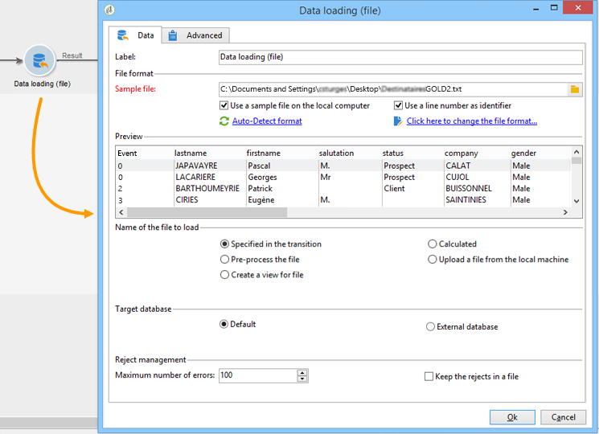

# 데이터 로드(파일){#data-loading-file}

## 사용 {#use}

이 **[!UICONTROL Load (File)]** 활동을 사용하면 외부 데이터 소스에 직접 액세스하여 Adobe Campaign에서 사용할 수 있습니다. 실제로 타깃팅 작업에 필요한 모든 데이터가 Adobe Campaign 데이터베이스에 항상 있는 것은 아닙니다.외부 파일에서 사용할 수 있습니다.

로드할 파일은 전환 또는 이 활동을 실행하는 동안 계산될 수 있습니다. 예를 들어 외부 데이터베이스에서 구매를 관리하는 클라이언트의 10개 즐겨찾기 제품 목록이 될 수 있습니다.

이 활동에 대한 구성 창의 위쪽 섹션에서 파일 형식을 정의할 수 있습니다. 이렇게 하려면 가져올 파일과 동일한 형식의 샘플 파일을 사용합니다. 이 파일은 로컬이나 서버에 저장할 수 있습니다.

>[!CAUTION]
>
>&quot;플랫&quot; 구조 파일만 지원됩니다(예: CSV, TXT 등). XML 포맷은 사용하지 않는 것이 좋습니다.

파일 가져오기 중에 실행될 사전 프로세스를 정의할 수 있습니다. 예를 들어, 서버에서 파일의 압축을 풀지 않아도 되고(따라서 압축을 푼 파일의 경우 공간 저장) 파일 처리에 압축을 해제해야 합니다. 옵션을 **[!UICONTROL Pre-process the file]** 선택하고 다음 세 가지 옵션 중 하나를 선택합니다. **[!UICONTROL None]**, **[!UICONTROL Decompression]** (zcat) 또는 **[!UICONTROL Decrypt]** (gpg).

## 파일 형식 정의 {#defining-the-file-format}

파일을 로드할 때 각 데이터 유형의 기본 매개 변수와 함께 열 형식이 자동으로 검색됩니다. 특히 오류나 빈 값이 있는 경우 데이터에 적용할 특정 프로세스를 지정하기 위해 이러한 기본 매개 변수를 수정할 수 있습니다.

이렇게 하려면 **[!UICONTROL Click here to change the file format...]** 활동의 기본 **[!UICONTROL Data loading (file)]** 창에서 선택합니다. 그러면 형식 세부 정보 창이 열립니다.

그런 다음 각 열에 대한 서식과 파일의 일반 서식을 수정할 수 있습니다.

일반 파일 형식을 사용하면 열을 인식할 수 있는 방법(파일 인코딩, 구분 기호 사용 등)을 정의할 수 있습니다.

열 서식을 사용하면 각 열의 값 처리를 정의할 수 있습니다.

* **[!UICONTROL Ignore column]**:은 데이터를 로드하는 동안 이 열을 처리하지 않습니다.
* **[!UICONTROL Data type]**:각 열에 필요한 데이터 유형을 지정합니다.
* **[!UICONTROL Allow NULLs]**:빈 값을 관리하는 방법을 지정합니다.

   * **[!UICONTROL Adobe Campaign default]**:숫자 필드에 대해서만 오류를 생성하고, 그렇지 않으면 NULL 값을 삽입합니다.
   * **[!UICONTROL Empty value allowed]**:빈 값을 허용합니다. 따라서 NULL 값이 삽입됩니다.
   * **[!UICONTROL Always populated]**:값이 비어 있으면 오류가 발생합니다.

* **[!UICONTROL Length]**: **문자열** 데이터 유형의 최대 문자 수를 지정합니다.
* **[!UICONTROL Format]**:시간 및 날짜 형식을 정의합니다.
* **[!UICONTROL Data transformation]**:character case 프로세스를 **문자열에**&#x200B;적용해야 하는지 여부를 정의합니다.

   * **[!UICONTROL None]**:가져온 문자열은 수정되지 않습니다.
   * **[!UICONTROL First letter in upper case]**:문자열의 각 단어의 첫 번째 문자는 대문자로 시작합니다.
   * **[!UICONTROL Upper case]**:문자열의 모든 문자는 대소문자를 구분합니다.
   * **[!UICONTROL Lower case]**:문자열의 모든 문자는 소문자로 표시됩니다.

* **[!UICONTROL White space management]**:문자열에서 특정 공백을 무시할지 여부를 지정합니다. 이 **[!UICONTROL Ignore spaces]** 값은 문자열 시작 및 끝 부분의 공백만 무시할 수 있습니다.
* **[!UICONTROL Error processings]**:오류가 발생하는 경우 동작을 정의합니다.

   * **[!UICONTROL Ignore the value]**:값이 무시됩니다. 워크플로우 실행 로그에 경고가 생성됩니다.
   * **[!UICONTROL Reject line]**:전체 줄이 처리되지 않습니다.
   * **[!UICONTROL Use a default value in case of error]**:오류가 발생하는 값을 **[!UICONTROL Default value]** 필드에 정의된 기본값으로 바꿉니다.
   * **[!UICONTROL Reject the line when there is no remapping value]**:잘못된 값에 대한 매핑이 정의되어 있지 않으면 전체 줄이 처리되지 않습니다(아래 **[!UICONTROL Mapping]** 옵션 참조).
   * **[!UICONTROL Use a default value in case the value is not remapped]**:잘못된 값에 대한 매핑이 정의되어 있지 않으면 오류가 발생하는 값을 **[!UICONTROL Default value]** 필드에 정의된 기본값으로 바꿉니다(아래 **[!UICONTROL Mapping]** 옵션 참조).

* **[!UICONTROL Default value]**:선택한 오류 처리에 따라 기본값을 지정합니다.
* **[!UICONTROL Mapping]**:이 필드는 열 세부 사항 구성에서만 사용할 수 있습니다(두 번 클릭하거나 열 목록 오른쪽의 옵션을 통해 액세스). 이러한 값은 가져올 때 변형됩니다. 예를 들어 &quot;3&quot;을 &quot;3&quot;으로 변환할 수 있습니다.

## 예:데이터 수집 및 데이터베이스에 로드 {#example--collecting-data-and-loading-it-in-the-database}

다음 예제에서는 매일 서버에서 파일을 수집하고, 해당 컨텐츠를 로드하고, 포함된 정보에 따라 데이터베이스의 데이터를 업데이트할 수 있습니다. 수집될 파일에는 구매하거나(3,000유로 이하) 환불을 요청하거나, 아무 것도 구매하지 않고 매장을 방문한 고객의 정보가 들어 있습니다. 이 정보에 따라 다양한 프로세스가 데이터베이스의 프로필에 적용됩니다.

1. 파일 수집기를 사용하면 지정된 빈도에 따라 디렉토리에 저장된 파일을 복구할 수 있습니다.

   이 **[!UICONTROL Directory]** 탭에는 복구할 파일에 대한 정보가 포함되어 있습니다. 이 예제에서는 이름에 &#39;customers&#39;라는 단어가 들어 있고 서버의 tmp/Adobe/Data/files 디렉토리에 저장된 모든 텍스트 형식의 파일이 복구됩니다.

   를 사용하는 **[!UICONTROL File collector]** 방법은 파일 [컬렉터](../../workflow/using/file-collector.md) 섹션에서 자세히 설명합니다.

   

   이 **[!UICONTROL Schedule]** 탭에서는 컬렉터 실행을 예약할 수 있습니다. 즉, 이러한 파일의 존재를 확인할 빈도를 지정할 수 있습니다.

   여기, 우리는 9시에 매일 집수리를 하고 싶습니다.

   

   이렇게 하려면 편집 도구의 오른쪽 아래에 있는 **[!UICONTROL Change...]** 단추를 클릭하고 일정을 구성합니다.

   자세한 내용은 스케줄러를 [참조하십시오](../../workflow/using/scheduler.md).

1. 그런 다음 데이터 로드(파일) 활동을 구성하여 수집된 파일을 읽어야 하는 방식을 지정합니다. 이렇게 하려면 로드할 파일과 동일한 구조로 샘플 파일을 선택합니다.

   

   이 파일에는 5개의 열이 포함되어 있습니다.

   * 첫 번째 열에는 이벤트와 일치하는 코드가 포함되어 있습니다.구매(3,000유로 이상), 하나 이상의 구매 시 구입 또는 환불이 필요 없음
   * 다음 네 개의 열에는 클라이언트의 이름, 성, 이메일 및 계정 번호가 포함됩니다.
   로드할 파일의 형식 구성은 Adobe Campaign에서 데이터를 가져오는 동안 정의된 형식 구성과 일치합니다. For more on this, refer to this [section](../../platform/using/importing-data.md#step-2---source-file-selection).

1. 분할 활동에서 이벤트 열 값에 따라 만들 하위 **세트를** 지정합니다.

   분할 활동은 섹션에 자세히 설명되어 있습니다.

   

   각 하위 세트에 대해 [이벤트] 열에 값 중 하나를 **지정합니다** .

   

   따라서 **[!UICONTROL Split]** 활동에는 다음 정보가 포함됩니다.

   

1. 그런 다음 각 유형의 모집단 유형에 대해 수행할 프로세스를 지정합니다. 이 예에서는 데이터베이스를 **[!UICONTROL Update the data]** 통해 이렇게 하려면 분할 활동에서 각 아웃바운드 전환 끝에 **[!UICONTROL Update data]** 활동을 배치합니다.

   이 **[!UICONTROL Update data]** 활동은 데이터 [업데이트](../../workflow/using/update-data.md) 섹션에 자세히 설명되어 있습니다.

