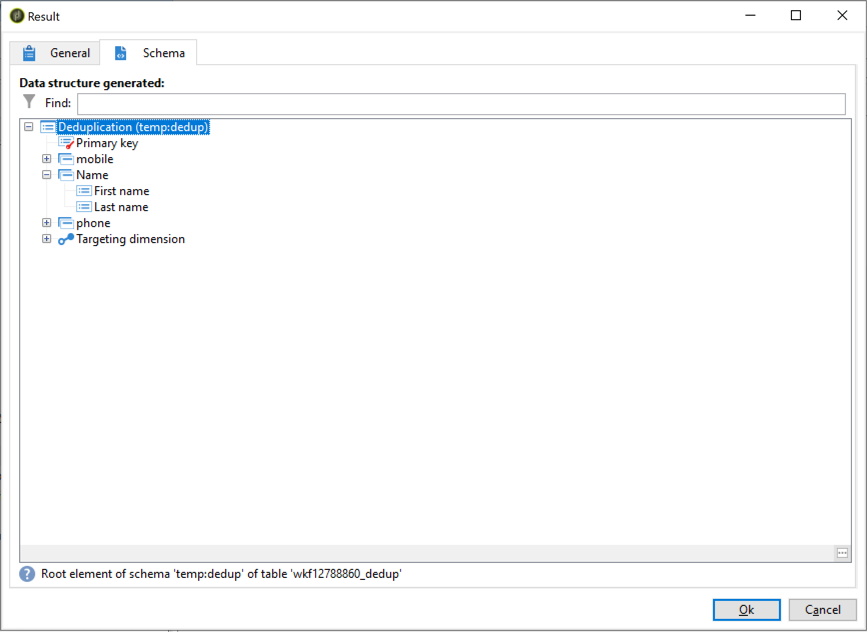

# 데이터 중복 제거 작업의 병합 기능 사용 {#deduplication-merge}

## 이 사용 사례 {#about-this-use-case} 정보

이 사용 사례는 **[!UICONTROL Deduplication]** 활동에서 **[!UICONTROL Merge]** 기능을 사용하는 방법을 설명합니다.

이 글꼴에 대한 자세한 내용은 [이 섹션](../../workflow/using/deduplication.md#merging-fields-into-single-record)을 참조하십시오.

**[!UICONTROL Deduplication]** 활동은 데이터 세트에서 중복 행을 제거하는 데 사용됩니다. 이 경우, 아래에 표시된 데이터는 이메일 필드를 기반으로 복제됩니다.

| 마지막 수정 날짜 | 이름 | 성 | 이메일 | 휴대폰 | 전화 |
|-----|------------|-----------|-------|--------------|------|
| 5/19/2020 | 로버트 | 티너 | bob@mycompany.com | 444-444-444 | 777-777-7777 |
| 7/22/2020 | 바비 | 티너 | bob@mycompany.com |  | 777-777-7777 |
| 10/03/2020 | Bob |  | bob@mycompany.com |  | 888-888-8888 |

데이터 중복 제거 작업의 **[!UICONTROL Merge]** 속성을 사용하여 데이터 중복 제거에 대한 규칙 세트를 구성하여 결과 데이터 기록 하나로 병합할 필드 그룹을 정의할 수 있습니다. 예를 들어 중복 레코드 집합을 사용하여 가장 오래된 전화 번호 또는 가장 최근 이름을 유지하도록 선택할 수 있습니다.

## 병합 기능 활성화 {#activating-merge}

병합 기능을 사용하려면 먼저 **[!UICONTROL Deduplication]** 활동을 구성해야 합니다. 이렇게 하려면 다음 단계를 수행합니다.

1. 활동을 연 다음 **[구성 편집]** 링크를 클릭합니다.

1. 데이터 중복 제거에 사용할 조정 필드를 선택한 다음 **[!UICONTROL Next]**&#x200B;을 클릭합니다. 이 예에서는 이메일 필드를 기반으로 중복 제거를 수행하려고 합니다.

   

1. **[!UICONTROL Advanced parameters]** 링크를 클릭한 다음 **[!UICONTROL Merge records]** 및 **[!UICONTROL Use several record merging criteria]** 옵션을 활성화합니다.

   

1. **[!UICONTROL Merge]** 탭이 **[!UICONTROL Deduplication]** 구성 화면에 추가됩니다. 데이터 중복 제거를 수행할 때 이 탭을 사용하여 병합할 데이터를 지정합니다.

## {#configuring-rules}을(를) 병합하도록 필드 구성

데이터를 단일 레코드로 병합하는 데 사용할 규칙은 다음과 같습니다.

* 최신 이름(이름 및 성 필드)을 유지합니다.
* 최신 휴대 전화
* 가장 오래된 전화 번호를 보관하세요
* 최종 레코드에 적격하려면 그룹의 모든 필드가 null이 아니어야 합니다.

이러한 규칙을 구성하려면 다음 단계를 수행하십시오.

1. **[!UICONTROL Merge]** 탭을 연 다음 **[!UICONTROL Add]** 단추를 클릭합니다.

   

1. 병합할 필드 그룹의 식별자 및 레이블을 지정합니다.

   

1. 고려할 레코드를 선택하는 조건을 표시합니다.

   

1. 최근 이름을 선택하려면 마지막 수정 날짜를 기준으로 정렬합니다.

   

1. 병합할 필드를 선택합니다. 이 예에서는 이름과 성 필드를 유지하려고 합니다.

   

1. 필드는 병합할 데이터 집합에 추가되고 새 요소가 워크플로 스키마에 추가됩니다.

   휴대폰 및 전화 필드를 구성하려면 다음 단계를 반복합니다.

   

   

## 결과 {#results}

이러한 규칙을 구성한 후 다음 데이터가 **[!UICONTROL Deduplication]** 활동의 끝에 수신됩니다.

| 수정 날짜 | 이름 | 성 | 이메일 | 휴대폰 | 전화 |
-----|------------|-----------|-------|--------------|------|
| 5/19/2020 | 로버트 | 티너 | bob@mycompany.com | 444-444-444 | 777-777-7777 |
| 7/22/2020 | 바비 | 티너 | bob@mycompany.com |  | 777-777-7777 |
| 10/03/2020 | Bob |  | bob@mycompany.com |  | 888-888-8888 |

결과는 앞서 구성된 규칙에 따라 3개의 레코드로부터 병합됩니다. 비교를 통해 가장 최근의 이름과 휴대 전화가 원래 전화 번호와 함께 사용되었다고 결론을 내렸습니다.

| 이름 | 성 | 이메일 | 휴대폰 | 전화 |
|------------|-----------|-------|--------------|------|
| 바비 | 티너 | bob@mycompany.com | 444-444-4444 | 888-888-8888 |

>[!NOTE]
>
> 병합된 이름은 &quot;Bobby&quot;이며, 이름과 마지막 필드 모두로 구성된 &quot;이름&quot; 규칙을 구성했기 때문입니다.
>
>그 결과, 연결된 성 필드가 비어 있기 때문에 &quot;Bob&quot;(가장 최근 이름)을 고려할 수 없었습니다. 성과 이름의 가장 최근 조합이 최종 기록에 병합되었다.
