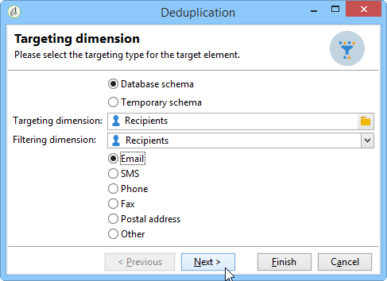

# 중복 제거{#deduplication}

중복 제거는 인바운드 활동 결과로부터 중복 항목을 삭제합니다. 데이터 중복 제거는 이메일 주소, 전화 번호 또는 다른 필드에서 수행할 수 있습니다.

## 모범 사례 {#best-practices}

중복 제거 중에는 인바운드 흐름이 별도로 처리됩니다. 쿼리 1의 결과뿐만 아니라 쿼리 2의 결과에서도 인스턴스 수신자 A가 발견되면 중복 제거되지 않습니다.

이 문제는 다음과 같이 해결되어야 합니다.

* 각 인바운드 **흐름을** 통합하기 위한 조합 활동을 만듭니다.
* Union **활동** 후 데이터 중복 제거 활동을 **만듭니다** .

## 구성 {#configuration}

데이터 중복 제거를 구성하려면 레이블, 방법, 데이터 중복 제거 기준 및 결과에 대한 옵션을 입력합니다.

링크를 클릭하여 중복 제거 모드를 정의합니다. **[!UICONTROL Edit configuration...]**

1. 대상 선택

   이 활동에 대한 타겟 유형(기본적으로 중복 제거와 관련된 수신자)과 사용할 기준(예: 동일한 값을 사용하여 중복 항목을 식별할 수 있는 필드)을 선택합니다.이메일 주소, 모바일 또는 전화 번호, 팩스 번호 또는 DM 주소.

   

   다음 단계에서 사용할 기준 또는 기준을 선택할 수 **[!UICONTROL Other]** 있습니다.

   

1. 중복 제거 방법

   드롭다운 목록에서 사용할 데이터 중복 제거 방법을 선택하고 보관할 복제본 수를 입력합니다.

   

   다음 방법을 사용할 수 있습니다.

   * **[!UICONTROL Choose for me]**:임의로 복제되지 않도록 보관할 레코드를 선택합니다.
   * **[!UICONTROL Following a list of values]**:하나 이상의 필드에 대한 값 우선 순위를 정의할 수 있습니다. 값을 정의하려면 필드를 선택하거나 표현식을 만든 다음 해당 표에 값을 추가합니다. 새 필드를 정의하려면 값 목록 위에 있는 **[!UICONTROL Add]** 단추를 클릭합니다.

      

   * **[!UICONTROL Non-empty value]**:이렇게 하면 선택한 표현식의 값이 우선 순위로 비어 있지 않은 레코드를 유지할 수 있습니다.

      

   * **[!UICONTROL Using an expression]**:지정된 표현식의 최저(또는 최고) 값으로 레코드를 유지할 수 있습니다.

      
   선택한 중복 제거 방법을 승인하려면 **[!UICONTROL Finish]** 을 클릭합니다.

   창의 가운데 섹션에서는 정의된 구성을 요약합니다.

   활동 편집기 창의 하단 섹션에서 그래픽 개체의 아웃바운드 전환에 대한 레이블을 수정하고 활동의 결과와 연결될 세그먼트 코드를 입력할 수 있습니다. 나중에 이 코드를 타깃팅 기준으로 사용할 수 있습니다.

   

   나머지 인구를 이용하려면 **[!UICONTROL Generate complement]** 옵션을 선택합니다. 그 보수는 모든 복제물로 구성되어 있다. 그러면 다음과 같이 활동에 추가 전환이 추가됩니다.

   

## 예:배달 전에 중복 항목 식별 {#example--identify-the-duplicates-before-a-delivery}

다음 예에서는 데이터 중복 제거가 세 개의 쿼리 결합에 대해 우려를 나타내고 있습니다.

워크플로우의 목표는 동일한 수신자에게 여러 번 보내지 않도록 중복 항목을 제외하여 배달 대상을 정의하는 것입니다.

또한 식별된 중복 항목은 필요한 경우 다시 사용할 수 있는 전용 복제 목록에 통합됩니다.

1. 워크플로우에 필요한 다양한 활동을 위에 표시된 대로 추가하고 연결합니다.

   조합 활동은 여기에서 세 개의 쿼리를 하나의 전환으로 &quot;통합&quot;하는 데 사용됩니다. 따라서 중복 제거는 각 쿼리에 개별적으로 작동하지 않고 전체 쿼리에 대해 작동합니다. 이 주제에 대한 자세한 내용은 우수 사례를 [참조하십시오](#best-practices).

1. 데이터 중복 제거 작업을 연 다음 **[!UICONTROL Edit configuration...]** 링크를 클릭하여 데이터 중복 제거 모드를 정의합니다.
1. 새 창에서 을 **[!UICONTROL Database schema]**&#x200B;선택합니다.
1. 타깃팅 **및** 필터링 차원으로 수신자를 선택합니다.
1. 각 이메일 주소로 한 번만 배달하려면 **[!UICONTROL Email]** 복사의 ID 필드를 선택한 다음 을 **[!UICONTROL Next]**&#x200B;클릭합니다.

   특정 필드에 중복 ID를 만들려면 사용 가능한 필드 목록에 **[!UICONTROL Other]** 액세스하려면 을 선택합니다.

1. 여러 수신자에 대해 동일한 이메일 주소가 식별될 때 하나의 항목만 유지하도록 선택합니다.
1. 중복 **[!UICONTROL Choose for me]** 중복 제거 모드를 선택하여 중복 식별이 가능한 경우에 저장된 레코드를 임의로 선택한 다음 을 **[!UICONTROL Finish]**&#x200B;클릭합니다.

워크플로를 실행할 때 중복으로 식별된 모든 수신자는 결과에서 제외되어(따라서 배달)가 중복 목록에 추가됩니다. 중복 항목을 다시 식별하지 않고 이 목록을 다시 사용할 수 있습니다.

## 입력 매개 변수 {#input-parameters}

* tableName
* 스키마

각 인바운드 이벤트는 이러한 매개 변수에 의해 정의된 대상을 지정해야 합니다.

## 출력 매개 변수 {#output-parameters}

* tableName
* 스키마
* recCount

이 세 값 집합은 중복 제거로 인해 발생한 대상을 식별합니다. **[!UICONTROL tableName]** 는 타겟 식별자를 저장하는 테이블의 이름이며, **[!UICONTROL schema]** 모집단(일반적으로 nms:recipient)의 스키마이며, **[!UICONTROL recCount]** 표의 요소 수입니다.

보수와 연결된 전환에는 동일한 매개 변수가 있습니다.
