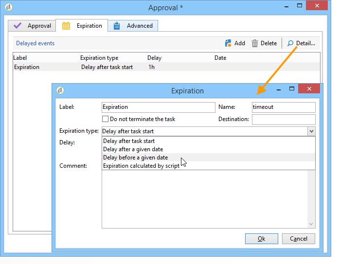

# 승인 정의 {#defining-approvals}

승인 기능을 사용하면 연산자는 워크플로우를 제어하는 의사 결정을 내릴 수 있고 실행을 확인할 수 있습니다.

메시지는 연산자 그룹에 전송되며 워크플로우는 다시 시작하기 전에 응답을 기다립니다. 워크플로가 중지되지 않고 다른 작업이 발생할 수 있습니다. 예를 들어 여러 개의 동시 승인이 보류 중일 수 있습니다.

승인에는 연산자가 선택할 수 있는 여러 옵션이 포함될 수 있습니다. 하지만 타깃팅 수행과 같이 수행자에게 수행할 작업을 제출하려면 선택 항목 수를 1개로 제한할 수 있습니다. 그런 다음 작업이 수행되면 연산자가 응답할 수 있습니다(그런 다음 프로세스가 다시 시작). 다음 예에서는 이러한 유형의 승인을 보여 줍니다.


작전 단계마다 승인이 필요한 모든 단계는 동일한 원칙에 근거한다.


승인 예는 이 [섹션에서 찾을 수 있습니다](../../campaign/using/marketing-campaign-approval.md#checking-and-approving-deliveries).

연산자는 다음 두 가지 방법 중 하나로 응답할 수 있습니다. 이메일 메시지 또는 콘솔을 통해 연결된 웹 페이지를 사용하는 것이 좋습니다.

>[!NOTE]
>
>응답을 저장하면 수정되지 않을 수 있습니다.

## 이메일 전송 {#sending-emails}

응답할 수 있는 웹 페이지에 대한 링크가 포함된 승인 메시지를 받을 수 있습니다. 타깃팅된 운영자가 승인 이메일을 수신하려면 운영자 이메일 주소가 완료되어야 합니다. 이 경우 연산자는 콘솔을 사용하여 응답해야 합니다

연산자 관리는 이 [섹션에 자세히 설명되어 있습니다](../../platform/using/access-management.md).

승인 이메일은 지속적으로 전송됩니다. 기본 배달 템플릿은 다음과 **[!UICONTROL notifyAssignee]**&#x200B;같습니다. 폴더에 **[!UICONTROL Administration > Campaign management > Technical delivery templates]** 저장됩니다. 이 시나리오를 사용자 지정할 수 있으며 각 활동에 대한 템플릿을 복사하고 변경하는 것이 좋습니다.

이 템플릿을 통해 생성된 배달은 **[!UICONTROL Administration > Production > Objects created automatically > Technical deliveries > Workflow notifications]** 폴더에 저장됩니다.

## 콘솔을 통한 승인 {#approval-via-the-console}

작업에서 승인할 요소는 캠페인 대시보드에 표시됩니다.

기술 워크플로우의 경우 사용자가 승인할 수 있는 작업은 **[!UICONTROL Administration > Production > Objects created automatically > Pending approvals]** 폴더의 트리 구조에서 액세스할 수 있습니다.


## 그룹 {#groups}

필터링 조건을 통해 선택한 연산자 그룹, 단일 연산자 또는 연산자 세트에 승인이 할당됩니다.

1. 가장 간단한 승인 양식을 위해 연산자가 응답하는 즉시 작업이 완료됩니다. 응답하려는 다른 연산자는 누군가가 이미 응답했다는 알림을 받게 됩니다.
1. 여러 승인은 복수 승인을 [참조하십시오](#multiple-approval).

승인을 위한 연산자 그룹은 지정된 개인이 아닌 역할 또는 기능으로 지정되어야 합니다. 예를 들어 &quot;Harry&#39;s group&quot;보다 &quot;캠페인 예산&quot; 그룹이 더 선호됩니다. 한 그룹에 작업을 승인할 수 있는 사람이 두 명 이상 있는 것이 좋습니다. 이렇게 하면 한 사람이 없으면 다른 사람이 응답할 수 있습니다.

## 만료 {#expirations}

만료는 다양한 활동 유형 및 특히 승인에서 사용되는 특정 전환입니다. 만료는 응답이 없는 경우 지정된 시간 후 작업을 트리거하거나 워크플로우를 계속 진행할 수 있습니다(예: 다른 그룹에 승인 할당).

활동 승인 속성의 두 번째 탭에서는 하나 이상의 만료를 정의할 수 있습니다. 여러 만료 유형을 정의할 수 있습니다.



새 만료일을 추가하려면 을 클릭합니다 **[!UICONTROL Add]**. 생성된 각 만료에 전환이 추가됩니다. 다음을 수행할 수 있습니다.

* 목록에서 셀을 클릭하거나 F2를 눌러 일반적인 매개변수를 직접 수정합니다.
* 또는 단추를 클릭하여 표현식을 **[!UICONTROL Detail...]** 편집합니다.

>[!NOTE]
>
>연대순으로 처리되므로 만료에 대한 순서를 지정할 필요가 없습니다.

이 옵션은 지연 **[!UICONTROL Do not terminate the task]** 이 초과될 때 승인을 활성 상태로 유지합니다. 이 모드에서는 승인을 활성화한 상태에서 미리 알림을 관리할 수 있습니다. 연산자는 여전히 응답할 수 있습니다. 이 옵션은 기본적으로 비활성화되어 있으므로 작업이 만료 시 완료되는 것으로 간주되며 연산자가 더 이상 응답하지 않을 수 있습니다.

다음 네 가지 유형의 만료를 만들 수 있습니다.

* **작업 시작 후 지연**: 만료는 승인이 활성화된 날짜에 지정된 기간을 추가하여 계산됩니다.
* **지정된 날짜 이후 지연**: 만료는 지정한 날짜에 기간을 추가하여 계산됩니다.
* **지정된 날짜보다 지연**: 만료는 지정한 날짜에서 기간을 뺀 값으로 계산됩니다.
* **스크립트로 계산된 만료**: 만료는 JavaScript를 사용하여 계산됩니다.

   다음 예에서는 배달을 시작한 날짜( **vars.deliveryId로 식별)보다 24시간 전에 만료를 계산합니다**.

   ```
   var delivery = nms.delivery.get(vars.deliveryId)
   var expiration = delivery.scheduling.contactDate
   var oneDay = 1000*60*60*24
   expiration.setTime(expiration.getTime() - oneDay)
   return expiration
   ```

## 다중 승인 {#multiple-approval}

다중 승인은 모든 승인 연산자가 응답할 수 있는 메커니즘입니다. 각 응답에 대해 전환이 활성화됩니다.

투표 또는 설문 조사 메커니즘에 대해 복수 승인이 유용합니다. 지정된 기간 후에 최종 기한을 추가하여 답변을 계산하고 결과를 처리할 수 있습니다.

## 필수 권한 {#required-rights}

승인 요청에 응답하려면 그룹의 연산자에 다음 권한이 있어야 합니다.

* 워크플로우에 대한 쓰기 권한
* 승인할 작업이 들어 있는 폴더에 대한 읽기 및 쓰기 권한

&#39;워크플로우 실행&#39; 그룹에는 이러한 권한이 있습니다. 이 그룹에 추가된 연산자는 승인 요청에 응답할 권한이 있습니다.
