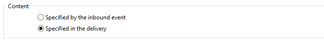

# 게재{#delivery}

**배달** 유형 활동을 사용하여 배달 작업을 만들 수 있습니다. 입력 요소를 사용하여 만들 수 있습니다.

이를 구성하려면 활동을 편집하고 배달 옵션을 입력합니다.


1. **게재**

   다음을 수행할 수 있습니다.

   * 인바운드 전환에서 지정된 전달에 대해 작업합니다. 이렇게 하려면 창의 **[!UICONTROL Delivery]** 섹션에 있는 첫 번째 옵션을 선택합니다.

      이 옵션은 이전 워크플로우 활동이 이미 생성되었거나 배달을 지정한 경우에 사용할 수 있습니다. 이것은 아래 예에서처럼 아웃바운드 전환을 생성한 동일한 유형의 활동으로 수행할 수 있습니다.

      다음 예에서 배달을 처음으로 만듭니다. 모집단 및 컨텐츠는 나중에 정의됩니다. 다음으로, 이 3개 요소에 대한 정보가 인바운드 전환을 사용하여 새 배달 활동에 다시 입력되므로 전송할 수 있습니다.

      

   * 해당 배달을 직접 선택합니다. 이렇게 하려면 **[!UICONTROL Explicit]** 옵션을 선택하고 **[!UICONTROL Delivery]** 필드의 드롭다운 목록에서 배달을 선택합니다.

      이 목록에는 기본적으로 **배달** 폴더에 포함된 완료되지 않은 배달이 표시됩니다. 다른 캠페인에 액세스하려면 **[!UICONTROL Select link]** 아이콘을 클릭합니다.

      

      **[!UICONTROL Folder]** 필드의 드롭다운 목록에서 캠페인을 선택하거나 **[!UICONTROL Display sub-levels]**&#x200B;을 클릭하여 하위 폴더에 포함된 모든 배달을 표시합니다.

      

      배달 작업을 선택한 후 **[!UICONTROL Edit link]** 아이콘을 클릭하여 컨텐츠를 표시할 수 있습니다.

   * 전달을 계산하는 스크립트를 만듭니다. 이렇게 하려면 **[!UICONTROL Computed by a script]** 옵션을 선택하고 스크립트를 입력합니다. **[!UICONTROL Edit...]** 옵션을 클릭하여 입력 창을 열 수 있습니다. 다음 예제에서는 배달의 식별자를 복구합니다.

      

   * 새 배달을 만듭니다. 이렇게 하려면 **[!UICONTROL New, created from a template]** 옵션을 선택하고 배달을 기반으로 할 배달 템플릿을 선택합니다.

      

      **[!UICONTROL Select link]** 아이콘을 클릭하여 폴더를 찾고 선택한 템플릿의 콘텐트를 보려면 **[!UICONTROL Edit link]** 아이콘을 클릭합니다.

1. **받는 사람**

   받는 사람은 파일 가져오기에 따라 또는 배달 작업에서 지정하는 등의 인바운드 이벤트로 지정할 수 있습니다. 하나 이상의 파일에 저장할 수도 있습니다.

   

1. **컨텐츠**

   메시지 내용은 전달 또는 인바운드 이벤트에서 정의할 수 있습니다.

   

1. **실행할 작업**

   배달을 만들고 준비하며 시작하고 대상을 예측하거나 증거를 보낼 수 있습니다.

   

   수행할 작업 유형을 선택합니다.

   * **[!UICONTROL Save]**:이 옵션을 사용하면 배달을 만들고 저장할 수 있습니다. 분석 또는 전달하지 않습니다.
   * **[!UICONTROL Estimate the target]**:이 옵션을 사용하면 전달 대상을 계산하여 잠재적(첫 번째 분석 단계)을 평가할 수 있습니다. 이 작업은 **[!UICONTROL Estimate the population to be targeted]** 옵션을 선택하고 **배달**&#x200B;을 통해 기본 타겟으로 배달을 보낼 때 **[!UICONTROL Analyze]**&#x200B;을 클릭하는 것과 같습니다.
   * **[!UICONTROL Prepare]**:이 옵션을 사용하면 전체 분석 프로세스(대상 계산 및 컨텐츠 준비)를 실행할 수 있습니다. 배달이 전송되지 않습니다. 이 작업은 **배달**&#x200B;으로 배달을 기본 대상에 보낼 때 **[!UICONTROL Deliver as soon as possible]** 옵션을 선택하고 **[!UICONTROL Analyze]**&#x200B;을 클릭하는 것과 같습니다.
   * **[!UICONTROL Send a proof]**:이 옵션을 사용하면 배달 증명을 보낼 수 있습니다. 이 작업은 **배달**&#x200B;이 있는 배달의 도구 모음에서 **[!UICONTROL Send a proof]** 단추를 클릭하는 것과 같습니다.
   * **[!UICONTROL Prepare and start]**:이 옵션은 전체 분석 프로세스(대상 계산 및 컨텐츠 준비)를 시작하고 배달을 전송합니다. 이 작업은 **배달**&#x200B;을 사용하여 기본 대상으로 배달을 보낼 때 **[!UICONTROL Deliver as soon as possible]**, **[!UICONTROL Analyze]** 및 **[!UICONTROL Confirm delivery]** 옵션을 클릭하는 것과 같습니다.

   워크플로우에서 추가적으로 사용되는 **[!UICONTROL Act on a delivery]** 활동을 사용하면 배달을 시작하는 데 필요한 나머지 모든 단계를 시작할 수 있습니다(대상 계산, 컨텐츠 준비, 배달). 자세한 내용은 [배달 컨트롤](../../workflow/using/delivery-control.md)을 참조하십시오.

   다음 옵션도 사용할 수 있습니다.

   * **[!UICONTROL Generate an outbound transition]**

      실행이 끝날 때 활성화될 아웃바운드 전환을 만듭니다. 아웃바운드 게재의 대상을 검색할지 여부를 선택할 수 있습니다.

   * **[!UICONTROL Do not recover target]**

      나가는 배달 작업의 대상을 복구하지 않습니다.

   * **[!UICONTROL Processing errors]**

      [배달 컨트롤](../../workflow/using/delivery-control.md)을 참조하십시오.
   **스크립트** 탭에서는 배달 매개 변수를 수정할 수 있습니다.

   

## 예:배달 워크플로 {#example--delivery-workflow}

아래 그래픽과 같이 새 워크플로우를 만들고 활동을 추가합니다.


**배달** 활동을 열고 속성을 다음과 같이 정의합니다.

* **[!UICONTROL Delivery]** 섹션에서 **[!UICONTROL New, created from a template]**&#x200B;을 선택하고 배달 템플릿을 선택합니다.
* **[!UICONTROL Recipients]** 섹션에서 **[!UICONTROL Specified in the delivery]**&#x200B;을 선택합니다.
* **[!UICONTROL Action to execute]** 섹션에서 **[!UICONTROL Prepare]** 옵션을 유지합니다.


**[!UICONTROL OK]**&#x200B;을 클릭하여 속성 창을 닫습니다. 타겟이 지정된 배달 템플릿을 기반으로 새 배달을 만들고 준비하는 작업으로 구성된 활동을 방금 구성했습니다.

**승인** 활동을 열고 속성을 다음과 같이 정의합니다.

1. **[!UICONTROL Assignment type]** 필드에서 등록된 그룹을 선택합니다. &#39;관리&#39; 계정을 사용하여 연결된 경우 관리 그룹을 선택합니다.
1. 다음으로 제목을 입력하고 메시지 본문에 다음 텍스트를 삽입합니다.

   ```
   Do you wish to approve delivery (<%= vars.recCount %> recipient(s))?
   ```

   JavaScript로 작성된 표현식이 포함된 메시지입니다.**[!UICONTROL vars.recCount]**&#x200B;은 이전 작업의 배달을 타깃팅한 받는 사람 수를 나타냅니다. JavaScript 표현식에 대한 자세한 내용은 [JavaScript 스크립트 및 템플릿](../../workflow/using/javascript-scripts-and-templates.md)을 참조하십시오.

   

   승인 작업은 [승인](../../workflow/using/approval.md)에 자세히 설명되어 있습니다.

## 입력 매개 변수 {#input-parameters}

**[!UICONTROL Delivery]** 섹션에서 **[!UICONTROL Specified in the transition]** 옵션을 선택한 경우 배달 식별자입니다.

* deliveryId
* tableName
* 스키마

각 인바운드 이벤트는 이러한 매개 변수로 정의된 대상을 지정해야 합니다.

>[!NOTE]
>
>이 매개 변수는 **[!UICONTROL Recipients]** 섹션에서 **[!UICONTROL Specified by inbound event(s)]** 옵션을 선택한 경우에만 나타납니다.

* 파일 이름

   **[!UICONTROL Recipients]** 섹션에서 **[!UICONTROL File(s) specified by inbound event(s)]** 옵션을 선택한 경우 생성된 파일의 전체 이름입니다.

* contentId

   **[!UICONTROL Content]** 섹션에서 **[!UICONTROL Specified by inbound events]** 옵션을 선택한 경우 컨텐츠 식별자입니다.

## 출력 매개 변수 {#output-parameters}

* tableName
* 스키마
* recCount

이 세 값 집합은 배달로 인한 대상을 식별합니다. **[!UICONTROL tableName]** 는 대상의 식별자를 기억하는 테이블의 이름이며,  **[!UICONTROL schema]** 인구의 스키마(일반적으로 nms:recipient) **[!UICONTROL recCount]** 이며 표의 요소 수입니다.

보어와 연결된 전환에는 동일한 매개 변수가 있습니다.

>[!NOTE]
>
>**[!UICONTROL Do not recover target]** 옵션을 선택하면 출력 매개 변수가 없습니다.

