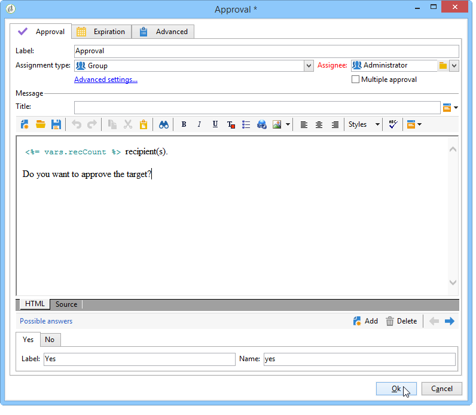

# 게재{#delivery}

배달 **유형**&#x200B;활동을 사용하여 배달 작업을 만들 수 있습니다. 입력 요소를 사용하여 생성할 수 있습니다.

구성하려면 활동을 편집하고 배달 옵션을 입력합니다.


1. **게재**

   다음 작업을 수행할 수 있습니다.

   * 인바운드 변환에 지정된 전달에 대해 수행합니다. 이렇게 하려면 창의 **[!UICONTROL Delivery]** 섹션에서 첫 번째 옵션을 선택합니다.

      이 옵션은 이전 워크플로우 활동이 이미 생성되었거나 배달을 지정한 경우에 사용할 수 있습니다. 이 작업은 아래 예와 같이 아웃바운드 전환을 생성한 동일한 유형의 활동으로 수행할 수 있습니다.

      다음 예에서는 처음으로 배달을 만듭니다. 모집단 및 컨텐츠는 나중에 정의됩니다. 그런 다음, 이 세 요소에 대한 정보가 인바운드 전환을 사용하여 새 배달 활동에 다시 입력되므로 전송할 수 있습니다.

      

   * 해당 배달을 직접 선택합니다. 이렇게 하려면 **[!UICONTROL Explicit]** 옵션을 선택하고 **[!UICONTROL Delivery]** 필드의 드롭다운 목록에서 배달을 선택합니다.

      이 목록에는 기본적으로 배달 폴더에 포함된 완료되지 않은 **배달이** 표시됩니다. 다른 캠페인에 액세스하려면 **[!UICONTROL Select link]** 아이콘을 클릭합니다.

      

      필드의 드롭다운 목록에서 캠페인을 **[!UICONTROL Folder]** 선택하거나 을 클릭하여 하위 폴더에 포함된 모든 배달을 **[!UICONTROL Display sub-levels]** 표시합니다.

      

      배달 작업을 선택한 후 **[!UICONTROL Edit link]** 아이콘을 클릭하여 컨텐츠를 표시할 수 있습니다.

   * 전달을 계산하는 스크립트를 만듭니다. 이렇게 하려면 **[!UICONTROL Calculated by a script]** 옵션을 선택하고 스크립트를 입력합니다. 이 **[!UICONTROL Edit...]** 옵션을 클릭하여 입력 창을 열 수 있습니다. 다음 예제에서는 배달 식별자를 복구합니다.

      

   * 새 배달을 만듭니다. 이렇게 하려면 **[!UICONTROL New, created from a template]** 옵션을 선택하고 배달을 기준으로 할 배달 템플릿을 선택합니다.

      

      아이콘을 클릭하여 폴더를 탐색하고 선택한 템플릿의 컨텐츠를 보려면 아이콘을 클릭합니다. **[!UICONTROL Select link]** **[!UICONTROL Edit link]**

1. **수신자**

   수신자는 인바운드 이벤트(예: 파일 가져오기 후)로 지정하거나 배달 작업에 지정할 수 있습니다. 하나 이상의 파일에 저장할 수도 있습니다.

   

1. **컨텐츠**

   메시지의 컨텐트는 배달 또는 인바운드 이벤트에서 정의할 수 있습니다.

   

1. **실행할 작업**

   배달을 만들고, 준비하며, 시작하고, 대상을 예측하거나, 증거를 보낼 수 있습니다.

   

   수행할 작업 유형을 선택합니다.

   * **[!UICONTROL Save]**:이 옵션을 사용하면 배달을 만들고 저장할 수 있습니다. 분석 또는 전달하지 않습니다.
   * **[!UICONTROL Estimate the target]**:이 옵션을 사용하면 전달 대상을 계산하여 잠재적(첫 번째 분석 단계)을 평가할 수 있습니다. 이 작업은 **[!UICONTROL Estimate the population to be targeted]** 옵션을 선택하고 배달을 통해 주 타겟으로 배달을 보낼 **[!UICONTROL Analyze]** 때 클릭하는 것과 **같습니다**.
   * **[!UICONTROL Prepare]**:이 옵션을 사용하면 전체 분석 프로세스(대상 계산 및 컨텐츠 준비)를 실행할 수 있습니다. 배달이 전송되지 않습니다. 이 작업은 배달을 사용하여 주 대상으로 배달을 보낼 때 **[!UICONTROL Deliver as soon as possible]** 옵션을 선택하고 **[!UICONTROL Analyze]** 클릭하는 것과 **같습니다**.
   * **[!UICONTROL Send a proof]**:이 옵션을 사용하면 배달 증명을 보낼 수 있습니다. 이 작업은 게재와 함께 배달의 도구 모음에서 **[!UICONTROL Send a proof]** 단추를 클릭하는 것과 **같습니다**
   * **[!UICONTROL Prepare and start]**:이 옵션은 전체 분석 프로세스(대상 계산 및 컨텐츠 준비)를 시작하고 배달을 전송합니다. 이 작업은 배달을 사용하여 기본 **[!UICONTROL Deliver as soon as possible]**&#x200B;타겟으로 배달을 보낼 때 클릭, **[!UICONTROL Analyze]**&#x200B;및 **[!UICONTROL Confirm delivery]** 옵션과 동일한 **것입니다**.
   워크플로우에서 추가로 사용되는 **[!UICONTROL Act on a delivery]** 활동을 사용하면 배달을 시작하는 데 필요한 나머지 모든 단계를 시작할 수 있습니다(타겟 계산, 컨텐츠 준비, 전달). 자세한 내용은 배달 컨트롤을 [참조하십시오](../../workflow/using/delivery-control.md).

   다음 옵션도 사용할 수 있습니다.

   * **[!UICONTROL Generate an outbound transition]**

      실행이 끝날 때 활성화될 아웃바운드 전환을 만듭니다. 아웃바운드 게재의 대상을 검색할지 여부를 선택할 수 있습니다.

   * **[!UICONTROL Do not recover target]**

      나가는 배달 작업의 대상을 복구하지 않습니다.

   * **[!UICONTROL Processing errors]**

      전달 [제어를](../../workflow/using/delivery-control.md)참조하십시오.
   스크립트 **탭에서는** 배달 매개 변수를 수정할 수 있습니다.

   

## 예:전달 워크플로우 {#example--delivery-workflow}

아래 그래픽과 같이 새 워크플로우를 만들고 활동을 추가합니다.


배달 **활동을 열고** 다음과 같이 속성을 정의합니다.

* 섹션에서 **[!UICONTROL Delivery]** 배달 템플릿을 선택하고 **[!UICONTROL New, created from a template]** 선택합니다.
* 섹션에서 **[!UICONTROL Recipients]** 을 선택합니다 **[!UICONTROL Specified in the delivery]**.
* 섹션에서 **[!UICONTROL Action to execute]** **[!UICONTROL Prepare]** 옵션을 유지합니다.


을 **[!UICONTROL OK]** 클릭하여 속성 창을 닫습니다. 타겟이 지정된 배달 템플릿을 기반으로 새 배달을 만들고 준비하는 작업으로 구성된 활동을 방금 구성했습니다.

승인 **활동을 열고** 다음과 같이 속성을 정의합니다.

1. 필드에서 등록한 그룹을 **[!UICONTROL Assignment type]** 선택합니다. &#39;admin&#39; 계정을 사용하여 연결된 경우 관리 그룹을 선택합니다.
1. 그런 다음 제목을 입력하고 메시지 본문에 다음 텍스트를 삽입합니다.

   ```
   Do you wish to approve delivery (<%= vars.recCount %> recipient(s))?
   ```

   JavaScript로 작성된 표현식을 포함하는 메시지입니다.이전 작업의 배달이 타깃팅한 받는 사람 수를 **[!UICONTROL vars.recCount]** 나타냅니다. JavaScript 표현식에 대한 자세한 내용은 JavaScript [스크립트 및 템플릿을](../../workflow/using/javascript-scripts-and-templates.md)참조하십시오.

   

   승인 작업은 승인에 자세히 [설명되어 있습니다](../../workflow/using/approval.md).

## 입력 매개 변수 {#input-parameters}

배달 식별자입니다. **[!UICONTROL Specified in the transition]** 옵션이 **[!UICONTROL Delivery]** 섹션에서 선택된 경우

* deliveryId
* tableName
* 스키마

각 인바운드 이벤트는 이러한 매개 변수에 의해 정의된 대상을 지정해야 합니다.

>[!NOTE]
>
>이 매개 변수는 **[!UICONTROL Specified by inbound event(s)]** **[!UICONTROL Recipients]** 섹션에서 옵션을 선택한 경우에만 나타납니다.

* 파일

   섹션에서 옵션을 선택한 경우 생성된 파일의 전체 **[!UICONTROL File(s) specified by inbound event(s)]** 이름입니다 **[!UICONTROL Recipients]** .

* contentId

   섹션에서 옵션을 선택한 경우 컨텐츠 **[!UICONTROL Specified by inbound events]** 식별자입니다 **[!UICONTROL Content]** .

## 출력 매개 변수 {#output-parameters}

* tableName
* 스키마
* recCount

이 세 개의 값 집합은 배달로 인해 발생한 대상을 식별합니다. **[!UICONTROL tableName]** 은 대상의 식별자를 기억하는 테이블의 이름이며, **[!UICONTROL schema]** 모집단(일반적으로 nms:recipient)의 스키마이며, **[!UICONTROL recCount]** 표의 요소 수입니다.

보수와 연결된 전환에는 동일한 매개 변수가 있습니다.

>[!NOTE]
>
>옵션을 선택하면 출력 매개 변수가 **[!UICONTROL Do not recover target]** 없습니다.

