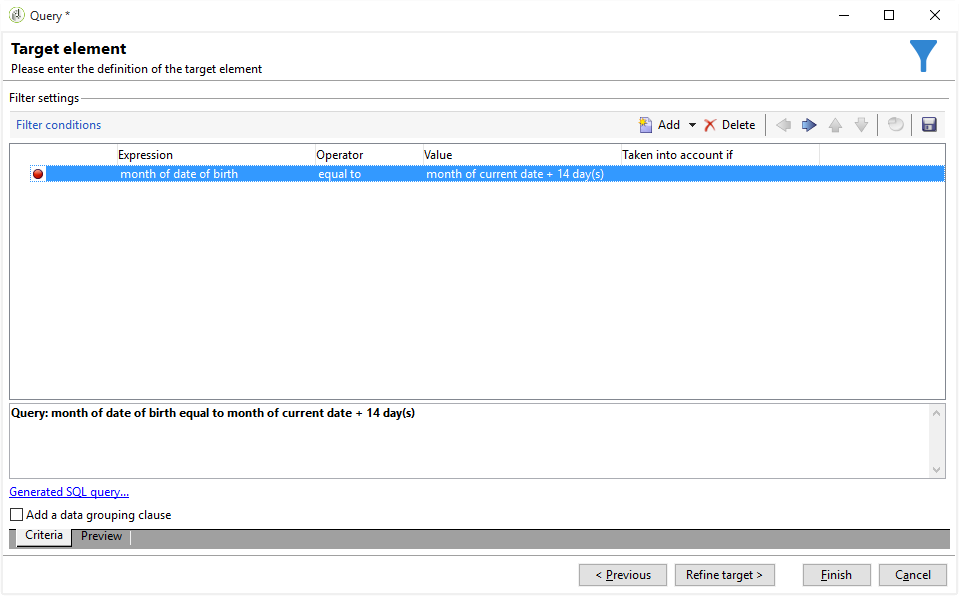
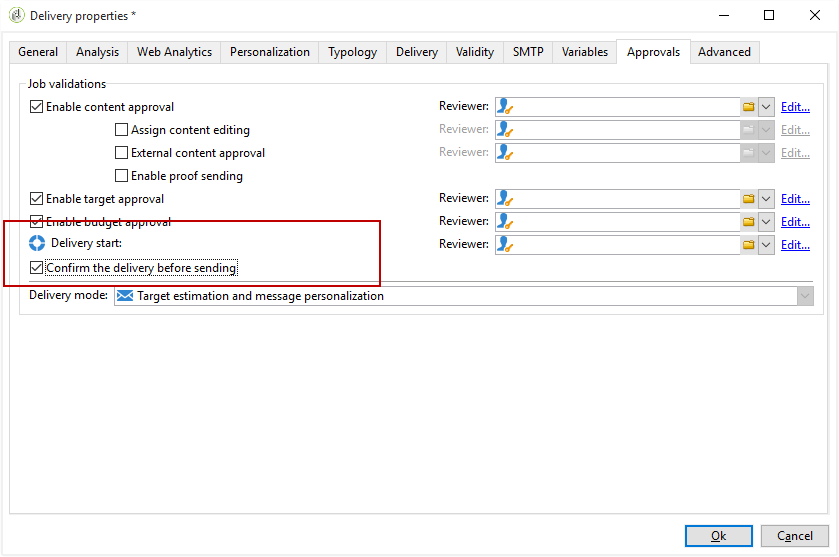

# 사용자 지정 날짜 필드를 사용한 전자 메일 강화{#email-enrichment-with-custom-date-fields}

이 예에서는 이번 달에 생일을 축하할 수신자에게 사용자 지정 데이터 필드가 포함된 이메일을 보내려고 합니다. 이메일에는 생일이 1주일 전후에 유효한 쿠폰이 포함됩니다.

우리는 **[!UICONTROL Split]** 활동을 통해 이번 달 생일을 축하할 목록에서 받는 사람을 타깃팅해야 합니다. 그런 다음 **[!UICONTROL Enrichment]** 활동을 사용하여 사용자 지정 데이터 필드는 고객의 특별 오퍼에 대한 이메일의 유효 날짜로 작동합니다.


이 예제를 만들려면 다음 단계를 수행하십시오.

1. 캠페인의 **[!UICONTROL Targeting and workflows]** 탭에서 **[!UICONTROL Read list]** 활동을 드래그하여 수신자 목록을 타깃팅합니다.
1. 처리할 목록은 여기에서 정의된 옵션 및 매개 변수에 따라 스크립트를 통해 계산하거나 동적으로 로컬라이즈된 후 명시적으로 지정할 수 있습니다.

   

1. **[!UICONTROL Split]** 활동을 추가하여 이번 달 생일을 다른 받는 사람과 구별합니다.
1. 목록을 분할하려면 **[!UICONTROL Filtering of selected records]** 범주에서 **[!UICONTROL Add a filtering condition on the inbound population]**&#x200B;을 선택합니다. 그런 다음 **[!UICONTROL Edit]**&#x200B;을 클릭합니다.

   

1. **[!UICONTROL Filtering conditions]**&#x200B;을 선택하고 **[!UICONTROL Edit expression]** 단추를 클릭하여 받는 사람의 생일 월을 필터링합니다.

   

1. **[!UICONTROL Advanced Selection]**&#x200B;을 클릭한 다음 **[!UICONTROL Edit the formula using an expression]** 표현식을 추가합니다.월(@birthDate).
1. **[!UICONTROL Operator]** 열에서 **[!UICONTROL equal to]**&#x200B;을 선택합니다.
1. 현재 날짜의 **[!UICONTROL Value]** 월을 추가하여 조건을 추가적으로 필터링합니다.Month(GetDate()).

   그러면 생일 달이 현재 월에 해당하는 받는 사람에게 질문합니다.

   

1. **[!UICONTROL Finish]**&#x200B;을(를) 클릭합니다. 그런 다음 **[!UICONTROL Split]** 활동의 **[!UICONTROL General]** 탭에서 **[!UICONTROL Results]** 범주의 **[!UICONTROL Generate complement]**&#x200B;를 클릭합니다.

   **[!UICONTROL Complement]** 결과를 사용하여 배달 활동을 추가하거나 목록을 업데이트할 수 있습니다. 여기에서 **[!UICONTROL End]** 활동을 추가했습니다.

   

이제 **[!UICONTROL Enrichment]** 활동을 구성해야 합니다.

1. 하위 세트 뒤에 **[!UICONTROL Enrichment]** 활동을 추가하여 사용자 지정 날짜 필드를 추가합니다.

   

1. **[!UICONTROL Enrichment]** 활동을 엽니다. **[!UICONTROL Complementary information]** 범주에서 **[!UICONTROL Add data]**&#x200B;을 클릭합니다.

   

1. **[!UICONTROL Data linked to the filtering dimension]**&#x200B;을 선택하고 **[!UICONTROL Data of the filtering dimension]**&#x200B;을 선택합니다.
1. **[!UICONTROL Add]** 버튼을 클릭합니다.

   

1. **[!UICONTROL Label]**&#x200B;을(를) 추가합니다. 그런 다음 **[!UICONTROL Expression]** 열에서 **[!UICONTROL Edit expression]**&#x200B;을 클릭합니다.

   

1. 첫째, 다음 **[!UICONTROL Expression]**&#x200B;과 함께 생년월일 전 주를 **유효성 시작 날짜**&#x200B;로 타깃팅해야 합니다.`SubDays([target/@birthDate], 7)`.

   

1. 그런 다음 생년월일 이후 주를 대상으로 하는 사용자 지정 날짜 필드 **유효성 종료 날짜**&#x200B;를 만들려면 **[!UICONTROL Expression]**&#x200B;을 추가해야 합니다.`AddDays([target/@birthDate], 7)`.

   표현식에 레이블을 추가할 수 있습니다.

   

1. **[!UICONTROL Ok]**&#x200B;을(를) 클릭합니다. 농축은 이제 준비가 되었습니다.

**[!UICONTROL Enrichment]** 활동 후에는 배달을 추가할 수 있습니다. 이 경우, 이 달에 생일을 축하하는 고객에게 유효 날짜가 포함된 특별 오퍼를 받는 사람에게 보내는 이메일 배달을 추가했습니다.

1. **[!UICONTROL Enrichment]** 활동 후에 **[!UICONTROL Email delivery]** 활동을 드래그하여 놓습니다.

   

1. **[!UICONTROL Email delivery]** 활동을 두 번 클릭하여 배달을 개인화합니다.
1. 배달에 **[!UICONTROL Label]**&#x200B;을(를) 추가하고 **[!UICONTROL Continue]**&#x200B;을 클릭합니다.
1. **[!UICONTROL Save]**&#x200B;을 클릭하여 이메일 배달을 만듭니다.
1. **[!UICONTROL Confirm delivery before sending option]**&#x200B;이(가) 선택되었는지 이메일 배달 **[!UICONTROL Properties]**&#x200B;의 **[!UICONTROL Approval]** 탭에서 확인합니다.

   그런 다음 워크플로우를 시작하여 타깃팅된 정보로 아웃바운드 전환을 강화합니다.

   

이제 **[!UICONTROL Enrichment]** 활동에서 만든 사용자 지정 날짜 필드를 사용하여 이메일 배달 디자인을 시작할 수 있습니다.

1. **[!UICONTROL Email delivery]** 활동을 두 번 클릭합니다.
1. 이메일에 타겟 확장을 추가합니다. 유효성 날짜 형식을 구성하려면 다음 표현식 안에 있어야 합니다.

   ```
   <%=
           formatDate(targetData.alias of your expression,"%2D.%2M")  %>
   ```

1. 을(를) 클릭합니다. **[!UICONTROL Target extension]**&#x200B;을 선택한 다음 **[!UICONTROL Enrichment]** 활동을 사용하여 이전에 만든 사용자 정의 유효성 날짜를 선택하여 formatDate 식에 확장을 추가합니다.

   

1. 필요에 따라 이메일 컨텐츠를 구성합니다.

   

1. 이메일 미리 보기를 통해 사용자 지정 날짜 필드가 올바르게 구성되었는지 확인

   

이제 이메일이 준비되었습니다. 교정본을 전송하고 배달 내용을 확인하여 생일 이메일을 보낼 수 있습니다.
