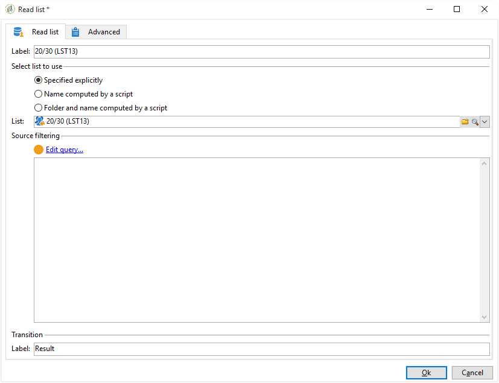

# 사용자 지정 날짜 필드를 사용한 전자 메일 강화{#email-enrichment-with-custom-date-fields}

이 예에서는 이번 달에 생일을 축하할 수신자에게 사용자 지정 데이터 필드가 포함된 이메일을 보내려고 합니다. 이 이메일에는 생일 1주일 전과 그 후 유효한 쿠폰이 포함됩니다.

우리는 이번 달에 **[!UICONTROL Split]** 활동을 하면서 그들의 생일을 축하할 목록에서 받는 사람들을 타겟팅해야 합니다. 그런 다음 **[!UICONTROL Enrichment]** 활동을 사용하여 사용자 지정 데이터 필드는 고객의 특별 오퍼에 대한 이메일의 유효 날짜로 작동합니다.


이 예제를 만들려면 다음 단계를 수행하십시오.

1. 캠페인 **[!UICONTROL Targeting and workflows]** 탭에서 활동을 드래그하여 **[!UICONTROL Read list]** 놓아 수신자 목록을 타깃팅합니다.
1. 처리할 목록은 스크립트로 계산하거나 동적으로 로컬라이즈되도록 명시적으로 지정할 수 있으며, 선택한 옵션과 여기에 정의된 매개 변수에 따라 지정할 수 있습니다.

   

1. 이번 달에 다른 받는 사람과 생일을 축하할 수신자를 차별화하는 **[!UICONTROL Split]** 활동을 추가합니다.
1. 목록을 분할하려면 카테고리에서 **[!UICONTROL Filtering of selected records]** 을 선택합니다 **[!UICONTROL Add a filtering condition on the inbound population]**. Then, click **[!UICONTROL Edit]**.

   

1. 그런 **[!UICONTROL Filtering conditions]** 다음 **[!UICONTROL Edit expression]** 단추를 클릭하여 받는 사람의 생일 날짜를 필터링합니다.

   

1. 을 **[!UICONTROL Advanced Selection]** 클릭한 다음 **[!UICONTROL Edit the formula using an expression]** 표현식을 추가합니다.Month(@birthDate).
1. 열에서 **[!UICONTROL Operator]** 해당 항목을 선택합니다 **[!UICONTROL equal to]**.
1. 현재 날짜의 월을 추가하여 조건을 **[!UICONTROL Value]** 추가로 필터링합니다.월(GetDate()).

   이 확인란을 선택하면 생일 달이 현재 월과 일치하는 수신자에게 질문합니다.

   

1. **[!UICONTROL Finish]**&#x200B;을(를) 클릭합니다. 그런 다음 **[!UICONTROL General]** 활동의 **[!UICONTROL Split]** 탭에서 카테고리 **[!UICONTROL Generate complement]** 의 을 **[!UICONTROL Results]** 클릭합니다.

   그 결과 **[!UICONTROL Complement]** 로 배달 활동을 추가하거나 목록을 업데이트할 수 있습니다. 여기, 우리는 방금 **[!UICONTROL End]** 활동을 추가했습니다.

   

이제 **[!UICONTROL Enrichment]** 활동을 구성해야 합니다.

1. 하위 세트 뒤에 **[!UICONTROL Enrichment]** 활동을 추가하여 사용자 지정 날짜 필드를 추가합니다.

   

1. 활동을 **[!UICONTROL Enrichment]** 엽니다. In the **[!UICONTROL Complementary information]** category, click **[!UICONTROL Add data]**.

   

1. 그런 다음 **[!UICONTROL Data linked to the filtering dimension]** 을 선택합니다 **[!UICONTROL Data of the filtering dimension]**.
1. **[!UICONTROL Add]** 버튼을 클릭합니다.

   

1. 추가 **[!UICONTROL Label]**. 그런 다음 **[!UICONTROL Expression]** 열에서 을 클릭합니다 **[!UICONTROL Edit expression]**.

   

1. 첫째, 다음 내용으로 **유효성 시작 날짜로** 생년월일 전 주를 타깃팅해야 합니다 **[!UICONTROL Expression]**. `SubDays([target/@birthDate], 7)`.

   

1. 그런 다음 **생년월일 이후 주를 타깃팅할 사용자 지정 날짜 필드 유효성 종료 날짜를** 만들려면 다음을 추가해야 합니다. **[!UICONTROL Expression]**`AddDays([target/@birthDate], 7)`.

   표현식에 레이블을 추가할 수 있습니다.

   

1. **[!UICONTROL Ok]**&#x200B;을(를) 클릭합니다. 이제 농축 작업이 가능합니다.

활동 후 **[!UICONTROL Enrichment]** 배달을 추가할 수 있습니다. 이 경우, 이 달 생일인 고객에게 유효 날짜가 포함된 특별 오퍼를 수신자에게 발송하기 위해 이메일 배달을 추가했습니다.

1. 활동 후에 **[!UICONTROL Email delivery]** 활동을 드래그하여 **[!UICONTROL Enrichment]** 놓습니다.

   

1. 활동을 두 번 클릭하여 **[!UICONTROL Email delivery]** 배달을 개인화합니다.
1. 게재에 **[!UICONTROL Label]** 를 추가하고 을 클릭합니다 **[!UICONTROL Continue]**.
1. 이메일 배달 **[!UICONTROL Save]** 을 만들려면 을 클릭합니다.
1. 이메일 배달 **[!UICONTROL Approval]** 탭에서 이메일 배달 **[!UICONTROL Properties]** 을 **[!UICONTROL Confirm delivery before sending option]** 확인합니다.

   그런 다음 워크플로우를 시작하여 타깃팅된 정보로 아웃바운드 전환을 강화할 수 있습니다.

   

이제 활동에서 만든 사용자 지정 날짜 필드로 이메일 배달 디자인을 시작할 수 **[!UICONTROL Enrichment]** 있습니다.

1. 활동을 두 번 **[!UICONTROL Email delivery]** 클릭합니다.
1. 이메일에 타겟 익스텐션을 추가합니다. 유효성 날짜 형식을 구성하려면 다음 표현식 내에 있어야 합니다.

   ```
   <%=
           formatDate(targetData.alias of your expression,"%2D.%2M")  %>
   ```

1. 을(를) 클릭합니다. 그런 **[!UICONTROL Target extension]** 다음 이전에 만든 사용자 지정 유효성 날짜를 **[!UICONTROL Enrichment]** 활동과 함께 선택하여 formatDate 식에 확장을 추가합니다.

   

1. 필요에 따라 이메일 컨텐츠를 구성합니다.

   

1. 사용자 지정 날짜 필드가 올바르게 구성되었는지 확인하려면 이메일을 미리 보십시오

   

이제 이메일이 준비되었습니다. 교정본을 전송하고 배달 내용을 확인하여 생일 이메일을 보낼 수 있습니다.
