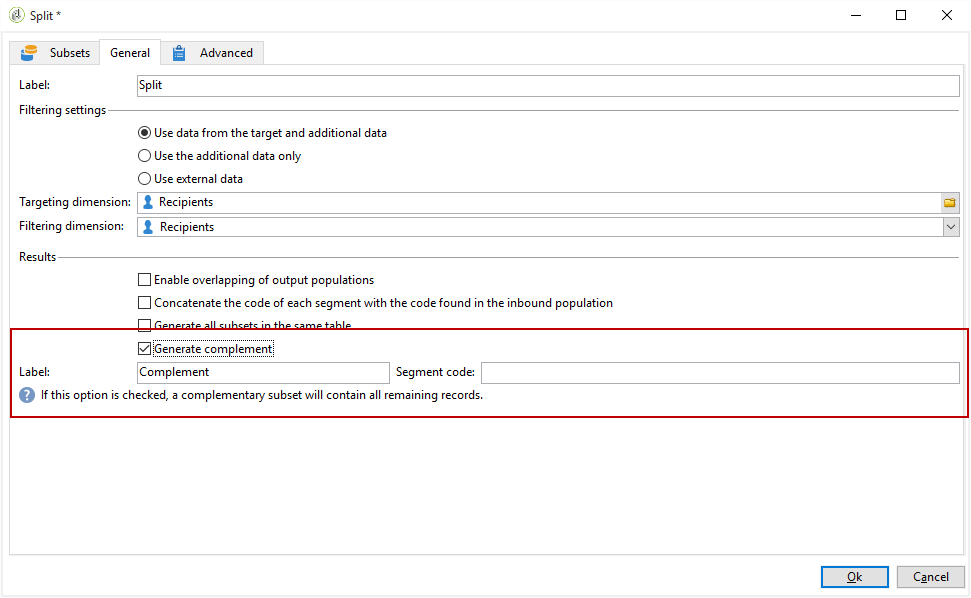
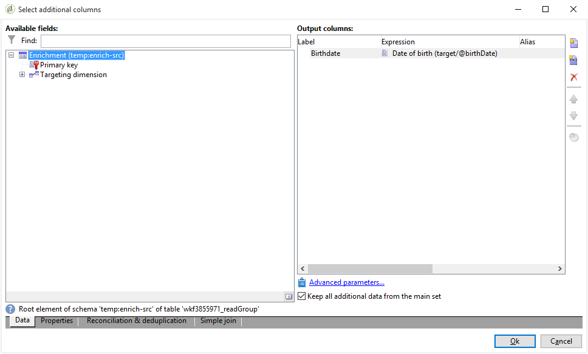

# 사용자 정의 날짜 필드를 통한 이메일 향상{#email-enrichment-with-custom-date-fields}

이 예에서는 이번 달에 생일을 축하할 수신자에게 사용자 지정 데이터 필드가 포함된 이메일을 보내려고 합니다. 이 이메일에는 생일 1주일 전과 생일 이후에 유효한 쿠폰이 포함됩니다.

우리는 이번 달에 **[!UICONTROL Split]** 활동을 하면서 그들의 생일을 축하할 목록에서 받는 사람들을 타겟팅해야 합니다. 그런 다음, **[!UICONTROL Enrichment]** 활동을 사용하여 사용자 지정 데이터 필드는 고객의 특별 오퍼에 대한 이메일의 유효 날짜로 작동합니다.


이 예를 만들려면 다음 단계를 적용합니다.

1. 캠페인의 **[!UICONTROL Targeting and workflows]** 탭에서 활동을 드래그하여 **[!UICONTROL Read list]** 수신자 목록을 타깃팅합니다.
1. 처리할 목록은 여기에서 정의된 옵션 및 매개 변수에 따라 스크립트를 통해 계산하거나 동적으로 로컬라이즈되도록 명시적으로 지정할 수 있습니다.

   

1. 이번 달에 다른 수신자와 생일을 축하할 수신자를 차별화하는 **[!UICONTROL Split]** 활동을 추가합니다.
1. 목록을 분할하려면 **[!UICONTROL Filtering of selected records]** 카테고리에서 을 선택합니다 **[!UICONTROL Add a filtering condition on the inbound population]**. 그런 다음 을 **[!UICONTROL Edit]**&#x200B;클릭합니다.

   

1. 그런 **[!UICONTROL Filtering conditions]** 다음 **[!UICONTROL Edit expression]** 단추를 클릭하여 받는 사람의 생년월일을 필터링합니다.

   

1. 아이콘을 **[!UICONTROL Advanced Selection]** 클릭한 다음 **[!UICONTROL Edit the formula using an expression]** 표현식을 추가합니다.Month(@birthDate).
1. 열에서 **[!UICONTROL Operator]** 을 선택합니다 **[!UICONTROL equal to]**.
1. 현재 날짜의 **[!UICONTROL Value]** 월을 추가하여 조건을 추가로 필터링합니다.월(GetDate()).

   그러면 생일의 월이 현재 월에 해당하는 수신자에게 질의합니다.

   

1. 클릭 **[!UICONTROL Finish]**. 그런 다음 **[!UICONTROL General]** 활동의 **[!UICONTROL Split]** 탭에서 **[!UICONTROL Generate complement]** **[!UICONTROL Results]** 카테고리의 아이콘을 클릭합니다.

   그 **[!UICONTROL Complement]** 결과, 배달 활동을 추가하거나 목록을 업데이트할 수 있습니다. 여기에 방금 **[!UICONTROL End]** 활동을 추가했습니다.

   

이제 **[!UICONTROL Enrichment]** 활동을 구성해야 합니다.

1. 하위 세트 뒤에 **[!UICONTROL Enrichment]** 활동을 추가하여 사용자 지정 날짜 필드를 추가합니다.

   

1. 활동을 **[!UICONTROL Enrichment]** 엽니다. 범주에서 을 **[!UICONTROL Complementary information]** 클릭합니다 **[!UICONTROL Add data]**.

   

1. 그런 **[!UICONTROL Data linked to the filtering dimension]** 다음 **[!UICONTROL Data of the filtering dimension]**&#x200B;선택합니다.
1. 단추를 **[!UICONTROL Add]** 클릭합니다.

   

1. 추가 **[!UICONTROL Label]**. 그런 다음 **[!UICONTROL Expression]** 열에서 을 클릭합니다 **[!UICONTROL Edit expression]**.

   

1. 첫째, 다음 항목을 사용하여 생년월일 전 주를 **유효 시작 날짜로** 타깃팅해야 합니다 **[!UICONTROL Expression]**. `SubDays([target/@birthDate], 7)`Adobe

   

1. 그런 다음, 생년월일 **이후 주를 타깃팅할 사용자 지정 날짜 필드 유효성 종료 날짜를** 만들려면 **[!UICONTROL Expression]**&#x200B;다음을 추가해야 합니다. `AddDays([target/@birthDate], 7)`Adobe

   표현식에 레이블을 추가할 수 있습니다.

   

1. 클릭 **[!UICONTROL Ok]**. 여러분의 농축은 이제 준비되어 있습니다.

활동 후 **[!UICONTROL Enrichment]** 배달을 추가할 수 있습니다. 이 경우, 이 달에 생일을 기념하는 고객에게 유효 날짜가 포함된 특별 오퍼를 수신자에게 보내기 위해 이메일 배달을 추가했습니다.

1. 활동 후에 **[!UICONTROL Email delivery]** **[!UICONTROL Enrichment]** 활동을 드래그하여 놓습니다.

   

1. 활동을 두 번 클릭하여 **[!UICONTROL Email delivery]** 게재의 개인화를 시작합니다.
1. 전달에 **[!UICONTROL Label]** 을 추가하고 을 클릭합니다 **[!UICONTROL Continue]**.
1. 이메일 배달을 **[!UICONTROL Save]** 만들려면 을 클릭합니다.
1. 이메일 배달 **[!UICONTROL Approval]** 탭에서 해당 이메일이 **[!UICONTROL Properties]** 선택되어 **[!UICONTROL Confirm delivery before sending option]** 있는지 확인합니다.

   그런 다음 워크플로우를 시작하여 타깃팅된 정보로 아웃바운드 전환을 강화합니다.

   

이제 **[!UICONTROL Enrichment]** 활동에서 만든 사용자 지정 날짜 필드를 사용하여 이메일 배달 디자인을 시작할 수 있습니다.

1. 활동을 두 번 클릭합니다. **[!UICONTROL Email delivery]**
1. 이메일에 타겟 확장 기능을 추가합니다. 유효성 날짜 형식을 구성하려면 다음 표현식 안에 있어야 합니다.

   ```
   <%=
           formatDate(targetData.alias of your expression,"%2D.%2M")  %>
   ```

1. 클릭  . 그런 **[!UICONTROL Target extension]** 다음 이전에 만든 사용자 지정 유효성 날짜를 **[!UICONTROL Enrichment]** 활동과 함께 선택하여 formatDate 표현식에 확장을 추가합니다.

   

1. 필요에 따라 이메일 컨텐츠를 구성합니다.

   

1. 이메일 미리 보기를 통해 사용자 지정 날짜 필드가 올바르게 구성되었는지 확인

   

이제 이메일이 준비되었습니다. 교정본을 전송하고 배달 여부를 확인하여 생일 이메일을 보낼 수 있습니다.
