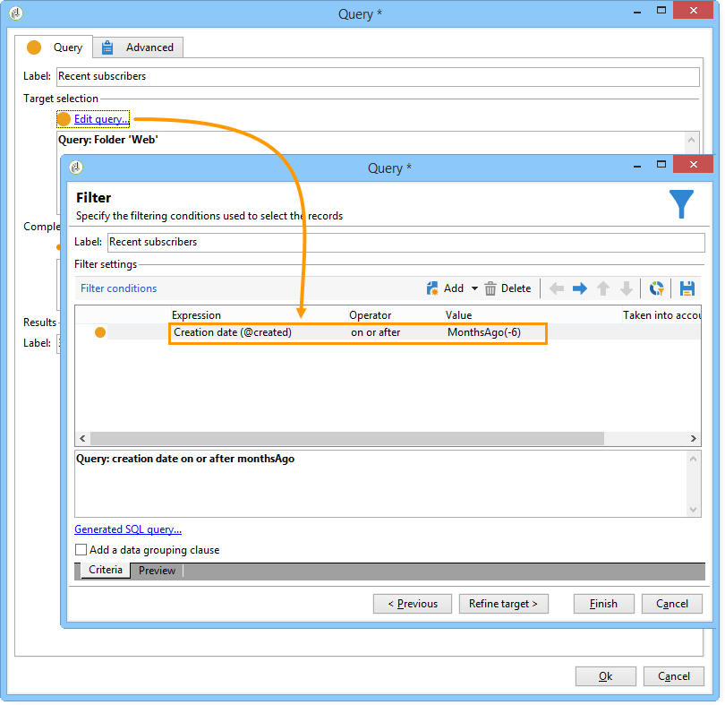

# 데이터 강화{#enriching-data}

## 데이터 농축 정보 {#about-enriching-data}

이 사용 사례 세부 사항은 타깃팅 워크플로우에서 **[!UICONTROL Enrichment]** 활동을 사용할 수 있습니다. 활동 사용에 대한 자세한 내용은 **[!UICONTROL Enrichment]** 다음을 참조하십시오.데이터 [수집](../../workflow/using/enrichment.md).

마케팅 데이터베이스의 연락처는 웹 애플리케이션을 통해 경쟁에 참가하도록 초대장을 보냅니다. 대회 결과가 **[!UICONTROL Competition results]** 테이블에서 회복되었다. 이 테이블은 연락처 테이블(**[!UICONTROL Recipients]**)에 연결되어 있습니다. 이 **[!UICONTROL Competition results]** 표에는 다음 필드가 포함되어 있습니다.

* 대회 이름(@game)
* 시험버전 번호(@trial)
* 점수(@score)

테이블에서 찾은 연락처를 **[!UICONTROL Recipients]** **[!UICONTROL Competition results]** 테이블의 여러 줄에 연결할 수 있습니다. 이 두 테이블 간의 관계는 1-n 유형입니다. 다음은 수신자에 대한 결과 로그의 예입니다.

이 사용 사례는 최고 점수에 따라 최신 경쟁에서 참가한 사람에게 개인화된 전달을 제공하기 위한 것입니다. 점수가 가장 높은 사람은 1등, 점수가 가장 높은 사람은 1등, 점수가 가장 높은 사람은 위로상을, 나머지 사람은 모두 다음번에 더 행운을 빌라는 메시지를 받는다.

이 사용 사례를 설정하기 위해 다음 타깃팅 워크플로우를 만들었습니다.

워크플로우를 만들려면 다음 단계를 적용합니다.

1. 두 **[!UICONTROL Query]** 가지 활동 및 한 **[!UICONTROL Intersection]** 활동이 마지막 경쟁업체에 가입한 신규 가입자를 타깃팅하는 데 추가됩니다.
1. 이 **[!UICONTROL Enrichment]** 활동을 통해 **[!UICONTROL Competition results]** 테이블에 저장된 데이터를 추가할 수 있습니다. Adobe의 전달 개인화가 수행되는 **[!UICONTROL Score]** 필드는 워크플로우의 작업 표에 추가됩니다.
1. 유형 **[!UICONTROL Split]** 활동을 통해 점수를 기준으로 수신자 하위 세트를 만들 수 있습니다.
1. 각 하위 세트에 대해 **[!UICONTROL Delivery]** 유형 활동이 추가됩니다.

## 1단계:타깃팅 {#step-1--targeting}

첫 번째 쿼리를 통해 지난 6개월 이내에 데이터베이스에 추가된 수신자를 타깃팅할 수 있습니다.

두 번째 쿼리는 마지막 경쟁에 참가한 수신자를 타게팅할 수 있도록 합니다.

그런 다음 **[!UICONTROL Intersection]** 유형 활동이 지난 6개월 이내에 데이터베이스에 추가된 수신자와 마지막 경쟁업체에 가입한 수신자를 타깃팅하는 데 추가됩니다.

## 2단계:농축 {#step-2--enrichment}

이 예에서는 표에 저장된 **[!UICONTROL Score]** 필드에 따라 게재를 개인화하려고 **[!UICONTROL Competition results]** 합니다. 이 테이블은 받는 사람 테이블과 100개 유형 관계를 갖습니다. 이 **[!UICONTROL Enrichment]** 활동을 통해 필터링 차원에 연결된 테이블의 데이터를 워크플로우의 작업 테이블에 추가할 수 있습니다.

1. 농축활동 편집 화면에서 **[!UICONTROL Add data]**&#x200B;선택한 다음 **[!UICONTROL Data linked to the filtering dimension]** 을 클릭합니다 **[!UICONTROL Next]**.

   

1. 그런 다음 **[!UICONTROL Data linked to the filtering dimension]** 옵션을 선택하고 **[!UICONTROL Competition results]** 표를 선택한 다음 을 클릭합니다 **[!UICONTROL Next]**.

   

1. ID와 레이블을 입력하고 **[!UICONTROL Limit the line count]** 필드에서 **[!UICONTROL Data collected]** 옵션을 선택합니다. 필드에서 **[!UICONTROL Lines to retrieve]** &#39;1&#39;을 값으로 선택합니다. 각 수신자의 경우, 농축된 활동은 워크플로우의 작업 표에 **[!UICONTROL Competition results]** 표에서 한 줄을 추가합니다. 클릭 **[!UICONTROL Next]**.

   

1. 이 예에서는 마지막 경쟁업체만 받는 사람의 최고 점수를 회수하려고 합니다. 이렇게 하려면 필드에 필터를 추가하여 이전 대회와 관련된 모든 줄을 제외합니다. **[!UICONTROL Competition name]** 클릭 **[!UICONTROL Next]**.

   

1. 화면으로 **[!UICONTROL Sort]** 이동하여 **[!UICONTROL Add]** 단추를 클릭하고 **[!UICONTROL Score]** 필드를 선택한 다음 열의 상자를 선택하여 **[!UICONTROL descending]** 필드의 항목을 내림차순으로 **[!UICONTROL Score]** 정렬합니다. 받는 사람마다, 우라늄 농축은 마지막 게임의 최고 점수와 일치하는 라인을 추가합니다. 클릭 **[!UICONTROL Next]**.

   

1. 창에서 **[!UICONTROL Data to add]** **[!UICONTROL Score]** 필드를 두 번 클릭합니다. 각 수신자의 경우, 우라늄 농축은 **[!UICONTROL Score]** 필드만 추가합니다. 클릭 **[!UICONTROL Finish]**.

   

농축 활동의 인바운드 전환을 마우스 오른쪽 버튼으로 클릭하고 **[!UICONTROL Display the target]**&#x200B;선택합니다. 작업 테이블에는 다음 데이터가 포함되어 있습니다.

연결된 스키마는 다음과 같습니다.

농축활동의 아웃바운드 전환으로 이 작업을 갱신하십시오. 받는 사람 점수에 연결된 데이터가 추가되었음을 확인할 수 있습니다. 각 수신자의 최고 점수가 복구되었습니다.

일치하는 스키마도 향상되었습니다.

## 3단계:분할 및 전달 {#step-3--split-and-delivery}

점수를 기준으로 수신자를 분류하기 위해, 우라늄 농축 후에 **[!UICONTROL Split]** 활동이 추가됩니다.

1. 첫 번째(**우승자**) 하위 세트가 가장 높은 점수를 받는 사람을 포함하도록 정의되었습니다. 이렇게 하려면 레코드 수의 제한을 정의하고 점수에 내림차순 정렬을 적용하고 레코드 수를 1로 제한합니다.

   

1. 두 번째(**두 번째**&#x200B;위치) 하위 집합에는 두 번째로 높은 점수가 있는 받는 사람이 포함됩니다. 구성은 첫 번째 하위 세트에 대해 동일합니다.

   

1. 세 번째(**패자**) 하위 집합에는 다른 모든 수신자가 포함됩니다. 두 개의 최고 점수를 달성하지 못한 모든 수신자를 타게팅하려면 **[!UICONTROL General]** 탭으로 이동한 후 **[!UICONTROL Generate complement]** 상자를 선택합니다.

   

1. 각 하위 세트에 대해 다른 배달 템플릿을 사용하여 각 하위 세트에 대한 유형 활동을 추가합니다. **[!UICONTROL Delivery]**

   

