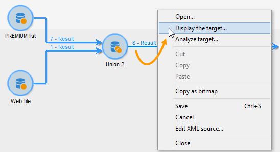

# 강화{#enrichment}

이 **[!UICONTROL Enrichment]** 활동을 사용하면 프로필 목록에 정보를 추가하고 기존 테이블에 링크를 추가할 수 있습니다(새 조인 만들기). 데이터베이스에 프로파일이 있는 조정 기준도 정의할 수 있습니다.


## 정의 {#definitions}

데이터 추가 시 사용할 수 있는 다양한 옵션에 익숙해져야 합니다.


이 **[!UICONTROL Data linked to the filtering dimension]** 옵션을 사용하면 다음 항목에 액세스할 수 있습니다.

* 필터링 차원의 데이터:작업 테이블 데이터에 대한 액세스
* 필터링 차원에 연결된 데이터:작업 테이블에 연결된 데이터에 대한 액세스


이 **[!UICONTROL A link]** 옵션을 사용하면 데이터베이스의 테이블에 조인을 만들 수 있습니다.


다음 네 가지 유형의 링크가 있습니다.

* **[!UICONTROL Define a collection]**:표 사이에 1-N 기수로 링크를 정의할 수 있습니다.
* **[!UICONTROL Define a link whose target is still available]**:표 사이에 1-1 기수로 링크를 정의할 수 있습니다. 조인 조건은 대상 테이블의 단일 레코드로 정의해야 합니다.
* **[!UICONTROL Define a link whose target does not necessarily exist in the base]**:표 사이에 0-1 기수로 링크를 정의할 수 있습니다. 조인 조건은 0 또는 1(최대)으로 정의해야 합니다. 레코드를 타겟 테이블에 추가합니다.

   이 옵션은 **[!UICONTROL Simple Join]** 활동 **[!UICONTROL Edit additional data]** **[!UICONTROL Enrichment]** 링크를 통해 액세스할 수 있는 탭에서 구성됩니다.

* **[!UICONTROL Define a link by searching for a reference among several options]**:이 유형의 링크는 고유한 레코드에 대한 조정을 정의합니다. Adobe Campaign은 고유 레코드에 대한 참조를 저장하기 위해 대상 테이블에 외래 키를 추가하여 대상 테이블에 대한 링크를 만듭니다.

   이 옵션은 **[!UICONTROL Reconciliation and deduplication]** 활동 **[!UICONTROL Edit additional data]** **[!UICONTROL Enrichment]** 링크를 통해 액세스할 수 있는 탭에서 구성됩니다.

데이터 [수집](../../workflow/using/enriching-data.md) 및 요약 [사용 사례 만들기는](../../workflow/using/creating-a-summary-list.md) 해당 컨텍스트에서 우라늄 활동의 운영을 자세히 설명합니다.

## 정보 추가 {#adding-information}

작업을 사용하여 **[!UICONTROL Enrichment]** 작업 테이블에 열을 추가합니다.이 활동은 쿼리 활동의 보수로 사용할 수 있습니다.

추가 열 구성은 데이터 추가에 [설명되어](../../workflow/using/query.md#adding-data)있습니다.

이 **[!UICONTROL Primary set]** 필드를 사용하면 인바운드 전환을 선택할 수 있습니다.이 활동의 작업 테이블 데이터가 풍부해집니다.

링크를 클릭하고 추가할 데이터 유형을 선택합니다. **[!UICONTROL Add data]** 제공되는 데이터 유형 목록은 플랫폼에 설치된 모듈 및 옵션에 따라 다릅니다. 최소 구성에서는 필터링 차원과 링크에 연결된 데이터를 항상 추가할 수 있습니다.


아래 예에서 아웃바운드 전환은 타깃팅된 프로필의 나이에 대한 정보와 함께 증가됩니다.


농축활동의 인바운드 전환을 마우스 오른쪽 버튼으로 클릭하여 농축 단계 전에 데이터를 확인합니다.



작업 테이블에는 다음 데이터 및 관련 스키마가 포함되어 있습니다.


농축단계 출력에 이 작업을 반복합니다.


프로필 페이지와 관련된 데이터가 추가되었음을 확인할 수 있습니다.


일치하는 스키마도 향상되었습니다.

## 추가 데이터 관리 {#managing-additional-data}

이전에 정의한 추가 데이터를 보관하지 않으려면 이 **[!UICONTROL Keep all additional data from the main set]** 옵션을 선택 취소합니다. 이 경우, 농축활동에서 선택한 추가 열만 나가는 작업 테이블에 추가됩니다. 업스트림 활동에 추가된 추가 정보는 저장되지 않습니다.


데이터 및 스키마 데이터 증가 단계 출력은 다음과 같습니다.


## 링크 만들기 {#creating-a-link}

농축된 활동을 사용하여 작업 데이터와 Adobe Campaign 데이터베이스 간의 링크를 만들 수 있습니다.인바운드 데이터 간의 워크플로우에 대한 로컬 링크가 됩니다.

예를 들어 계정 번호, 국가 및 수신자의 전자 메일이 포함된 파일의 데이터를 로드하는 경우 해당 프로필에서 이 정보를 업데이트하려면 국가 테이블로 연결되는 링크를 만들어야 합니다.

이렇게 하려면 다음 단계를 적용합니다.

1. 다음 유형의 파일을 수집하고 로드합니다.

   ```
   Account number;Country;Email
   18D65;FRANCE;agnes@gmail.com
   243PP;RUSSIA;paul@gmail.com
   55H87;CROATIA;dave@gmail.com
   56U81;USA;susan@gmail.com
   853PI;ITALY;anna@gmail.com
   890LP;FRANCE;robert@gmail.com
   83TY2;SWITZERLAND;mike@gmail.com
   ```

1. **농축 활동을 편집하고 데이터**&#x200B;추가...를 클릭합니다.링크를 클릭하여 국가 테이블로 조인을 만듭니다.

   

1. 옵션을 **[!UICONTROL Link definition]** 선택하고 **[!UICONTROL Next]** 단추를 클릭합니다. 만들 링크의 유형을 지정합니다. 이 예에서는 데이터베이스의 전용 테이블에 있는 사용 가능한 국가 목록에 있는 국가와 파일 수신자 국가를 조정할 것입니다. 옵션을 **[!UICONTROL Define a link by searching for a reference among several options]** 선택합니다. 필드에서 국가 테이블을 **[!UICONTROL Target schema]** 선택합니다.

   

1. 마지막으로 소스 파일 값을 데이터베이스의 필드에 연결할 수 있는 필드를 선택합니다.

   

이 농축활동 결과시 임시 스키마에는 국가 테이블에 대한 링크가 포함됩니다.


## 데이터 조정 {#data-reconciliation}

데이터 수집 활동은 일단 데이터가 데이터베이스에 로드되면 데이터 조정을 구성하는 데 사용할 수 있습니다. 이 경우 이 **[!UICONTROL Reconciliation]** 탭에서는 Adobe Campaign 데이터베이스의 데이터와 작업 테이블의 데이터 간의 링크를 정의할 수 있습니다.

옵션을 **[!UICONTROL Identify the targeting document based on work data]** 선택하고 링크를 만들 스키마를 지정하고 조인 조건을 정의합니다.이렇게 하려면 작업 데이터(**[!UICONTROL Source expression]**) 및 타깃팅 차원(**[!UICONTROL Destination expression]**)에서 조정할 필드를 선택합니다.

하나 이상의 조정 기준을 사용할 수 있습니다.


여러 개의 참여 조건이 지정된 경우 데이터를 함께 연결할 수 있도록 모든 참여 조건을 확인해야 합니다.

## 제안 제안 삽입 {#inserting-an-offer-proposition}

데이터 연계 강화 활동을 통해 제공 받는 사람을 위한 오퍼나 링크를 추가할 수 있습니다.

농축활동에 대한 자세한 내용은 이 [섹션을](../../workflow/using/enrichment.md)참조하십시오.

예를 들어 배달하기 전에 수신자 쿼리에 대한 데이터를 보완할 수 있습니다.


쿼리를 구성한 후(이 [섹션](../../workflow/using/query.md)참조):

1. 추가 및 열기
1. 탭에서 **[!UICONTROL Enrichment]** 을 선택합니다 **[!UICONTROL Add data]**.
1. 추가할 데이터 **[!UICONTROL An offer proposition]** 유형에서 선택합니다.

   

1. 추가할 제안에 대한 레이블과 식별자를 지정합니다.
1. 오퍼 선택을 지정합니다. 다음과 같은 두 가지 옵션을 사용할 수 있습니다.

   * **[!UICONTROL Search for the best offer in a category]**:이 옵션을 선택하고 오퍼 엔진 호출 매개 변수(오퍼 공간, 카테고리 또는 테마, 연락처 날짜, 유지할 오퍼 수)를 지정합니다. 엔진은 이러한 매개 변수에 따라 추가할 오퍼를 자동으로 계산합니다. 두 필드를 동시에 **[!UICONTROL Category]** 모두 수료하는 것이 아니라 **[!UICONTROL Theme]** 필드를 완료하는 것이 좋습니다.

      

   * **[!UICONTROL A predefined offer]**:이 옵션을 선택하고 오퍼 엔진을 호출하지 않고 추가하려는 오퍼를 직접 구성할 오퍼 공간, 특정 오퍼 및 연락처 날짜를 지정합니다.

      

1. 그런 다음 선택한 채널에 해당하는 배달 활동을 구성합니다. 크로스 [채널 전달을](../../workflow/using/cross-channel-deliveries.md)참조하십시오.

   미리 보기에 사용할 수 있는 제안의 수는 전달에서 직접 수행되는 가능한 구성이 아니라 농축활동에서 수행되는 구성에 따라 다릅니다.

오퍼 제안을 지정하려면 오퍼에 대한 링크를 참조하도록 선택할 수도 있습니다. 자세한 내용은 오퍼에 [대한](#referencing-a-link-to-an-offer)링크 참조를 참조하십시오.

## 오퍼에 대한 링크 참조 {#referencing-a-link-to-an-offer}

또한 농축활동의 오퍼에 대한 링크를 참조할 수 있습니다.

이렇게 하려면:

1. 활동의 **[!UICONTROL Add data]** 탭에서 **[!UICONTROL Enrichment]** 선택합니다.
1. 추가할 데이터 유형을 선택하는 창에서 선택합니다 **[!UICONTROL A link]**.
1. 설정하려는 링크 유형과 대상을 선택합니다. 이 경우 대상은 오퍼 스키마입니다.

   

1. 농축활동의 인바운드 테이블 데이터(수신자 테이블)와 오퍼 테이블 간의 조인을 지정합니다. 예를 들어, 오퍼 코드를 수신자에게 연결할 수 있습니다.

   

1. 그런 다음 선택한 채널에 해당하는 배달 활동을 구성합니다. 크로스 [채널 전달을](../../workflow/using/cross-channel-deliveries.md)참조하십시오.

   >[!NOTE]
   >
   >미리 보기에 사용할 수 있는 제안 수는 전달에서 수행된 구성에 따라 달라집니다.

## 오퍼 순위 및 가중치 저장 {#storing-offer-rankings-and-weights}

기본적으로, **농축** 활동이 제안을 전달하는 데 사용될 경우, 순위 및 가중치는 제안 표에 저장되지 않습니다.

이 **[!UICONTROL Offer engine]** 활동은 기본적으로 이 정보를 저장합니다.

그러나 다음과 같이 이 정보를 저장할 수 있습니다.

1. 쿼리 후와 배달 활동 전에 배치된 농축활동의 오퍼 엔진에 대한 호출을 만듭니다. 이 [섹션을](../../interaction/using/integrating-an-offer-via-a-workflow.md#specifying-an-offer-or-a-call-to-the-offer-engine)참조하십시오.
1. 활동의 기본 창에서 을 **[!UICONTROL Edit additional data...]**&#x200B;선택합니다.

   

1. 등급 및 오퍼 가중치에 대한 **[!UICONTROL @rank]** 열을 **[!UICONTROL @weight]** 추가합니다.

   

1. 추가를 확인하고 워크플로우를 저장합니다.

게시는 오퍼의 등급 및 중량을 자동으로 저장합니다. 이 정보는 전달의 **[!UICONTROL Offers]** 탭에 표시됩니다.
