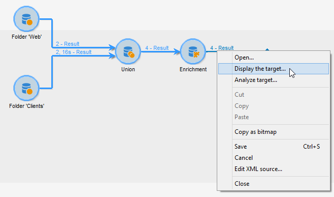
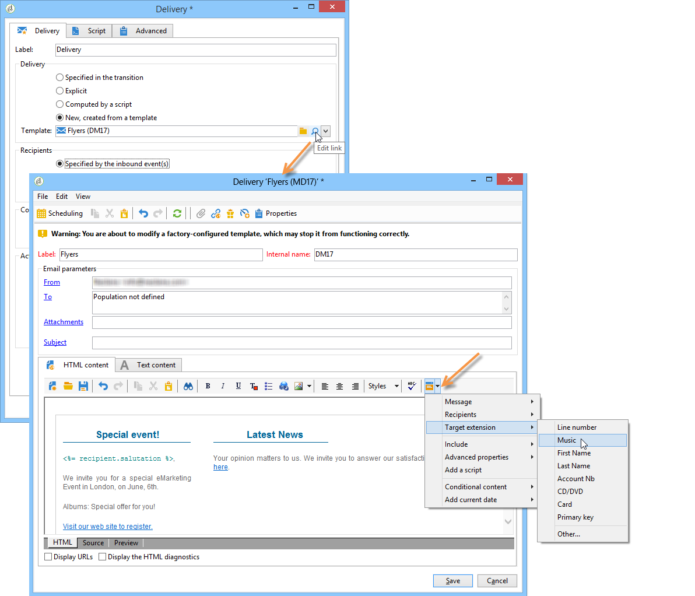
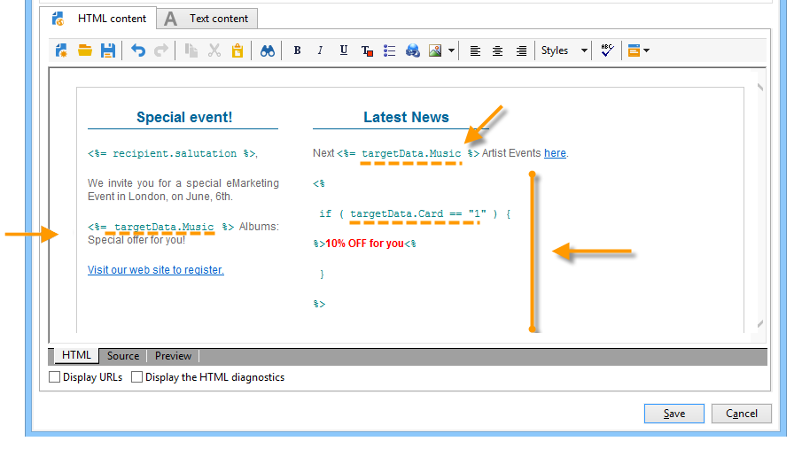

# 워크플로우 실행{#executing-a-workflow}

워크플로우 실행과 관련된 문제 해결 지침은 [이 섹션에서](../../production/using/workflow-execution.md)사용할 수 있습니다.

## 워크플로우 시작 {#starting-a-workflow}

워크플로우는 항상 수동으로 시작됩니다. 시작할 때 스케줄러(스케줄러 참조) 또는 활동 예약을 통해 지정된 정보에 따라 비활성 상태로 [유지될](../../workflow/using/scheduler.md)수 있습니다.

타깃팅 워크플로우 실행과 관련된 작업(시작, 중지, 일시 중지 등) 은(는) **비동기** 프로세스입니다.주문은 기록되며 서버가 해당 주문을 적용하는 즉시 효력을 발휘합니다.

도구 모음에서 워크플로우 실행을 시작하고 추적할 수 있습니다.

메뉴 및 마우스 오른쪽 단추 클릭 메뉴에서 사용할 수 있는 옵션 목록은 아래에 자세히 설명되어 있습니다. **[!UICONTROL Actions]**

### 작업 도구 모음 {#actions-toolbar}

도구 모음 단추는 이 [섹션에](../../campaign/using/marketing-campaign-deliveries.md#building-the-main-target-in-a-workflow)자세히 설명되어 있습니다. 이 **[!UICONTROL Actions]** 단추를 사용하면 선택한 워크플로우에서 작업을 수행하기 위한 추가 실행 옵션을 이용할 수 있습니다. 메뉴를 사용하거나 **[!UICONTROL File > Actions]** 워크플로우를 마우스 오른쪽 버튼으로 클릭하고 선택할 수도 **[!UICONTROL Actions]**&#x200B;있습니다.


* **[!UICONTROL Start]**

   이 작업을 사용하면 워크플로우의 실행을 시작할 수 있습니다.완료, 편집 ****&#x200B;중 **또는** 일시 중지된 **워크플로우는** StartedContesting **상태로**&#x200B;변경됩니다. 그런 다음 워크플로우 엔진이 이 워크플로우의 실행을 처리합니다. 워크플로가 일시 중지된 경우 다시 시작되며, 다시 시작되는 경우 워크플로우가 시작되고 초기 활동이 활성화됩니다.

   시작하는 것은 비동기 프로세스입니다.요청이 저장되고 워크플로 서버에서 가능한 한 빨리 처리됩니다.

* **[!UICONTROL Pause]**

   이 작업을 수행하면 워크플로우의 상태가 일시 **중지됨으로 설정됩니다**. 워크플로가 다시 시작될 때까지 활동이 활성화되지 않습니다.그러나 진행 중인 작업이 일시 중지되지 않습니다.

* **[!UICONTROL Stop]**

   이 작업은 현재 실행 중인 워크플로우를 중지합니다. 인스턴스의 상태는 [마침]으로 **설정됩니다**. 진행 중인 작업이 가능한 경우 중지됩니다. 가져오기 및 SQL 쿼리는 즉시 취소됩니다.

   정지는 비동기 프로세스입니다. 요청이 등록되면 워크플로 서버나 서버가 진행 중인 작업을 취소합니다. 따라서 워크플로우 인스턴스를 중지하면 시간이 걸릴 수 있습니다. 특히 워크플로우가 여러 서버에서 실행 중인 경우 각 서버에서 제어하여 진행 중인 작업을 취소해야 합니다.

* **[!UICONTROL Restart]**

   이 작업이 중지되면 워크플로우가 다시 시작됩니다. 대부분의 경우 다시 시작할 수 있습니다. 또한 정지에 일정 시간이 걸릴 때 다시 시작을 자동화하는 것도 유용합니다.워크플로가 중지될 때 &#39;중지&#39; 명령을 사용할 수 없기 때문입니다.

   도구 모음의 실행 아이콘을 통해 작업을 사용할 수도 **[!UICONTROL Start / Pause / Stop / Restart]** 있습니다. For more on this, refer to this [section](../../campaign/using/marketing-campaign-deliveries.md#creating-a-targeting-workflow).

* **[!UICONTROL Purge history]**

   이 작업을 통해 워크플로우 내역을 삭제할 수 있습니다. 자세한 내용은 로그 제거를 [참조하십시오](../../workflow/using/monitoring-workflow-execution.md#purging-the-logs).

* **[!UICONTROL Start in simulation mode]**

   이 옵션을 사용하면 실제 모드와 달리 시뮬레이션 모드에서 워크플로우를 시작할 수 있습니다. 즉, 이 모드를 활성화하면 데이터베이스나 파일 시스템에 영향을 주지 않는 활동만 실행됩니다(예: **[!UICONTROL Query]**&#x200B;등) **[!UICONTROL Union]****[!UICONTROL Intersection]**. 영향을 주는 활동(예: **[!UICONTROL Export]****[!UICONTROL Import]**&#x200B;등) 이후(동일한 분기)와 마찬가지로 실행되지 않습니다.

* **[!UICONTROL Execute pending tasks now]**

   이 작업을 사용하면 모든 보류 중인 작업을 가능한 한 빨리 시작할 수 있습니다. 특정 작업을 시작하려면 해당 활동을 마우스 오른쪽 단추로 클릭하고 **[!UICONTROL Execute pending task(s) now]**&#x200B;선택합니다.

* **[!UICONTROL Unconditional stop]**

   이 옵션은 워크플로우 상태를 로 변경합니다 **[!UICONTROL Finished]**. 이 작업은 몇 분 후 일반 정지 프로세스가 실패하는 경우에만 마지막 수단으로 사용해야 합니다. 진행 중인 실제 워크플로 작업이 없는 경우에만 무조건적인 중지를 사용하십시오.

   >[!CAUTION]
   >
   >이 옵션은 전문가 사용자용으로 예약되어 있습니다.

* **[!UICONTROL Save as template]**

   이 작업을 수행하면 선택한 워크플로우를 기반으로 새 워크플로우 템플릿이 만들어집니다. 저장할 폴더를 **[!UICONTROL Folder]** 필드에 지정해야 합니다.

   및 **[!UICONTROL Mass update of selected lines]** 옵션은 모든 **[!UICONTROL Merge selected lines]** **[!UICONTROL Actions]** 메뉴에서 사용할 수 있는 일반 플랫폼 옵션입니다. For more on this, refer to this [section](../../platform/using/updating-data.md).

### 마우스 오른쪽 단추 클릭 메뉴 {#right-click-menu}

하나 이상의 워크플로우 활동을 선택한 경우 마우스 오른쪽 버튼을 클릭하여 선택한 내용에 따라 작업을 수행할 수 있습니다.


마우스 오른쪽 단추 클릭 메뉴에서 다음 옵션을 사용할 수 있습니다.

**[!UICONTROL Open]**:이 옵션을 사용하면 활동 속성에 액세스할 수 있습니다.

**[!UICONTROL Display logs:]** 이 옵션을 사용하면 선택한 활동에 대한 작업 실행 로그를 볼 수 있습니다. 로그 [표시를](../../workflow/using/monitoring-workflow-execution.md#displaying-logs)참조하십시오.

**[!UICONTROL Execute pending task(s) now:]** 이 작업을 사용하면 가능한 한 빨리 보류 중인 작업을 시작할 수 있습니다.

**[!UICONTROL Workflow restart from a task:]** 이 옵션을 사용하면 이전에 이 활동에 대해 저장한 결과를 사용하여 워크플로우를 다시 시작할 수 있습니다.

**[!UICONTROL Cut/Copy/Paste/Delete:]** 이러한 옵션을 사용하면 활동을 잘라내거나 복사, 붙여넣기 및 삭제할 수 있습니다.

**[!UICONTROL Copy as bitmap:]** 이 옵션을 사용하면 모든 활동의 스크린샷을 만들 수 있습니다.

**[!UICONTROL Normal execution / Enable but do not execute / Do not enable:]** 이러한 옵션은 활동 속성의 **[!UICONTROL Advanced]** 탭에서도 사용할 수 있습니다. 이 내용은 실행에 [자세히 설명되어 있습니다](../../workflow/using/advanced-parameters.md#execution).

**[!UICONTROL Save / Cancel:]** 워크플로우 변경 사항을 저장하거나 취소할 수 있습니다.

>[!NOTE]
>
>활동 그룹을 선택하고 이러한 명령 중 하나를 적용할 수 있습니다.

마우스 오른쪽 단추 클릭 메뉴는 이 [섹션에도](../../campaign/using/marketing-campaign-deliveries.md#executing-a-workflow)자세히 설명되어 있습니다.

## 워크플로우 라이프 사이클 {#workflow-life-cycle}

워크플로우 주기에 세 가지 주요 단계가 있습니다.

* **편집 중**

   이는 초기 디자인 단계입니다.새 워크플로우가 만들어지면 해당 상태는 &#39;편집 중&#39;입니다. 워크플로우는 서버에서 아직 처리되지 않으며 위험 없이 수정할 수 있습니다.

* **시작됨**

   초기 디자인 단계가 완료되면 워크플로우를 시작할 수 있습니다. 이 단계에서는 인스턴스가 서버에 의해 처리되고 개별 작업이 실행됩니다. 특정 사전 예방 조치로 워크플로우를 수정할 수 있습니다.

* **완료**

   진행 중인 작업이 더 이상 없거나 연산자가 명시적으로 인스턴스를 중지한 경우 워크플로가 &#39;완료&#39;입니다.

예를 들어, 시작 및 **배달** **활동은** 아래 작업대에서 승인 **활동이** 깜박이는 동안요약되어 있습니다.


즉, 처음 두 활동이 성공적으로 실행되었으며 승인이 진행 중임을 의미합니다(예: 생성되었지만 아직 완료되지 않음).

배달 **활동 다음의 전환 위에 표시된 문자** 574 -Ok는 **** 배달 준비가 받는 사람 574명을 대상으로 수행되었으며 작업이 성공적으로 완료되었음을 의미합니다. 이 정보는 전환 실행 시 전환에 추가되며 데이터를 처리하는 활동에 의해 계산됩니다.

워크플로우가 시작되어 승인 활동에 지정된 그룹에 속하는 **운영자가** 결정을 내릴 때까지 기다리는 중입니다. 해당 그룹에 속한 운영자에게 이메일 주소 또는 모바일 전화 번호를 알려 줍니다.

연산자 관리는 이 [섹션에](../../platform/using/access-management.md)자세히 설명되어 있습니다.

워크플로우를 모니터링하는 방법에 대한 자세한 내용은 [이 섹션을](../../workflow/using/monitoring-workflow-execution.md)참조하십시오.

## 데이터 라이프사이클 {#data-life-cycle}

### 작업 테이블 {#work-table}

워크플로우에서 한 활동에서 다른 활동으로 전송된 데이터는 임시 작업 테이블에 저장됩니다.

해당 전환을 마우스 오른쪽 단추로 클릭하여 이 데이터를 표시하고 분석할 수 있습니다.



이렇게 하려면 관련 메뉴를 선택합니다.

* 대상 표시

   이 메뉴는 대상 모집단 및 작업 테이블 구조(**[!UICONTROL Schema]** 탭)에 사용 가능한 데이터를 표시합니다.

   

   자세한 내용은 작업 테이블 및 [워크플로우 스키마를](../../workflow/using/monitoring-workflow-execution.md#worktables-and-workflow-schema)참조하십시오.

* 대상 분석

   이 메뉴를 사용하면 전환 데이터에 대한 통계 및 보고서를 생성할 수 있는 설명 분석 마법사에 액세스할 수 있습니다.

   For more on this, refer to this [section](../../reporting/using/using-the-descriptive-analysis-wizard.md).

워크플로우가 실행되면 대상 데이터가 삭제됩니다. 마지막 작업 테이블만 액세스할 수 있습니다. 모든 작업 테이블에 액세스할 수 있도록 워크플로우를 구성할 수 있습니다.workflow 속성에서 옵션을 선택합니다 **[!UICONTROL Keep the result of interim populations between two executions]** .

하지만 많은 양의 데이터가 있는 경우 이 옵션을 활성화하지 않는 것이 좋습니다.


### 타겟 데이터 {#target-data}

워크플로우의 작업 표에 저장된 데이터는 개인화 필드에서 액세스할 수 있습니다.

이렇게 하면 목록을 통해 수집한 데이터 또는 배달에서 설문 조사에 대한 답변을 기반으로 데이터를 사용할 수 있습니다. 이렇게 하려면 다음 구문을 사용합니다.

```
%= targetData.FIELD %
```

**[!UICONTROL Target extension]** (targetData) 유형 개인화 요소는 타깃팅 워크플로우에 사용할 수 없습니다. 전달 대상을 워크플로우에서 작성하고 배달 인바운드 전환에서 지정해야 합니다.

전달 증명 자료를 만들려면 개인화 데이터를 입력할 수 있도록 **[!UICONTROL Address substitution]** 모드를 기반으로 증명 타겟을 구축해야 합니다. For more on this, refer to this [section](../../delivery/using/steps-defining-the-target-population.md#using-address-substitution-in-proof).

다음 예에서는 고객 정보 목록을 수집하여 개인화된 이메일에 사용됩니다.

다음 단계를 적용합니다.

1. 워크플로우를 만들어 정보를 수집하고, 데이터베이스에 이미 있는 데이터와 대조한 다음, 배달을 시작합니다.

   

   이 예에서는 파일 컨텐츠가 다음과 같습니다.

   ```
   Music,First name,Last name,Account,CD/DVD,Card
   Pop,David,BLAIR,4323,CD,0
   Rock,Daniel,ARCARI,3222,DVD,1
   Disco,Uma,ALTON,0488,DVD,0
   Jazz,Paul,BOLES,6475,CD,1
   Jazz,David,BOUKHARI,0841,DVD,1
   [...]
   ```

   파일을 로드하려면 다음 단계를 적용합니다.

   

1. 수집된 데이터를 이미 Adobe Campaign 데이터베이스에 있는 데이터와 대사하도록 **[!UICONTROL Enrichment]** 유형 활동을 구성합니다.

   여기에서 조정 키는 계정 번호입니다.

   

1. 그런 다음 **[!UICONTROL Delivery]**&#x200B;다음을 구성합니다.템플릿은 템플릿을 기반으로 생성되며 수신자는 인바운드 전환으로 지정됩니다.

   

   >[!CAUTION]
   >
   >전환에 포함된 데이터만 전달을 개인화하는 데 사용할 수 있습니다. **targetData** 유형 개인화 필드는 **[!UICONTROL Delivery]** 활동의 인바운드 모집에만 사용할 수 있습니다.

1. 배달 템플릿에서 워크플로우에서 수집한 필드를 사용합니다.

   이렇게 하려면 **[!UICONTROL Target extension]** 유형 개인화 필드를 삽입합니다.

   

   워크플로우에서 수집한 파일에 명시된 대로 고객이 가장 좋아하는 음악 장르와 미디어 유형(CD 또는 DVD)을 삽입하려고 합니다.

   게다가, &#39;카드&#39; 값이 1인 수신자와 같은 충성도 카드 소지자를 위한 쿠폰을 추가할 예정입니다.

   

   **[!UICONTROL Target extension]** (targetData) 유형 데이터는 모든 개인화 필드와 동일한 특성을 사용하여 게재에 삽입됩니다. 제목, 링크 레이블 또는 링크 자체에도 사용할 수 있습니다.

   수집된 수신자에게 전송되는 메시지에는 다음 데이터가 포함됩니다.

   

## 승인 정의 {#defining-approvals}

승인 기능을 사용하면 운영자가 워크플로우를 제어하는 의사 결정을 내릴 수 있고 지속적인 실행을 확인할 수 있습니다.

메시지는 연산자 그룹에 전송되며 워크플로우는 다시 시작하기 전에 응답을 기다립니다. 워크플로우가 중지되지 않고 다른 작업이 수행될 수 있습니다. 예를 들어 여러 개의 동시 승인이 보류 중일 수 있습니다.

승인에는 연산자가 선택할 수 있는 여러 옵션이 포함될 수 있습니다. 하지만 타깃팅 수행과 같이 수행자에게 수행할 작업을 제출하려면 선택 항목 수를 1로 제한할 수 있습니다. 그런 다음 작업이 수행되면(그런 다음 다시 시작) 연산자가 응답할 수 있습니다. 다음 예에서는 이러한 유형의 승인을 보여 줍니다.


수술에서는 승인이 필요한 모든 단계는 동일한 원칙에 근거한다.


승인 예는 이 [섹션에](../../campaign/using/marketing-campaign-approval.md#checking-and-approving-deliveries)있습니다.

연산자는 다음 두 가지 방법 중 하나로 응답할 수 있습니다.이메일 메시지 또는 콘솔을 통해 링크된 웹 페이지를 사용하여 유효성을 확인합니다.

>[!NOTE]
>
>응답이 저장되면 수정되지 않을 수 있습니다.

### 이메일 보내기 {#sending-emails}

응답할 수 있는 웹 페이지에 대한 링크가 포함된 승인 메시지를 받을 수 있습니다. 대상 운영자가 승인 이메일을 받으려면 운영자 이메일 주소가 완료되어야 합니다. 이 경우 연산자는 콘솔을 사용하여 응답해야 합니다

연산자 관리는 이 [섹션에](../../platform/using/access-management.md)자세히 설명되어 있습니다.

승인 이메일은 지속적으로 전송됩니다. 기본 배달 템플릿은 **[!UICONTROL notifyAssignee]**&#x200B;다음과 같습니다.이 폴더는 **[!UICONTROL Administration > Campaign management > Technical delivery templates]** 폴더에 저장됩니다. 이 시나리오는 사용자 정의할 수 있으며, 사본을 만들고 각 활동에 대한 템플릿을 변경하는 것도 좋습니다.

이 템플릿을 통해 생성된 배달은 **[!UICONTROL Administration > Production > Objects created automatically > Technical deliveries > Workflow notifications]** 폴더에 저장됩니다.

### 콘솔을 통한 승인 {#approval-via-the-console}

작업에서 승인할 요소는 캠페인 대시보드에 표시됩니다.

기술 워크플로우의 경우 사용자가 승인할 수 있는 작업은 **[!UICONTROL Administration > Production > Objects created automatically > Pending approvals]** 폴더의 트리 구조에서 액세스할 수 있습니다.


### 그룹 {#groups}

필터링 조건을 통해 선택한 연산자 그룹, 단일 연산자 또는 연산자 집합에 승인이 할당됩니다.

1. 가장 간단한 승인 양식을 위해 연산자가 응답하는 즉시 작업이 완료됩니다. 응답하려는 다른 운영자에게는 이미 응답한 것으로 통보됩니다.
1. 여러 승인이 필요하면 복수 승인을 [참조하십시오](#multiple-approval).

승인 연산자 그룹은 지정된 개인이 아닌 역할 또는 기능으로 지정되어야 합니다. 예를 들어 &quot;Harry&#39;s group&quot;보다 &quot;Campaign budget&quot; 그룹이 더 선호됩니다. 한 그룹에 작업을 승인할 수 있는 사람이 두 명 이상 있는 것이 좋습니다. 이렇게, 한 명이 결석하면 다른 사람이 응답할 수 있습니다.

### 만료 {#expirations}

만료는 다양한 활동 유형, 특히 승인과 관련하여 사용되는 특정 전환입니다. 만료는 응답이 없을 때 지정된 시간 경과 후 작업을 트리거하거나 워크플로우를 계속 진행할 때(예: 다른 그룹에 승인 할당) 사용할 수 있습니다.

활동 승인 속성의 두 번째 탭에서는 하나 이상의 만료를 정의할 수 있습니다. 여러 만료 유형을 정의할 수 있습니다.


새 만료일을 추가하려면 을 클릭합니다 **[!UICONTROL Add]**. 전환이 생성된 각 만료에 추가됩니다. 다음 작업을 수행할 수 있습니다.

* 목록에서 셀을 클릭하거나 F2를 눌러 일반적인 매개변수를 직접 수정합니다.
* 또는 **[!UICONTROL Detail...]** 단추를 클릭하여 표현식을 편집합니다.

>[!NOTE]
>
>연대순으로 처리되므로 만료에 대한 순서를 지정할 필요는 없습니다.

이 **[!UICONTROL Do not terminate the task]** 옵션은 지연이 초과될 때 승인을 활성화합니다. 이 모드에서는 승인을 활성화한 상태에서 미리 알림을 관리할 수 있습니다.연산자는 여전히 응답할 수 있습니다. 이 옵션은 기본적으로 비활성화되어 있으므로 작업이 만료 시 완료되는 것으로 간주되며 연산자가 더 이상 응답하지 않을 수 있습니다.

다음 네 가지 유형의 만료를 만들 수 있습니다.

* **작업 시작**&#x200B;후 지연:만료는 승인이 활성화된 날짜에 지정된 기간을 추가하여 계산됩니다.
* **지정된 날짜**&#x200B;이후 지연:만료는 지정한 날짜에 기간을 추가하여 계산됩니다.
* **지정된 날짜**&#x200B;전의 지연:만료는 지정한 날짜에서 기간을 빼서 계산됩니다.
* **스크립트로**&#x200B;계산된 만료:만료는 JavaScript를 사용하여 계산됩니다.

   다음 예에서는 배달을 시작한 날짜( **vars.deliveryId로 식별됨)보다 24시간 전에 만료를 계산합니다**.

   ```
   var delivery = nms.delivery.get(vars.deliveryId)
   var expiration = delivery.scheduling.contactDate
   var oneDay = 1000*60*60*24
   expiration.setTime(expiration.getTime() - oneDay)
   return expiration
   ```

### 다중 승인 {#multiple-approval}

다중 승인은 모든 승인 연산자가 응답할 수 있는 메커니즘입니다. 각 응답에 대해 전환이 활성화됩니다.

투표 또는 설문 조사 메커니즘에 대해 복수 승인은 유용합니다. 지정된 기간 후에 최종 기한을 추가하여 답변을 계산하고 결과를 처리할 수 있습니다.

### 필수 권한 {#required-rights}

승인 요청에 응답하려면 그룹의 연산자에 다음 권한이 있어야 합니다.

* 워크플로우에 대한 쓰기 권한
* 승인할 작업이 들어 있는 폴더에 대한 읽기 및 쓰기 권한

&#39;워크플로우 실행&#39; 그룹에는 이러한 권한이 있습니다. 이 그룹에 추가된 연산자는 승인 요청에 응답할 권한이 있습니다.

## 아키텍처 {#architecture}

워크플로우는 특정 모듈에 의해 처리됩니다. 이 모듈은 처리 로드를 공유하기 위해 여러 서버에서 시작할 수 있습니다.


* &#39;Workflow Instance Runner&#39;(runwf) 프로세스는 지정된 워크플로 인스턴스의 모든 작업을 실행합니다. 당분간은 실행할 작업이 없으면 &#39;수동&#39;이 되므로 데이터베이스의 상태를 저장한 다음 중지합니다.
* &#39;Workflow Server&#39;(wfserver) 모듈은 현재 워크플로 인스턴스를 모니터링합니다. 수행할 작업이 있으면 이 모듈은 해당 인스턴스를 활성화(또는 재활성화)하는 프로세스를 만듭니다.

연산자가 워크플로우(시작, 중지, 일시 중지 등)에서 작업을 수행하는 경우 작업은 &#39;nlserver&#39; 모듈에 의해 바로 실행되지 않고, 대신 작업 흐름 모듈에서 처리하도록 대기열에 배치됩니다.
