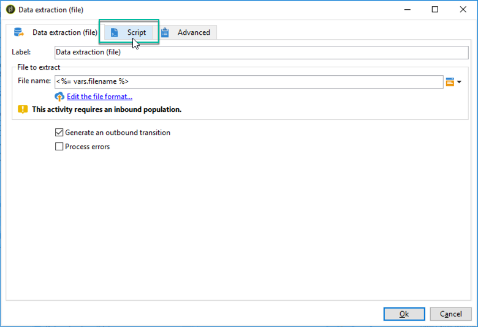

# 데이터 추출(파일){#extraction-file}

활동을 사용하여 외부 파일의 워크플로우 테이블에서 데이터를 추출할 수 **[!UICONTROL Data extraction (file)]** 있습니다.

>[!CAUTION]
>
>이 활동에는 추출할 데이터가 들어 있는 인바운드 전환이 항상 있어야 합니다.

데이터 추출을 구성하려면 다음 단계를 적용합니다.

1. 출력 파일의 이름을 지정합니다. 이 이름에는 필드 오른쪽의 개인화 단추를 통해 삽입된 변수가 포함될 수 있습니다.
1. 추출할 데이터 **[!UICONTROL Edit the file format...]** 를 선택하려면 을 클릭합니다.

   

   이 **[!UICONTROL Handle groupings (GROUP BY + HAVING)]** 옵션은 합산된 최종 결과를 필터링하는 추가 단계를 추가합니다. 예를 들어 지정된 구매 발주 유형, 10회 이상 주문을 한 고객 등이 여기에 해당합니다.

1. 필요한 경우 출력 파일에 컴퓨팅 또는 처리 결과와 같은 새 열을 추가할 수 있습니다. 이렇게 하려면 **[!UICONTROL Add]** 아이콘을 클릭합니다.

   

   추가 라인에서 아이콘을 클릭하여 새 열의 컨텐츠를 **[!UICONTROL Edit expression]** 정의합니다.

   

   그런 다음 선택 창에 액세스합니다. 데이터 **[!UICONTROL Advanced selection]** 에 적용할 프로세스를 선택하려면 을 클릭합니다.

   

   목록에서 원하는 공식을 선택합니다.

   

데이터 추출 중에 실행될 포스트 프로세스를 정의하여 파일을 압축하거나 암호화할 수 있습니다. 이렇게 하려면 활동 **[!UICONTROL Script]** 탭에 원하는 명령을 추가해야 합니다.

자세한 내용은 다음 섹션을 참조하십시오. [파일](../../workflow/using/how-to-use-workflow-data.md#zipping-or-encrypting-a-file)압축 또는 암호화

## 집계 함수 목록 {#list-of-aggregate-functions}

다음은 사용 가능한 집계 함수 목록입니다.

* **[!UICONTROL Count]** 중복 값(집계된 필드의 값)을 포함하여, 합산될 필드의 null이 아닌 모든 값을 계산하려면,

   **[!UICONTROL Distinct]** 을 클릭하여 합산할 필드의 서로 다른 값과 null이 아닌 값의 총 개수를 계산합니다(중복 값은 계산 전에 제외됨).

* **[!UICONTROL Sum]** 숫자 필드의 값 합계를 계산하려면
* **[!UICONTROL Minimum value]** 필드의 최소 값(숫자 또는 기타)을 계산하려면
* **[!UICONTROL Maximum value]** 필드의 최대 값(숫자 또는 기타)을 계산하려면
* **[!UICONTROL Average]** 숫자 필드의 값의 평균을 계산하기 위해.

