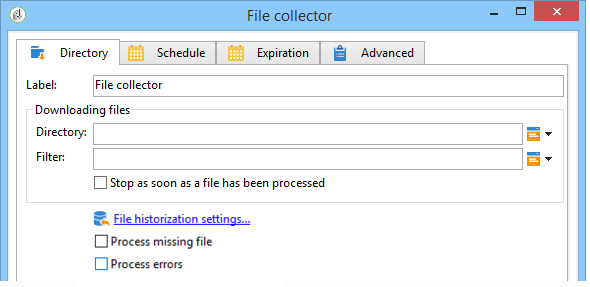

# 파일 수집 툴{#file-collector}

The **File collector** monitors the arrival of one or more files in a directory and activates its transition for each file received. For each event, a **[!UICONTROL filename]** variable contains the full name of the file received. 수집된 파일은 보관을 위해 다른 디렉터리로 이동되며 한 번만 카운트됩니다.

기본적으로 파일 수집기는 일정에 의해 지정된 시간에 파일의 존재를 테스트하는 지속적인 작업입니다.

파일은 이 워크플로를 담당하는 wfserver 모듈이 실행되는 서버에 있어야 합니다. 단일 인스턴스에 여러 개의 wfserver 모듈이 배포되는 경우 이러한 파일을 사용하는 활동의 관련성 또는 워크플로우의 전체적인 관련성을 지정해야 합니다.

## Properties {#properties}

활동의 첫 번째 탭에서는 **[!UICONTROL File collector]** 소스 디렉토리를 선택하고 필요한 경우 수집된 파일을 필터링할 수 있습니다. 다른 탭은 [인바운드 이메일](../../workflow/using/inbound-emails.md) (**[!UICONTROL Schedule]** 및 **[!UICONTROL Expiry]** 탭)에 자세히 설명되어 있습니다.

1. **파일 다운로드**

   * **[!UICONTROL Directory]**

      다운로드할 파일이 들어 있는 디렉터리. 이 디렉토리는 서버에 미리 만들어야 합니다. 존재하지 않으면 오류가 발생합니다.

   * **[!UICONTROL Filter]**

      이 필터와 일치하는 파일만 고려됩니다. 디렉토리의 다른 파일은 무시됩니다. 필터가 비어 있으면 디렉토리의 모든 파일이 고려됩니다. 필터 예: ***.zip**, **import-*.txt**.

   * **[!UICONTROL Stop as soon as a file has been processed]**

      이 옵션을 활성화하면 첫 번째 파일의 수신 후에 작업이 종료됩니다. 디렉토리에 필터에 해당하는 여러 파일이 있을 경우 하나만 고려됩니다. 이 옵션을 사용하면 하나의 이벤트만 전송됩니다. 고려되는 파일은 목록의 첫 번째 알파벳순입니다.

      예약되지 않은 작업의 경우, 지정된 디렉토리에서 필터와 일치하는 파일이 없으면 **[!UICONTROL Process file nonexistence]** 옵션이 활성화되지 않으면 오류가 발생합니다.

   * **[!UICONTROL Execution schedule]**

      탭의 매개 변수를 통해 파일 현재 상태 확인 빈도를 **[!UICONTROL Schedule]** 결정합니다.

1. **오류 처리**

   다음 두 옵션을 사용할 수 있습니다.

   * **[!UICONTROL Process file nonexistence]**

      이 옵션은 지정한 디렉토리에서 필터와 일치하는 파일이 없을 때마다 특수 전환을 시작합니다.

      작업이 예약되지 않은 경우 이 전환은 한 번만 활성화됩니다.

   * **[!UICONTROL Processing errors]**

      이 옵션을 사용하면 특수 전환이 나타나며 오류가 발생하는 경우 활성화됩니다. 이 경우 워크플로우는 오류 상태로 변경되지 않고 실행을 계속합니다

      파일 시스템 오류(파일을 이동할 수 없음, 디렉터리에 액세스할 수 없음 등)를 고려한 오류입니다.

      이 옵션은 활동 구성과 관련된 오류(예: 잘못된 값)를 처리하지 않습니다.

1. **역사화**

   다음 **[!UICONTROL File historization]** 단계를 참조하십시오. [웹 다운로드](../../workflow/using/web-download.md).

파일 처리 순서를 확인할 수 없습니다. 일련의 파일을 순차적으로 처리하려면 옵션을 사용하여 루프를 **[!UICONTROL Stop as soon as a file has been processed]** 만듭니다. 이 경우 파일은 알파벳 순서로 처리됩니다. 이 **[!UICONTROL Process file nonexistence]** 옵션을 사용하면 반복을 완료할 수 있습니다.

## 출력 매개 변수 {#output-parameters}

* 파일: 전체 파일 이름. 기록 디렉토리로 이동한 후의 파일 이름입니다. 경로가 다르기 때문에 이름이 같은 파일이 이미 디렉터리에 있는 경우에도 이름이 다릅니다. 내선 번호는 유지된다.
