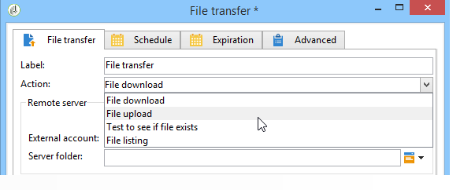

# 파일 전송{#file-transfer}

파일 **전송** 작업을 사용하면 파일을 수신하거나 보내고, 파일이 있는지 테스트하거나, 서버에 파일을 나열할 수 있습니다. 사용되는 프로토콜은 Amazon Simple Storage Service(S3), FTP 또는 SFTP입니다.
S3 또는 SFTP 연결을 사용하면 Adobe 실시간 고객 데이터 플랫폼을 통해 세그먼트 데이터를 Adobe Campaign으로 가져올 수도 있습니다. 자세한 내용은 이 [문서를](https://docs.adobe.com/content/help/en/experience-platform/rtcdp/destinations/destinations-cat/adobe-destinations/adobe-campaign-destination.html)참조하십시오.

## 속성 {#properties}

필드의 드롭다운 목록을 사용하여 **[!UICONTROL Action]** 활동의 작업을 선택합니다.

구성은 선택한 작업에 따라 달라집니다.

1. **파일 받기**

   원격 서버에 저장된 파일을 받으려면 **[!UICONTROL File download]****[!UICONTROL Action]** 필드에서 선택합니다. 관련 필드에 URL을 지정해야 합니다.

   

   트리의 **[!UICONTROL Use an external account]** **[!UICONTROL Administration > Platform > External accounts]** 노드에 구성된 S3, FTP 또는 SFTP 계정에서 계정을 선택하려면 선택합니다. 그런 다음 서버에 다운로드할 파일이 포함된 디렉토리를 지정합니다.

   

1. **파일 전송**

   파일을 서버로 전송하려면 **[!UICONTROL File upload]** 필드에서 **[!UICONTROL Action]** 선택합니다. 편집기의 **[!UICONTROL Remote server]** 섹션에서 대상 서버를 지정해야 합니다. 매개 변수는 인바운드 파일과 동일합니다. 위의 내용을 참조하십시오.

   소스 파일은 이전 활동에서 가져올 수 있습니다. 이 경우 옵션을 선택해야 **[!UICONTROL Use the file generated by the previous activity]** 합니다.

   

   하나 이상의 다른 파일에도 문제가 있을 수 있습니다. 이 옵션을 선택하려면 옵션의 선택을 취소한 다음 을 클릭합니다 **[!UICONTROL Insert]**. 전송할 파일의 액세스 경로를 지정합니다. 다른 파일을 추가하려면 **[!UICONTROL Insert]** 다시 클릭합니다. 이제 각 파일에 자체 탭이 있습니다.

   

   화살표를 사용하여 탭의 순서를 변경합니다. 이는 파일이 서버로 전송되는 순서와 관련이 있습니다.

   이 **[!UICONTROL Keep history of files sent]** 옵션을 사용하면 전송된 파일을 추적할 수 있습니다. 이 내역은 디렉토리에서 액세스할 수 있습니다.

1. **파일이 있는지 확인하기 위한 테스트**

   파일이 있는지 테스트하려면 **[!UICONTROL Test to see if file exists]** 필드에서 **[!UICONTROL Action]** 옵션을 선택합니다. 원격 서버의 구성은 파일 다운로드와 동일합니다. 자세한 내용은 이 [섹션을](#properties)참조하십시오.

   

1. **파일 목록**

   파일을 나열하려면 **[!UICONTROL File listing]** **[!UICONTROL Action]** 필드에서 옵션을 선택합니다. 원격 서버의 구성은 파일 수신과 동일합니다. 자세한 내용은 이 [섹션을](#properties)참조하십시오.

   작업을 선택할 때 사용할 수 있는 **[!UICONTROL List all files]** 옵션을 사용하면 이벤트 변수 **[!UICONTROL File listing]** vars.filenames **에 있는 모든 파일을 저장할 수 있습니다. 이벤트 변수에는 파일 이름이** `\n` 문자로 구분되어 있습니다.

모든 파일 전송 옵션에는 다음 두 가지 옵션이 있습니다.

* 이 **[!UICONTROL Process missing file]** 옵션은 지정된 디렉토리에 파일이 없을 경우 활성화되는 전환을 추가합니다.
* 이 **[!UICONTROL Process errors]** 옵션은 처리 [오류에](../../workflow/using/monitoring-workflow-execution.md#processing-errors)자세히 설명되어 있습니다.

이 **[!UICONTROL Advanced parameters...]** 링크를 통해 다음 옵션에 액세스할 수 있습니다.

* **[!UICONTROL Delete the source files after transfer]**

   원격 서버의 파일을 지웁니다.

* **[!UICONTROL Use SSL]**

   파일을 전송하는 동안 SSL 프로토콜을 통해 보안 연결을 사용할 수 있습니다.

* **[!UICONTROL Display the session logs]**

   S3, FTP 또는 SFTP 전송의 로그를 복구하여 워크플로우 로그에 포함할 수 있습니다.

* **[!UICONTROL Disable passive mode]**

   데이터 전송에 사용할 연결 포트를 지정할 수 있습니다.

이 **[!UICONTROL File historization settings...]** 링크는 웹 다운로드 [(](../../workflow/using/web-download.md)**[!UICONTROL File historization]** 단계)에 자세히 설명된 옵션에 액세스할 수 있도록 해줍니다.

## 입력 매개 변수 {#input-parameters}

* 파일

   보낸 파일의 전체 이름입니다.

## 출력 매개 변수 {#output-parameters}

* 파일

   옵션을 선택한 경우 받은 파일의 전체 **[!UICONTROL Use the file generated by the previous activity]** 이름입니다.

