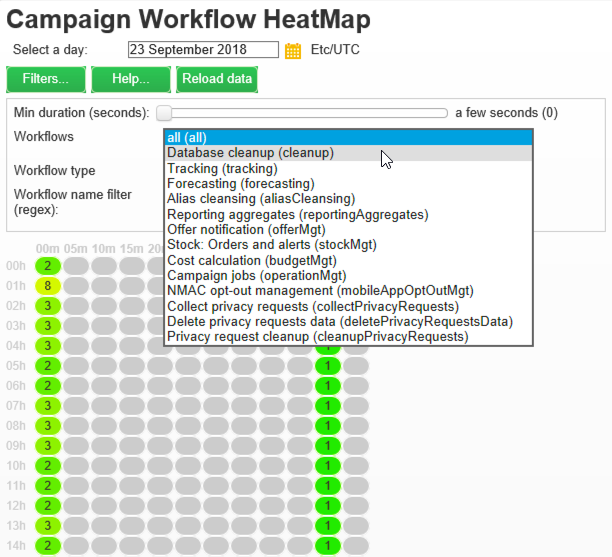

# 워크플로우 열 지도 {#workflow-heatmap}

Adobe Campaign 워크플로우 HeatMap은 현재 실행 중인 모든 워크플로우를 색상으로 구분된 그래픽으로 표시합니다. 인스턴스 관리자만 사용할 수 있습니다.

다양한 캠페인 프로세스를 모니터링하는 추가 방법이 [이 페이지에 나와 있습니다](../../production/using/monitoring-guidelines.md).

## 워크플로우 HeatMap 정보 {#about-the-workflow-heatmap}

Workflow HeatMap은 동시 워크플로우 수에 대한 빠른 개요를 제공함으로써 Adobe Campaign 플랫폼 관리자가 인스턴스의 로드를 모니터링하고 그에 따라 워크플로우를 계획할 수 있도록 합니다.

보다 정확하게 플랫폼 관리자는 다음을 수행할 수 있습니다.

* 동시 실행 워크플로우 보기 및 이해
* 기간별로 워크플로우를 필터링하여 문제가 발생할 수 있는 워크플로우 확인
* 기간별로 활동을 필터링하여 문제가 발생할 수 있는 활동을 확인합니다.
* 개별 워크플로우 및 모든 관련 활동(해당 기간 포함)을 손쉽게 검색
* 워크플로우 유형별로 검색([기술 워크플로우](../../workflow/using/building-a-workflow.md#technical-workflows) 또는 [캠페인 워크플로우](../../workflow/using/building-a-workflow.md#campaign-workflows))
* 분석할 특정 워크플로우 검색

>[!NOTE]
>
>워크플로우 **히트맵**&#x200B;외에도 워크플로우 세트의 상태를 모니터링하고 반복적인 메시지를 감독자에게 전송할 수 있는 워크플로우를 만들 수 있습니다. For more on this, refer to the [dedicated section](../../workflow/using/supervising-workflows.md).

Workflow HeatMap을 사용하려면 다음 개념을 잘 이해해야 합니다. [워크플로우](../../workflow/using/about-workflows.md), [활동](../../workflow/using/about-activities.md) 및 [워크플로우 우수 사례](../../workflow/using/workflow-best-practices.md).

Workflow HeatMap은 기본적으로 Adobe Campaign 18.10 릴리스에서 사용할 수 있습니다. 빌드 수가 8700에서 8977(18.10) 사이인 경우 이 기능을 활용할 수도 있습니다. 해당 패키지를 요청하려면 [Adobe 고객 지원 센터에](https://support.neolane.net/) 문의하고 [이 페이지](https://helpx.adobe.com/campaign/kb/install-workflow-heatmap-package.html) 의 지침에 따라 해당 패키지를 설치하는 방법을 이해합니다.

처음 Workflow HeatMap에 액세스하면 다음 팝업 창이 나타납니다. 본 계약은 Adobe Campaign이 다음 작업을 할 수 있도록 미국 내 양도 및 보관을 허용합니다.

* 인스턴스를 모니터링하여 성능 문제를 조사할 수 있습니다.
* 예외 항목 탐지를 위한 데이터 수집

데이터 전송은 Adobe ID을 사용하여 Adobe Campaign에 연결하는 사용자만 사용할 수 있습니다.

다음 세 가지 옵션을 사용할 수 있습니다.

* **[!UICONTROL Accept]** :본 계약을 수락하면, 귀하는 Adobe Campaign이 귀하의 데이터를 수집하고 이것을 미국 측에 전송하여 예외 항목이 감지되는 경우에 도움을 줄 수 있도록 합니다.
* **[!UICONTROL Refuse]** :계약을 거절하면 데이터가 전송되지 않지만 Workflow Heatmap을 사용할 수 있습니다.
* **[!UICONTROL Do not show this message again]** :을 **[!UICONTROL Do not show this message again]** 클릭하면 팝업 창이 Workflow Heatmap에 액세스할 때 표시되지 않지만 여전히 **[!UICONTROL Term of use]** 단추에서 사용할 수 있습니다.

이 선택 사항은 최종본이 아닙니다. **[!UICONTROL Term of use]** 단추를 클릭하여 언제든지 변경할 수 있습니다.

## HeatMap 사용 {#using-the-heatmap}

>[!NOTE]
>
>관리 권한이 있는 사용자만 캠페인 워크플로우 HeatMap에 액세스할 수 있습니다.

1. 이동 **[!UICONTROL Monitoring]** 으로 이동하고 **[!UICONTROL Workflow HeatMap]** 링크를 클릭하여 **[!UICONTROL Campaign Workflow HeatMap]** 페이지를 표시합니다.

   

1. 달력을 클릭하여 날짜를 선택합니다.

   기본적으로 현재 날짜에 대한 워크플로우 활동이 페이지에 표시됩니다. 이를 변경하고 과거 어느 날이든 선택할 수 있습니다.

   >[!NOTE]
   >
   >워크플로우에서 삭제하지 않은 워크플로우만 **[!UICONTROL Database cleanup]** 표시됩니다. 데이터베이스 정리 워크플로에 대한 자세한 내용은 [이 섹션을 참조하십시오](../../production/using/database-cleanup-workflow.md).\
   >기본적으로 Workflow HeatMap 시간대는 현재 관리자 사용자에 대해 정의된 시간대입니다. 예를 들어 작업 중인 마케팅 사용자와 동일한 영역에 있지 않은 경우 변경할 수 있습니다.

1. **[!UICONTROL Filters]** 버튼을 클릭합니다.

   

1. 슬라이더를 사용하여 최소 지속 시간을 0초에서 1시간으로 설정합니다. 따라서 특정 시간 또는 분 이상 실행되는 워크플로우만 검색할 수 있습니다.

   

1. 목록에서 특정 워크플로우를 선택할 수도 **[!UICONTROL Workflows]** 있습니다.

   

   >[!NOTE]
   >
   >필터가 **[!UICONTROL Min duration]** 적용됩니다. 특정 워크플로우를 찾을 수 없는 경우 모든 워크플로우가 목록에 표시되도록 최소 기간을 0으로 재설정합니다.

1. 다음을 필터링할 수도 **[!UICONTROL Workflow type]** 있습니다.

   * **[!UICONTROL Technical]** :기본 기술 워크플로우 [및](../../workflow/using/building-a-workflow.md#technical-workflows) 데이터 관리 워크플로우만  표시됩니다.
   * **[!UICONTROL Marketing]** :캠페인 워크플로라고 하는 마케팅 캠페인에 연결된 [워크플로만](../../workflow/using/building-a-workflow.md#campaign-workflows)표시됩니다.

1. 이름별로 특정 워크플로우를 검색하려면 필드를 사용할 수도 **[!UICONTROL Workflow name filter]** 있습니다.

   

1. 중간에 일부 워크플로우를 편집한 경우 단추를 클릭하여 그리드에 표시되는 데이터를 새로 고칩니다. **[!UICONTROL Reload data]**

## HeatMap 읽기 {#reading-the-heatmap}

캠페인 워크플로우 HeatMap은 왼쪽 위에서 오른쪽 아래로 자연스럽게 읽을 수 있는 그리드로, 녹색-빨간색 코드 범위의 &quot;핫 존&quot;을 찾을 수 있습니다.

* 어두운 빨간색 셀은 동시에 많은 수의 워크플로우가 실행되는 기간과 일치합니다.
* 회색 셀은 워크플로우가 실행되고 있지 않을 때의 기간에 해당합니다.

색상 코드가 적용되는 방법과 HeatMap을 탐색하는 방법을 알려면 **[!UICONTROL Help]** 단추를 클릭합니다.

각 행은 하루의 시간을 나타내며 각 셀은 해당 시간의 5분을 나타냅니다.

격자에는 이러한 5분 각 기간에 대해 동시에 실행되는 모든 워크플로우가 표시됩니다.

아래 예에서 오전 8시에서 오전 8시 5분 사이에 세 개의 워크플로우가 실행 중입니다(개별 기간에 관계 없음).

1. 이 기간 동안 실행되는 모든 동시 워크플로우의 세부 사항을 표시하려면 색상 셀을 클릭합니다.

   

   각 워크플로에 대해 포함된 모든 활동이 지속 시간과 함께 나열됩니다.

1. 워크플로우 ID 또는 이름을 클릭하여 워크플로우를 직접 엽니다.
1. 보기로 돌아가려면 **[!UICONTROL Campaign Workflow HeatMap]** 단추를 **[!UICONTROL Home]** 클릭합니다.

## 활용 사례:HeatMap을 사용하여 작업 {#use-cases--using-the-heatmap-to-take-actions}

캠페인 워크플로우 HeatMap이 유용할 수 있는 주요 사례는 두 가지가 있습니다.

### 동시 워크플로우 수 감소 {#reducing-the-number-of-concurrent-workflows}

캠페인 관리자는 Workflow HeatMap을 사용하여 인스턴스의 로드를 파악하고 적절한 시기에 기존 또는 새 워크플로우를 계획할 수 있습니다.

1. 보기에서 **[!UICONTROL Campaign Workflow HeatMap]** 단추를 **[!UICONTROL Filters]** 클릭합니다.
1. 지속 시간을 몇 초 또는 몇 분으로 설정합니다.
1. 지속 시간 필터를 늘려 중요하지 않은 가장 짧은 워크플로우를 제외합니다.

   

1. 결과를 탐색하여 인스턴스의 로드를 이해하고 적절한 작업을 수행합니다.

   * 성능 문제가 발생하고 하나 이상의 빨간색 셀이 격자에 표시되는 경우 여러 워크플로우의 시작 시간을 변경하는 것이 좋습니다. 마케팅 사용자에게 사용 중인 시간(&quot;핫&quot;)에서 사용 가능한 시간 슬롯으로 수동 워크플로우를 이동하도록 요청합니다. 이는 하루 동안 안정된 활동의 수준을 유지할 것입니다.
   * 최고점을 방지하고 인스턴스가 과부하를 방지하려면 새로운 워크플로우를 계획하기 전에 HeatMap을 살펴보고 최상의 시간을 선택하십시오. 새로운 워크플로우를 시작하려면 격자의 회색 또는 녹색 셀에 해당하는 시간 슬롯을 고려하십시오.

### 성능에 영향을 미치는 긴 실행 워크플로우 찾기 {#finding-long-running-workflows-that-impact-performance}

캠페인 관리자인 Workflow HeatMap을 사용하면 활동을 느리게 할 수 있는 가장 긴 워크플로우를 찾을 수 있습니다.

1. 보기에서 **[!UICONTROL Campaign Workflow HeatMap]** 단추를 **[!UICONTROL Filters]** 클릭합니다.
1. 지속 시간을 1시간으로 설정합니다.

   

1. 필터를 줄여 더 많은 결과를 **[!UICONTROL Min duration]** 포함합니다.
1. 결과를 통해 서버 및 데이터베이스 리소스(CPU, RAM, 네트워크, IOPS 등)에 더 많은 영향을 미칠 수 있는 가장 긴 워크플로우를 확인할 수 있습니다.
1. 적절한 작업 수행:

   * 마케팅 사용자에게 가장 긴 워크플로우를 분할하여 처리 시간을 단축하도록 권장합니다.
   * 특정 워크플로우 및 특정 활동(예: JavaScript, 가져오기, 내보내기 등)에 대한 심층적인 분석을 시작하여 문제를 분리하여 보다 손쉽게 해결할 수 있습니다.

## 예:HeatMap을 사용하여 워크플로우 계획 향상 {#example--using-the-heatmap-to-improve-workflow-planning}

아래 예제는 Adobe Campaign Workflow HeatMap을 사용할 때 어떻게 보다 효율적으로 계획을 추진하고 성능을 개선할 수 있는지를 보여줍니다.

이 경우 많은 사용자가 워크플로우 성능에 대해 불평하고 있습니다. 당신은 어떤 것이 활동을 늦추게 하고 있는지 그리고 그 문제를 어떻게 해결하는지 확인해야 한다.

1. 이동 **[!UICONTROL Monitoring]** 으로 이동하고 **[!UICONTROL Workflows]** 링크를 클릭하여 **[!UICONTROL Campaign Workflow HeatMap]** 페이지를 표시합니다.
1. 필터를 5분으로 **[!UICONTROL Min duration]** 설정합니다.
1. 필터를 **[!UICONTROL Workflow type]** 로 **[!UICONTROL Marketing]** 설정합니다.
1. HeatMap 그리드에서 다음을 관찰합니다.

   

   * 50개의 지속(5분 이상) 캠페인 워크플로우가 오전 10시에 실행됩니다.
   * 대부분 보류 중인 상태가 있습니다(기본적으로 동시성 제한은 20으로 설정됨).
   * 대기 중인 워크플로우는 매일 수동으로 다시 시작해야 합니다.
   * 성능이 낮습니다.

1. 오전 10시부터 워크플로우를 50개 시작하는 대신 나머지 시간에는 워크플로우의 시작 시간을 균등하게 분배할 수 있습니다.
1. 페이지로 돌아가서 **[!UICONTROL Campaign Workflow HeatMap]** 단추를 **[!UICONTROL Reload data]** 클릭합니다.
1. 이제 다음을 확인하십시오.

   

   * 18개의 지속적인 캠페인 워크플로우만 오전 10시에 실행됩니다.
   * 보류 중인 워크플로가 더 이상 없습니다(동시 사용 제한은 20으로 여전히 설정됨).
   * 워크플로우 시작 시간은 하루 종일 균등하게 배포됩니다.
   * 더 이상 성능 문제에 대해 불평하는 사용자가 없습니다.
