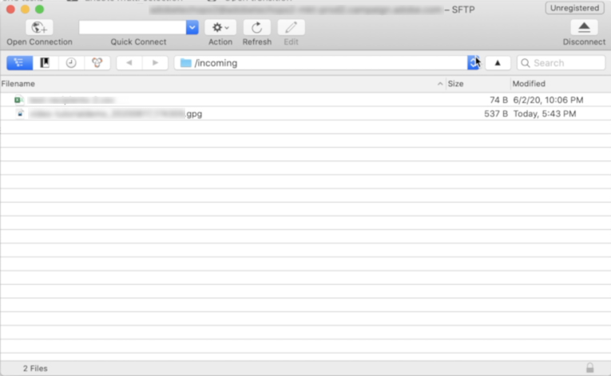

# 워크플로우 데이터 사용 방법{#how-to-use-workflow-data}

## 데이터베이스 업데이트 {#updating-the-database}

수집된 모든 데이터는 데이터베이스를 업데이트하거나 배달에서 사용할 수 있습니다. 예를 들어 메시지 컨텐츠 개인화의 가능성(메시지에 계약 수 포함, 지난 1년간 평균 장바구니 지정 등)을 강화할 수 있습니다. 또는 세부 인구 타겟팅(계약 공동 보유자에게 메시지 전송, 온라인 서비스 등 1,000명의 우수 가입자를 타깃팅합니다.) 이 데이터를 목록에 내보내거나 보관할 수도 있습니다.

### 목록 및 직접 업데이트 {#lists-and-direct-updates}

Adobe Campaign 데이터베이스 및 기존 목록의 데이터는 두 개의 전용 작업을 사용하여 업데이트할 수 있습니다.

* 이 **[!UICONTROL List update]** 활동을 통해 작업표를 데이터목록에 저장할 수 있습니다.

   기존 목록을 선택하거나 만들 수 있습니다. 이 경우 이름과 레코드 폴더가 계산될 수 있습니다.

   

   목록 [업데이트를 참조하십시오](../../workflow/using/list-update.md).

* 이 **[!UICONTROL Update data]** 활동은 데이터베이스의 필드를 대량으로 업데이트합니다.

   For more on this, refer to [Update data](../../workflow/using/update-data.md).

### 구독/구독 취소 관리 {#subscription-unsubscription-management}

워크플로우를 통해 수신자의 정보 서비스 가입 및 가입 해지에 대한 자세한 내용은 [구독 서비스를 참조하십시오](../../workflow/using/subscription-services.md).

## 워크플로우를 통해 전송 {#sending-via-a-workflow}

### 배달 활동 {#delivery-activity}

배달 활동은 [게재에서 자세히 설명합니다](../../workflow/using/delivery.md).

### 컨텐츠 전달 및 타깃팅 {#enriching-and-targeting-deliveries}

게재는 컨텐츠를 사용자 정의하기 위해 또는 대상 모집단 선택 프레임워크에서 워크플로우의 데이터를 처리할 수 있습니다.

예를 들어, DM 전달의 프레임워크 내에서 워크플로우에서 수행된 데이터 조작에서 얻은 추가 데이터를 추출 파일에 포함시킬 수 있습니다.


일반적인 개인화 필드 외에도 워크플로우 단계에서 전달 컨텐츠에 개인화 필드를 추가할 수 있습니다. 워크플로우 활동에 정의된 추가 데이터는 아래 예와 같이 배달 마법사에서 보관하여 액세스 가능하도록 함으로써 DM 전달 프레임워크 내에서 출력 파일의 이름을 정의할 수 있습니다.


워크플로우 테이블에 포함된 데이터는 해당 이름으로 식별됩니다. 항상 targetData **링크로** 구성됩니다. For more on this, refer to [Target data](../../workflow/using/data-life-cycle.md#target-data).

이메일 전달 프레임워크 내에서 개인화 필드는 아래 예와 같이 타깃팅 워크플로우 단계에서 수행된 대상 익스텐션의 데이터를 사용할 수도 있습니다.


세그먼트 코드가 타깃팅 활동에 지정된 경우, 워크플로우 테이블의 특정 열에 추가되고 개인화 필드와 함께 제공됩니다. 모든 개인화 필드를 표시하려면 개인화 단추를 통해 액세스할 수 있는 **[!UICONTROL Target extension > Other...]** 링크를 클릭합니다.


## 데이터 내보내기 {#exporting-data}

### 파일 압축 또는 암호화 {#zipping-or-encrypting-a-file}

Adobe Campaign을 사용하면 zip 파일 또는 암호화된 파일을 내보낼 수 있습니다. 활동을 통해 내보내기를 정의할 때 **[!UICONTROL Data extraction (file)]** 압축 또는 파일 암호화를 위한 후처리 정의를 할 수 있습니다.

다음을 수행할 수 있습니다.

1. 제어판을 사용하여 인스턴스에 대한 GPG 키 쌍을 [설치합니다](https://docs.adobe.com/content/help/en/control-panel/using/instances-settings/gpg-keys-management.html#encrypting-data).

   >[!NOTE]
   >
   >제어판은 AWS에서 호스팅되는 모든 고객이 사용할 수 있습니다(마케팅 인스턴스를 전제에 호스트하는 고객 제외).

1. Adobe Campaign 설치가 Adobe에서 호스팅하는 경우 Adobe 고객 지원 센터에 문의하여 서버에 필요한 유틸리티를 설치하도록 하십시오.
1. Adobe Campaign의 설치가 온-프레미스 경우 사용할 유틸리티를 설치합니다(예: GPG, GZIP) 및 응용 프로그램 서버의 필요한 키(암호화 키)입니다.

그런 다음 활동이나 활동 **[!UICONTROL Script]** 탭에서 명령이나 코드를 사용할 수 **[!UICONTROL JavaScript code]** 있습니다. 아래의 사용 사례에는 예가 나와 있습니다.

**관련 항목:**

* [처리 전 파일 지핑 또는 해독](../../workflow/using/importing-data.md#unzipping-or-decrypting-a-file-before-processing)
* [데이터 추출(파일) 활동](../../workflow/using/extraction--file-.md).

### 사용 사례: 제어판에 설치된 키를 사용하여 데이터 암호화 및 내보내기 {#use-case-gpg-encrypt}

이러한 경우 제어판에 설치된 키를 사용하여 데이터를 암호화하고 내보낼 수 있는 워크플로우를 구축할 예정입니다.

GPG 키를 사용하여 데이터를 암호화하는 방법을 보여주는 자습서 비디오도 [이 섹션에서 사용할 수 있습니다](https://docs.adobe.com/content/help/en/campaign-classic-learn/tutorials/administrating/control-panel-acc/gpg-key-management/using-a-gpg-key-to-encrypt-data.html).

이 사용 사례를 수행하는 단계는 다음과 같습니다.

1. GPG 유틸리티를 사용하여 GPG 키 쌍(공개/비공개)을 생성한 다음 공개 키를 제어판에 설치합니다. 자세한 단계는 [제어판 설명서에서 확인할 수 있습니다](https://docs.adobe.com/content/help/en/control-panel/using/instances-settings/gpg-keys-management.html#encrypting-data).

1. Campaign Classic에서 제어판을 통해 설치된 개인 키를 사용하여 데이터를 내보내고 내보내는 워크플로우를 구축할 수 있습니다. 이를 위해 다음과 같은 워크플로우를 구축할 예정입니다.

   

   * **[!UICONTROL Query]** 활동: 이 예에서는 내보낼 데이터베이스의 데이터를 대상으로 하는 쿼리를 실행하려 합니다.
   * **[!UICONTROL Data extraction (file)]** 활동: 데이터를 파일로 추출합니다.
   * **[!UICONTROL JavaScript code]** 활동: 추출할 데이터를 암호화합니다.
   * **[!UICONTROL File transfer]** 활동: 외부 소스(이 예에서는 SFTP 서버)로 데이터를 보냅니다.

1. 데이터베이스에서 원하는 데이터를 타깃팅할 **[!UICONTROL Query]** 활동을 구성합니다. 이 작업에 대한 자세한 정보는 [이 섹션](../../workflow/using/query.md)을 참조하십시오.

1. 활동을 열고 **[!UICONTROL Data extraction (file)]** 필요에 따라 구성합니다. 활동을 구성하는 방법에 대한 글로벌 개념은 [이 섹션에서 사용할 수 있습니다](../../workflow/using/extraction--file-.md).

   

1. 활동을 연 다음 아래 명령을 복사하여 붙여넣어 추출할 데이터를 암호화합니다. **[!UICONTROL JavaScript code]**

   >[!IMPORTANT]
   >
   >명령에서 **지문** 값을 제어판에 설치된 공개 키의 지문으로 바꾸십시오.

   ```
   var cmd='gpg ';
   cmd += ' --trust-model always';
   cmd += ' --batch -yes';
   cmd += ' --recipient fingerprint';
   cmd += ' --encrypt --output ' + vars.filename + '.gpg ' + vars.filename;
   execCommand(cmd,true);
   vars.filename=vars.filename + '.gpg'
   ```

   

1. 활동을 **[!UICONTROL File transfer]** 연 다음 파일을 전송할 SFTP 서버를 지정합니다. 활동을 구성하는 방법에 대한 글로벌 개념은 [이 섹션에서 사용할 수 있습니다](../../workflow/using/file-transfer.md).

   

1. 이제 워크플로우를 실행할 수 있습니다. 쿼리가 실행되면, 쿼리별 데이터 대상이 SFTP 서버로 암호화된 .gpg 파일로 내보내집니다.

   
