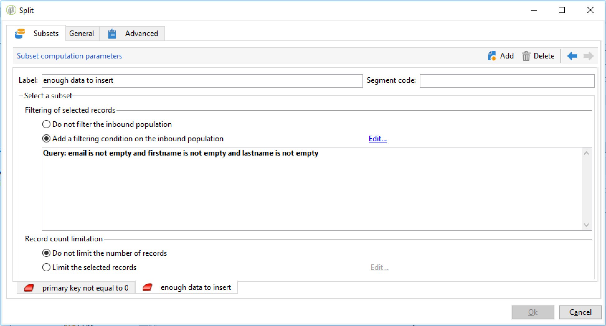

# 데이터 가져오기{#importing-data}

## 데이터 수집 방법 {#how-to-collect-data}

### 목록의 데이터 사용: 목록 읽기 {#using-data-from-a-list--read-list}

워크플로우에서 전송된 데이터는 데이터가 미리 준비되고 구조화된 목록에서 가져올 수 있습니다.

이 목록은 Adobe Campaign에서 직접 만들거나 옵션으로 가져올 수 **[!UICONTROL Import a list]** 있습니다. 이 옵션에 대한 자세한 내용은 이 [페이지를 참조하십시오](../../platform/using/generic-imports-and-exports.md).

워크플로우에서 목록 읽기 활동 사용에 대한 자세한 내용은 목록 [읽기를 참조하십시오](../../workflow/using/read-list.md).

### 파일에서 데이터 로드 {#loading-data-from-a-file}

워크플로우에서 처리된 데이터는 구조화된 파일에서 추출하여 Adobe Campaign으로 가져올 수 있습니다.

데이터 로드 활동에 대한 설명은 [데이터 로드(파일) 섹션에서 찾을 수](../../workflow/using/data-loading--file-.md) 있습니다.

가져올 구조화된 파일의 예:

```
lastname;firstname;birthdate;email;crmID
Smith;Hayden;23/05/1989;hayden.smith@example.com;124365
Mars;Daniel;17/11/1987;dannymars@example.com;123545
Smith;Clara;08/02/1989;hayden.smith@example.com;124567
Durance;Allison;15/12/1978;allison.durance@example.com;120987
```

## 처리 전 파일 지핑 또는 해독 {#unzipping-or-decrypting-a-file-before-processing}

### 사전 처리 단계 정보 {#about-pre-processing-stages}

Adobe Campaign을 사용하면 zip 파일 또는 암호화된 파일을 가져올 수 있습니다. 데이터 로드(파일) [활동에서](../../workflow/using/data-loading--file-.md) 읽기 전에 파일의 압축을 해제하거나 파일의 암호를 해독하기 위해 사전 처리를 정의할 수 있습니다.

다음을 수행할 수 있습니다.

1. 제어판 [을](https://docs.adobe.com/content/help/en/control-panel/using/instances-settings/gpg-keys-management.html#decrypting-data) 사용하여 공개/개인 키 쌍을 생성합니다.

   >[!NOTE]
   >
   >제어판은 AWS에서 호스팅되는 모든 고객이 사용할 수 있습니다(마케팅 인스턴스를 전제에 호스트하는 고객 제외).

1. Adobe Campaign 설치가 Adobe에서 호스팅하는 경우 Adobe 고객 지원 센터에 문의하여 서버에 필요한 유틸리티를 설치하도록 하십시오.
1. Adobe Campaign의 설치가 온-프레미스 경우 사용할 유틸리티를 설치합니다(예: GPG, GZIP) 및 응용 프로그램 서버의 필요한 키(암호화 키)입니다.

그런 다음 원하는 사전 처리 명령을 워크플로우에 사용할 수 있습니다.

1. 워크플로우에서 **[!UICONTROL File transfer]** 활동을 추가하고 구성합니다.
1. 활동을 추가하고 파일 형식을 정의합니다. **[!UICONTROL Data loading (file)]**
1. 옵션을 **[!UICONTROL Pre-process the file]** 확인하십시오.
1. 적용할 사전 처리 명령을 지정합니다.
1. 다른 활동을 추가하여 파일에서 가져오는 데이터를 관리합니다.
1. 워크플로우를 저장하고 실행합니다.

아래의 사용 사례에는 예가 나와 있습니다.

**관련 항목:**

* [데이터 로드(파일) 활동](../../workflow/using/data-loading--file-.md).
* [파일](../../workflow/using/how-to-use-workflow-data.md#zipping-or-encrypting-a-file)압축 또는 암호화

### 사용 사례: 제어판에서 생성한 키를 사용하여 데이터를 암호화 가져오기 {#use-case-gpg-decrypt}

이 경우 제어판에서 생성된 키를 사용하여 외부 시스템에서 암호화된 데이터를 가져오기 위한 워크플로우를 구축할 예정입니다.

GPG 키를 사용하여 데이터를 해독하는 방법을 보여주는 자습서 비디오도 [이 섹션에 있습니다](https://docs.adobe.com/content/help/en/campaign-classic-learn/tutorials/administrating/control-panel-acc/gpg-key-management/decrypting-data.html).

이 사용 사례를 수행하는 단계는 다음과 같습니다.

1. 제어판을 사용하여 키 쌍(공개/비공개)을 생성합니다. 자세한 단계는 [제어판 설명서에서 확인할 수 있습니다](https://docs.adobe.com/content/help/en/control-panel/using/instances-settings/gpg-keys-management.html#decrypting-data).

   * 공개 키는 Campaign으로 전송할 데이터를 암호화하는 데 사용하는 외부 시스템과 공유됩니다.
   * 개인 키는 Campaign Classic이 들어오는 암호화된 데이터를 해독하는 데 사용됩니다.

   

1. 외부 시스템에서 제어판에서 다운로드한 공개 키를 사용하여 Campaign Classic으로 가져올 데이터를 암호화합니다.

   

1. Campaign Classic에서 제어판을 통해 설치된 개인 키를 사용하여 암호화된 데이터를 가져와 해독하는 워크플로우를 만듭니다. 이를 위해 다음과 같은 워크플로우를 구축할 예정입니다.

   

   * **[!UICONTROL File transfer]** 활동: 외부 소스에서 Campaign Classic으로 파일을 전송합니다. 이 예에서는 SFTP 서버에서 파일을 전송하려고 합니다.
   * **[!UICONTROL Data loading (file)]** 활동: 파일의 데이터를 데이터베이스에 로드하고 제어판에서 생성된 개인 키를 사용하여 암호를 해독합니다.

1. 활동을 연 다음 **[!UICONTROL File transfer]** 암호화된 .gpg 파일을 가져올 외부 계정을 지정합니다.

   

   활동을 구성하는 방법에 대한 글로벌 개념은 [이 섹션에서 사용할 수 있습니다](../../workflow/using/file-transfer.md).

1. 활동을 열고 **[!UICONTROL Data loading (file)]** 필요에 따라 구성합니다. 활동을 구성하는 방법에 대한 글로벌 개념은 [이 섹션에서 사용할 수 있습니다](../../workflow/using/data-loading--file-.md).

   들어오는 데이터의 암호를 해독하려면 활동에 사전 처리 단계를 추가합니다. 이렇게 하려면 옵션을 선택한 **[!UICONTROL Pre-process the file]** 다음 **[!UICONTROL Command]** 필드에 이 암호 해독 명령을 복사하여 붙여 넣습니다.

   `gpg --batch --passphrase passphrase --decrypt <%=vars.filename%>`

   

   >[!CAUTION]
   >
   >이 예에서는 &quot;암호 문구&quot;인 제어판에서 기본적으로 사용되는 암호를 사용하고 있습니다.
   >
   >이전에 고객 지원 요청을 통해 인스턴스에 이미 GPG 키를 설치한 경우 암호가 변경되었을 수 있으며 기본적으로 다른 형태일 수 있습니다.

1. 활동 구성 **[!UICONTROL OK]** 을 확인하려면 을(를) 클릭합니다.

1. 이제 워크플로우를 실행할 수 있습니다. 실행 후에는 워크플로우 로그에서 암호 해독 작업이 실행되었고 파일의 데이터를 가져올 수 있습니다.

   

## 데이터를 가져올 때의 모범 사례 {#best-practices-when-importing-data}

아래 설명된 몇 가지 간단한 규칙을 주의하여 준수하면 데이터베이스 내에서 데이터 일관성을 유지하고 데이터베이스 업데이트나 데이터 내보내기 중 일반적인 오류를 방지하는 데 많은 도움이 됩니다.

### 가져오기 템플릿 사용 {#using-import-templates}

대부분의 가져오기 워크플로우는 다음 활동을 포함해야 합니다. **[!UICONTROL Data loading (file)]**, **[!UICONTROL Enrichment]**, **[!UICONTROL Split]**, **[!UICONTROL Deduplication]**, **[!UICONTROL Update data]**

가져오기 템플릿을 사용하면 유사한 가져오기를 준비하고 데이터베이스 내에서 데이터를 일관되게 유지할 수 있습니다. 워크플로우 템플릿 섹션에서 워크플로우 템플릿 [을 작성하는 방법을](../../workflow/using/building-a-workflow.md#workflow-templates) 알아봅니다.

많은 프로젝트에서 가져오기는 프로젝트에 사용된 파일에 중복이 없으므로 **[!UICONTROL Deduplication]** 작업 없이 빌드됩니다. 여러 파일을 가져올 때 중복되는 경우가 있습니다. 데이터 중복 제거는 매우 어렵습니다. 따라서 데이터 중복 제거 단계는 모든 가져오기 워크플로우에 적합한 예방책입니다.

수신 데이터가 일관되고 올바르거나 IT 부서 또는 Adobe Campaign 감독자가 해결할 것이라는 가정을 하지 마십시오. 프로젝트 중에 데이터 청소에 주의하십시오. 데이터를 가져올 때 데이터 중복 제거, 조정, 일관성 유지

가져오기 템플릿 예는 반복 가져오기 설정 [섹션에서 사용할 수](#setting-up-a-recurring-import) 있습니다.

### 플랫 파일 포맷 사용 {#using-flat-file-formats}

가장 효율적인 포맷은 플랫 파일입니다. 데이터베이스 수준에서 플랫 파일을 벌크 모드로 가져올 수 있습니다.

예:

* 구분 문자: 탭 또는 세미콜론
* 머리글이 있는 첫 줄
* 문자열 구분 기호 없음
* 날짜 형식: YYYY/MM/DD HH:mm:SS

Adobe Campaign은 표준 파일 가져오기 작업을 사용하여 XML 파일을 가져올 수 없습니다. JavaScript를 사용하여 XML 파일을 가져올 수 있지만 적은 볼륨만 가져올 수 있습니다. 파일당 10K 미만의 레코드

### 압축 및 암호화 사용 {#using-compression-and-encryption}

압축을 푼 파일을 가져와 내보낼 수 있습니다.

Linux에서는 명령줄을 사용하여 파일의 압축을 풀고 동시에 가져올 수 있습니다. 예:

```
zcat nl6/var/vp/import/filename.gz
```

또한 보안되지 않은 경우 네트워크를 통해 전송되는 파일을 암호화하는 것이 좋습니다. GPG는 여기에 사용할 수 있습니다.

### 파일에서 데이터 일괄 로드 {#loading-data-in-batch-from-files}

파일에서 데이터를 일괄적으로 로딩하는 것은 한 번에 한 줄씩 실시간으로(예: 웹 서비스를 통해) 로드하는 것보다 더 효과적입니다.

웹 서비스를 사용하여 가져오는 것은 효율적이지 않습니다. 가능하면 파일을 사용하는 것이 가장 좋습니다.

외부 웹 서비스를 통해 실시간으로 프로파일을 강화하면 성능 문제와 메모리 누수가 발생할 수 있습니다. 이는 라인 레벨에서 작동하기 때문입니다.

데이터를 가져와야 하는 경우 웹 애플리케이션이나 웹 서비스를 사용하는 것보다 작업 과정을 사용하여 데이터를 일괄적으로 가져오는 것이 더 좋습니다.

### 데이터 관리 사용 {#using-data-management}

JavaScript를 사용하여 반복적인 모드(라인별)로 로드하는 것은 작은 볼륨으로 제한됩니다.

효율성을 높이기 위해 항상 데이터 관리 워크플로우의 **[!UICONTROL Data Loading (File)]** 활동을 활용하십시오.

### 델타 모드로 가져오기 {#importing-in-delta-mode}

일반 가져오기는 델타 모드에서 수행해야 합니다. 즉, 수정되거나 새 데이터만 항상 전체 테이블 대신 Adobe Campaign으로 전송됩니다.

전체 가져오기는 초기 로드에만 사용해야 합니다.

JavaScript가 아닌 데이터 관리를 사용하여 데이터를 가져옵니다.

### 일관성 유지 {#maintaining-consistency}

Adobe Campaign 데이터베이스에서 데이터 일관성을 유지하려면 아래 원칙을 따르십시오.

* 가져온 데이터가 Adobe Campaign의 참조 테이블과 일치하는 경우 워크플로우의 해당 테이블과 대사되어야 합니다. 일치하지 않는 레코드는 거부해야 합니다.
* 가져온 데이터가 항상 **&quot;표준화&quot;** (이메일, 전화 번호, DM 주소)되었는지,이러한 표준화가 안정적이며 수년 동안 변경되지 않는지 확인합니다. 이 경우 데이터베이스에 일부 중복 항목이 나타날 수 있으며 Adobe Campaign에서 &quot;퍼지&quot; 일치를 수행하는 도구를 제공하지 않으므로 이러한 항목을 관리하고 제거하는 것은 매우 어렵습니다.
* 트랜잭션 데이터에는 조정 키가 있어야 하며, 중복을 만들지 않도록 기존 데이터와 조정해야 합니다.
* **관련 파일을 순서대로 가져올 수 있습니다**.

   가져오기가 서로 의존하는 여러 파일로 구성된 경우 워크플로우는 파일을 올바른 순서로 가져왔는지 확인해야 합니다. 파일이 실패하면 다른 파일을 가져올 수 없습니다.

* **데이터를 가져올 때**&#x200B;데이터 중복 제거, 조정, 일관성 유지

## 반복 가져오기 설정 {#setting-up-a-recurring-import}

가져오기 템플릿을 사용하는 것은 구조가 동일한 파일을 정기적으로 가져와야 하는 경우에 가장 좋습니다.

이 예에서는 Adobe Campaign 데이터베이스의 CRM에서 가져온 프로파일을 가져오는 데 재사용할 수 있는 워크플로우를 사전 설정하는 방법을 보여줍니다. 각 활동에 대한 가능한 모든 설정에 대한 자세한 내용은 이 [섹션을 참조하십시오](../../workflow/using/about-activities.md).

1. 에서 새 워크플로우 템플릿을 만듭니다 **[!UICONTROL Resources > Templates > Workflow templates]**.
1. 다음 활동을 추가합니다.

   * **[!UICONTROL Data loading (file)]**: 가져올 데이터가 포함된 파일의 예상 구조를 정의합니다.
   * **[!UICONTROL Enrichment]**: 가져온 데이터를 데이터베이스 데이터와 조정합니다.
   * **[!UICONTROL Split]**: 조정 가능 여부에 따라 필터를 만들어 레코드를 다르게 처리합니다.
   * **[!UICONTROL Deduplication]**: 데이터베이스에 삽입되기 전에 들어오는 파일의 데이터를 중복 제거합니다.
   * **[!UICONTROL Update data]**: 가져온 프로필로 데이터베이스를 업데이트합니다.

   

1. 활동을 **[!UICONTROL Data Loading (file)]** 구성합니다.

   * 샘플 파일을 업로드하여 예상 구조를 정의합니다. 샘플 파일은 가져올 수 있는 몇 개의 줄만 포함해야 합니다. 파일 형식을 확인하고 편집하여 각 열의 유형이 올바르게 설정되어 있는지 확인합니다. 텍스트, 날짜, 정수 등 예:

      ```
      lastname;firstname;birthdate;email;crmID
      Smith;Hayden;23/05/1989;hayden.smith@mailtest.com;123456
      ```

   * 섹션에서 **[!UICONTROL Name of the file to load]** 필드를 **[!UICONTROL Upload a file from the local machine]** 선택하고 비워 둡니다. 이 템플릿에서 새 워크플로우를 만들 때마다 정의된 구조에 해당하는 파일 중에서 원하는 파일을 여기에 지정할 수 있습니다.

      옵션을 사용할 수 있지만 그에 따라 템플릿을 수정해야 합니다. 예를 들어, 선택하는 경우 **[!UICONTROL Specified in the transition]** FTP/SFTP 서버에서 가져올 파일을 검색하기 전에 **[!UICONTROL File Transfer]** 활동을 추가할 수 있습니다. S3 또는 SFTP 연결을 사용하면 Adobe 실시간 고객 데이터 플랫폼을 통해 세그먼트 데이터를 Adobe Campaign으로 가져올 수도 있습니다. For more on this, refer to this [documentation](https://docs.adobe.com/content/help/en/experience-platform/rtcdp/destinations/destinations-cat/adobe-destinations/adobe-campaign-destination.html).

      

1. 활동을 **[!UICONTROL Enrichment]** 구성합니다. 이 컨텍스트에서 이 활동의 목적은 들어오는 데이터를 식별하는 것입니다.

   * 탭에서 **[!UICONTROL Enrichment]** 가져온 데이터와 수신자 타깃팅 차원 사이의 링크를 **[!UICONTROL Add data]** 선택하고 정의합니다. 이 예에서 **CRM ID** 사용자 정의 필드는 조인 조건을 만드는 데 사용됩니다. 고유한 레코드를 식별할 수 있는 동안 필요한 필드 또는 필드 조합을 사용하십시오.
   * 탭에서 옵션 **[!UICONTROL Reconciliation]** 을 선택 **[!UICONTROL Identify the document from the working data]** 취소하지 않습니다.

   

1. 한 전환에서 조정된 받는 사람과 조정할 수 없지만 두 번째 변환에서 충분한 데이터를 가진 받는 사람을 검색할 **[!UICONTROL Split]** 활동을 구성합니다.

   조정된 받는 사람과의 전환 기능을 사용하여 데이터베이스를 업데이트할 수 있습니다. 그러면 파일에서 최소 정보 세트를 사용할 수 있는 경우 알 수 없는 수신자와 함께 전환하여 데이터베이스에 새 받는 사람 항목을 만들 수 있습니다.

   조정할 수 없고 데이터가 충분하지 않은 수신자는 아웃바운드 보완에서 선택되며 별도의 파일로 내보내거나 무시하면 됩니다.

   * 활동의 **[!UICONTROL General]** 탭에서 필터링 설정 **[!UICONTROL Use the additional data only]** 으로 선택하고 이 **[!UICONTROL Targeting dimension]** 가 자동으로 설정되어 있는지 **[!UICONTROL Enrichment]**&#x200B;확인합니다.

      데이터베이스에 레코드를 삽입할 수 없는 **[!UICONTROL Generate complement]** 옵션을 확인합니다. 필요한 경우 보완 데이터에 추가 처리를 적용할 수 있습니다. 파일 내보내기, 목록 업데이트 등

   * 탭의 첫 번째 하위 세트에서 **[!UICONTROL Subsets]** 받는 사람 기본 키가 0과 같지 않은 레코드만 선택하려면 인바운드 모집단 필터링 조건을 추가합니다. 이렇게 하면 데이터베이스의 수신자와 조정된 파일의 데이터가 해당 하위 세트에서 선택됩니다.

      

   * 데이터베이스에 삽입할 데이터를 충분히 가진 대사되지 않은 레코드를 선택하는 두 번째 하위 집합을 추가합니다. 예: 이메일 주소, 이름 및 성

      하위 세트는 생성 순서로 처리됩니다. 즉, 이 두 번째 하위 세트가 처리되면 데이터베이스에 이미 존재하는 모든 레코드가 첫 번째 하위 세트에서 이미 선택되어 있습니다.

      

   * 처음 두 하위 세트에서 선택되지 않은 모든 레코드가 이 세트에 선택되어 **[!UICONTROL Complement]**&#x200B;있습니다.

1. 이전에 구성된 **[!UICONTROL Update data]** 활동의 첫 번째 아웃바운드 전환 뒤에 있는 **[!UICONTROL Split]** 활동을 구성합니다.

   * 인바운드 전환 **[!UICONTROL Update]** 에 이미 데이터베이스에 있는 수신자만 포함되므로 **[!UICONTROL Operation type]** 을 선택합니다.
   * 섹션에서 **[!UICONTROL Record identification]** 타깃팅 차원 **[!UICONTROL Using reconciliation keys]** 과 에서 만든 링크 간의 키를 선택하고 정의합니다 **[!UICONTROL Enrichment]**. 이 예에서는 **CRM ID** 사용자 정의 필드가 사용됩니다.
   * 섹션에서 파일의 해당 열 값으로 업데이트할 수신자 차원의 필드를 **[!UICONTROL Fields to update]** 지정합니다. 파일 열 이름이 받는 사람 차원 필드 이름과 동일하거나 거의 동일한 경우 자동 선택 단추를 사용하여 다른 필드를 자동으로 일치시킬 수 있습니다.

      

1. 대사되지 않은 수신자가 포함된 전환 후에 있는 **[!UICONTROL Deduplication]** 활동을 구성합니다.

   * 타깃팅 차원 **[!UICONTROL Edit configuration]** 을 선택하고 워크플로의 활동에서 생성된 임시 스키마로 **[!UICONTROL Enrichment]** 설정합니다.

      

   * 이 예에서는 이메일 필드를 사용하여 고유한 프로필을 찾습니다. 반드시 채워야 하는 필드와 고유한 조합의 일부를 사용할 수 있습니다.
   * 화면에서 기본 키가 0과 같은 레코드(이 전환의 모든 레코드) **[!UICONTROL Deduplication method]** 가 제외되지 않도록 하려면 **[!UICONTROL Advanced parameters]** **[!UICONTROL Disable automatic filtering of 0 ID records]** 옵션을 선택하고 선택합니다.

   

1. 이전에 구성된 **[!UICONTROL Update data]** 활동 뒤에 **[!UICONTROL Deduplication]** 있는 활동을 구성합니다.

   * 인바운드 전환 **[!UICONTROL Insert]** 에 데이터베이스에 없는 수신자만 포함되므로 **[!UICONTROL Operation type]** 선택합니다.
   * 섹션에서 **[!UICONTROL Record identification]** 차원을 **[!UICONTROL Directly using the targeting dimension]** 선택하고 **[!UICONTROL Recipients]** 선택합니다.
   * 섹션에서 파일의 해당 열 값으로 업데이트할 수신자 차원의 필드를 **[!UICONTROL Fields to update]** 지정합니다. 파일 열 이름이 받는 사람 차원 필드 이름과 동일하거나 거의 동일한 경우 자동 선택 단추를 사용하여 다른 필드를 자동으로 일치시킬 수 있습니다.

      

1. 활동에 대한 세 번째 전환 후 데이터베이스에 삽입되지 않은 데이터를 추적하려는 경우 **[!UICONTROL Split]** 활동 및 **[!UICONTROL Data extraction (file)]** **[!UICONTROL File transfer]** 활동을 추가합니다. 필요한 열을 내보내고 파일을 검색할 수 있는 FTP 또는 SFTP 서버에서 파일을 전송할 활동을 구성합니다.
1. 활동을 **[!UICONTROL End]** 추가하고 워크플로우 템플릿을 저장합니다.

이제 템플릿을 사용할 수 있으며 모든 새로운 워크플로우에서 사용할 수 있습니다. 그런 다음 활동에 가져올 데이터가 포함된 파일을 모두 **[!UICONTROL Data loading (file)]** 지정해야 합니다.


