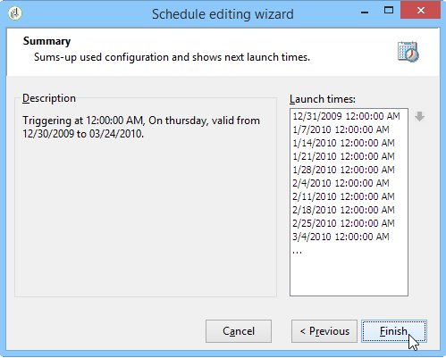

# 증가식 쿼리{#incremental-query}

증분 쿼리를 사용하면 이 기준에 대해 이미 타깃팅된 사람을 제외하면서 기준을 기반으로 대상을 주기적으로 선택할 수 있습니다.

이미 타깃팅된 채우기는 워크플로우 인스턴스별로 메모리에 저장되며, 즉 동일한 템플릿에서 시작된 두 워크플로우는 동일한 로그를 공유하지 않습니다. 반면에 동일한 워크플로우 인스턴스에 대해 동일한 증분 쿼리를 기반으로 하는 두 개의 작업은 동일한 로그를 사용합니다.

쿼리는 표준 쿼리와 동일한 방식으로 정의되지만(쿼리 [만들기](../../workflow/using/query.md#creating-a-query)참조) 실행이 예약됩니다.

>[!CAUTION]
>
>증분 쿼리의 결과가 실행 중 **0** 과 같은 경우 쿼리의 다음 프로그래밍 실행 시까지 워크플로가 일시 중지됩니다. 따라서 증분 쿼리를 따르는 전환 및 활동은 다음 실행 전에 처리되지 않습니다.

이렇게 하려면:

1. 탭에서 **[!UICONTROL Scheduling & History]** **[!UICONTROL Schedule execution]** 옵션을 선택합니다. 작업은 일단 만들어지면 활성 상태로 유지되며 쿼리 실행 일정에 의해 지정된 시에만 트리거됩니다. 그러나 이 옵션을 비활성화하면 쿼리가 즉시 **실행되며 동시에**&#x200B;실행됩니다.
1. 단추를 **[!UICONTROL Change]** 클릭합니다.

   창에서 빈도 유형, 이벤트 되풀이 및 이벤트 유효 기간을 구성할 수 **[!UICONTROL Schedule editing wizard]** 있습니다.

   

1. 예약을 **[!UICONTROL Finish]** 저장하려면 을 클릭합니다.

   

1. 탭의 하단 섹션에서는 **[!UICONTROL Scheduling & History]** 내역에 계상할 일 수를 선택할 수 있습니다.

   

   * **[!UICONTROL History in days]**

      이미 타깃팅된 수신자는 타깃팅된 날로부터 최대 일 수를 기록할 수 있습니다. 이 값이 0이면 받는 사람은 로그에서 삭제되지 않습니다.

   * **[!UICONTROL Keep history when starting]**

      이 옵션을 사용하면 활동이 활성화된 경우 로그를 제거하지 않을 수 있습니다.

   * **[!UICONTROL SQL table name]**

      이 매개 변수를 사용하면 내역 데이터를 포함하는 기본 SQL 테이블을 오버로드할 수 있습니다.

## 증분 쿼리의 예:분기별 목록 업데이트 {#example-of-an-incremental-query--quarterly-list-update}

다음 예에서는 수신자 목록을 자동으로 업데이트하는 데 증분 쿼리를 사용합니다. 이러한 수신자는 계절별 마케팅 캠페인의 일부로 타깃팅됩니다.

이러한 캠페인은 매 시즌 초에 관련 스포츠 활동을 제공하기 위해 시작되므로 분기별로 업데이트됩니다. 하지만 여기에서 받는 사람은 이 캠페인으로 9개월마다 한 번만 타깃팅되어야 합니다. 이를 통해 수신자의 자격 주기를 넓히고 여러 계절에 대한 활동을 제공할 수 있습니다.

1. 증분 쿼리와 목록 업데이트 활동을 새 워크플로우에 추가합니다.
1. 쿼리 **[!UICONTROL Incremental query]** 만들기에 지정된 대로 활동의 탭을 구성합니다.
1. 탭을 **[!UICONTROL Scheduling & History]** 선택한 다음 270일 내역을 지정합니다. 이미 타깃팅된 수신자는 더 이상 270일 또는 약 9개월 동안 타깃팅되지 않습니다.

   그런 다음 **[!UICONTROL Change...]** 단추를 클릭합니다.

1. 각 계절의 시작 전에 목록이 업데이트되도록 하려면 을 **[!UICONTROL Monthly]**&#x200B;선택합니다.
1. 다음 화면에서 3월, 6월, 9월 및 12월을 선택합니다. 월의 20일을 선택하고 워크플로우를 실행할 시간을 선택합니다.
1. 그런 다음 쿼리의 유효 기간을 선택합니다. 예를 들어 이 활동을 영구적으로 활성화하려면 **[!UICONTROL Permanent validity]**&#x200B;을 선택합니다.

   

1. 증분 쿼리를 승인한 후 목록 업데이트에 [설명된 대로 목록 업데이트 활동을](../../workflow/using/list-update.md)구성합니다.

따라서 워크플로우는 각 시즌이 시작되기 직전에 자동으로 시작됩니다. 이 목록은 새로운 적격한 수신자가 오퍼를 받을 수 있도록 업데이트됩니다.

## 출력 매개 변수 {#output-parameters}

* tableName
* 스키마
* recCount

이 세 개의 값 세트는 쿼리를 기준으로 타깃팅된 인구를 식별합니다. **[!UICONTROL tableName]** 는 대상 식별자를 기록하는 테이블의 이름이며 **[!UICONTROL schema]** 모집단(일반적으로 nms:recipient)의 스키마이며 **[!UICONTROL recCount]** 표의 요소 수입니다.
