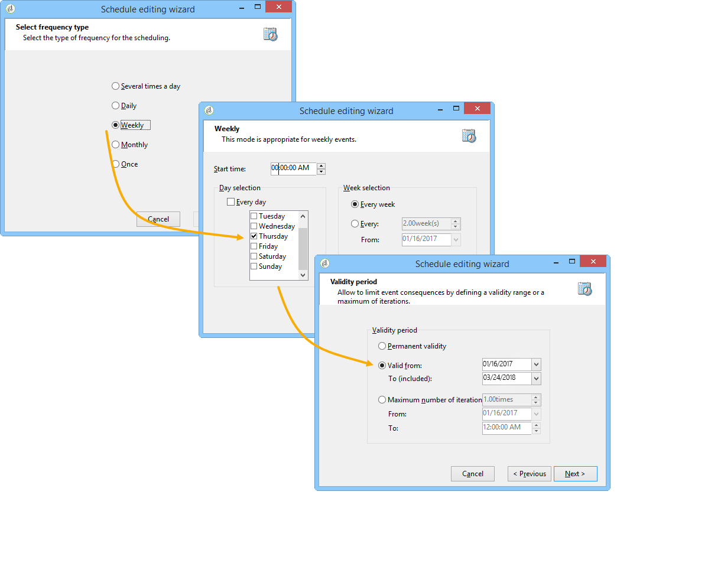

# 증가식 쿼리{#incremental-query}

증분 쿼리를 사용하면 이 기준에 대해 이미 타깃팅된 사람을 제외하고 기준을 기반으로 대상을 주기적으로 선택할 수 있습니다.

이미 타깃팅된 모집단은 워크플로우 인스턴스별로 메모리에 저장되며, 즉 동일한 템플릿에서 시작된 두 개의 워크플로우는 동일한 로그를 공유하지 않습니다. 반면에 동일한 워크플로우 인스턴스에 대해 동일한 증분 쿼리를 기반으로 하는 두 개의 작업은 동일한 로그를 사용합니다.

쿼리는 표준 쿼리와 동일한 방식으로 정의되지만 실행이 예약됩니다.

**관련 항목:**

* [사용 사례: 증분 쿼리를 사용한 분기별 목록 업데이트](../../workflow/using/quarterly-list-update.md)
* [쿼리 만들기](../../workflow/using/query.md#creating-a-query)

>[!CAUTION]
>
>증분 쿼리의 결과가 실행 중 **0** 과 같은 경우 쿼리의 다음 프로그래밍 실행 시까지 워크플로가 일시 중지됩니다. 따라서 증분 쿼리를 따르는 전환 및 활동은 다음 실행 전에 처리되지 않습니다.

이렇게 하려면:

1. 탭에서 **[!UICONTROL Scheduling & History]** 옵션을 **[!UICONTROL Schedule execution]** 선택합니다. 작업은 만들어진 후에는 활성 상태로 유지되며 쿼리 실행 일정에 의해 지정된 경우에만 트리거됩니다. 그러나 이 옵션을 비활성화하면 즉시 쿼리 **가 실행되고 한 번의 실행으로 실행됩니다**.
1. **[!UICONTROL Change]** 버튼을 클릭합니다. 

   창 **[!UICONTROL Schedule editing wizard]** 에서 빈도 유형, 이벤트 되풀이 및 이벤트 유효 기간을 구성할 수 있습니다.

   

1. 예약 **[!UICONTROL Finish]** 을 저장하려면 을 클릭합니다.

   

1. 탭의 **[!UICONTROL Scheduling & History]** 하단에서는 작업 내역에 기록할 일 수를 선택할 수 있습니다.

   

   * **[!UICONTROL History in days]**

      이미 타깃팅된 수신자는 타깃팅된 날로부터 최대 일 수를 기록할 수 있습니다. 이 값이 0이면 받는 사람은 로그에서 삭제되지 않습니다.

   * **[!UICONTROL Keep history when starting]**

      이 옵션을 사용하면 활동이 활성화된 경우 로그를 제거하지 않을 수 있습니다.

   * **[!UICONTROL SQL table name]**

      이 매개 변수를 사용하면 내역 데이터를 포함하는 기본 SQL 테이블을 오버로드할 수 있습니다.

## 출력 매개 변수 {#output-parameters}

* tableName
* 스키마
* recCount

이 세 개의 값 세트는 쿼리를 기준으로 타깃팅된 모집단을 식별합니다. **[!UICONTROL tableName]** 는 대상 식별자를 기록하는 테이블 이름 **[!UICONTROL schema]** 으로, 모집단(일반적으로 nms:recipient)의 스키마이며 표의 요소 **[!UICONTROL recCount]** 수입니다.
