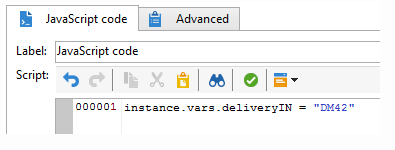

# JavaScript 스크립트 및 템플릿{#javascript-scripts-and-templates}

스크립트를 사용하면 값을 계산하고, 프로세스에서 여러 작업 간에 데이터를 교환하고, SOAP 호출을 사용하여 특정 작업을 실행할 수 있습니다.

스크립트는 워크플로우 다이어그램에서 자주 사용됩니다.

* 모든 활동에는 초기화 스크립트가 있습니다. 초기화 스크립트는 활동이 활성화되면 실행되며 변수를 초기화하고 속성을 수정하는 데 사용할 수 있습니다.
* &#39;JavaScript 코드&#39; 활동은 단순히 스크립트를 실행하는 데 사용됩니다.
* &#39;Test&#39; 활동은 적절한 전환을 활성화하기 위해 JavaScript 표현식을 평가합니다.
* 대부분의 텍스트 필드는 JavaScript 템플릿입니다.JavaScript 표현식은 &lt;%= 및 %> 사이에 포함될 수 있습니다. 이러한 필드는 표현식을 입력하는 데 도움이 되는 드롭다운 목록을 여는 단추를 제공합니다.

   

## 노출된 개체 {#objects-exposed}

워크플로우 컨텍스트에서 실행되는 JavaScript는 일련의 추가 글로벌 객체에 액세스합니다.

* **인스턴스**:실행 중인 워크플로우를 나타냅니다. 이 개체의 스키마는 xtk: **workflow**&#x200B;입니다.
* **작업**:실행 중인 작업을 나타냅니다. 이 개체의 스키마는 xtk:workflowTask **입니다**.
* **이벤트**:실행 중인 작업을 활성화한 이벤트를 나타냅니다. 이 개체의 스키마는 xtk:workflowEvent **입니다**. 이 개체는 여러 전환에서 활성화된 **AND-join** 유형 활동에 대해 초기화되지 않았습니다.
* **이벤트**:현재 작업을 활성화한 이벤트 목록을 나타냅니다. 이 개체의 스키마는 xtk:workflowEvent **입니다**. 이 표에는 보통 하나의 요소가 포함되어 있지만 여러 전환을 기반으로 **활성화된 AND-join** 유형 활동에 대해 몇 가지 요소가 포함될 수 있습니다.
* **활동**:실행 중인 작업의 모델을 나타냅니다. 이 개체의 스키마는 활동 유형에 따라 다릅니다. 이 개체는 초기화 스크립트에서 다른 스크립트에서 확인할 수 없는 효과가 있는 수정으로 수정할 수 있습니다.

이러한 개체에 사용할 수 있는 속성은 스크립트 도구 모음 오른쪽에 있는 단추를 클릭하여 드롭다운 목록에서 볼 수 있습니다.

>[!CAUTION]
>
>이러한 객체의 속성은 vars 속성의 하위 속성을 제외하고 읽기 전용입니다.
>  
>이러한 대부분의 속성은 기본 작업을 실행한 후나 인스턴스가 수동된 후에만 업데이트됩니다. 읽히는 값은 현재 상태가 아닌 이전 상태와 반드시 일치하지 않습니다.

**예**

이 예제와 다음 예에서 다음 다이어그램과 같이 JavaScript 코드 **활동** 및 종료 **활동을 포함하는** 워크플로우를 만듭니다.


JavaScript **코드** 활동을 두 번 클릭하고 다음 스크립트를 삽입합니다.

```
logInfo("Label: " + instance.label)
logInfo("Start date: " + task.creationDate)
```

이 **[!UICONTROL logInfo(message)]** 함수는 로그에 메시지를 삽입합니다.

아이콘을 **[!UICONTROL OK]** 클릭하여 작성 마법사를 닫은 다음 워크플로우 목록 오른쪽 상단에 있는 작업 버튼을 사용하여 워크플로우를 시작합니다. 실행이 완료되면 로그를 참조하십시오. 스크립트에 해당하는 두 개의 메시지가 표시됩니다.하나는 워크플로우의 레이블을 표시하고 다른 하나는 스크립트가 활성화된 날짜를 표시합니다.

## 변수 {#variables}

변수는 **[!UICONTROL instance]**&#x200B;및 **[!UICONTROL task]** 객체의 무료 속성입니다 **[!UICONTROL event]** . 이러한 변수에 대해 승인된 JavaScript 유형은 **[!UICONTROL string]**&#x200B;및 **[!UICONTROL number]** 입니다 **[!UICONTROL Date]**.

### 인스턴스 변수 {#instance-variables}

인스턴스 변수(**[!UICONTROL instance.vars.xxx]**)는 전역 변수와 비교할 수 있습니다.모든 활동에 의해 공유됩니다.

### 작업 변수 {#task-variables}

작업 변수(**[!UICONTROL task.vars.xxx]**)는 로컬 변수와 비교할 수 있습니다.현재 작업에서만 사용됩니다. 이러한 변수는 지속적인 활동에 의해 데이터를 유지하는 데 사용되며, 경우에 따라 동일한 활동의 다른 스크립트 간에 데이터를 교환하는 데 사용됩니다.

### 이벤트 변수 {#event-variables}

이벤트 변수(**[!UICONTROL vars.xxx]**)를 사용하면 워크플로우 프로세스의 기본 작업 간에 데이터를 교환할 수 있습니다. 이러한 변수는 진행 중인 작업을 활성화한 작업에 의해 전달됩니다. 이를 수정하고 새 항목을 정의할 수 있습니다. 그런 다음 다음 다음 활동으로 전달됩니다.

AND **조인** 유형 활동의 경우 변수가 병합되지만 동일한 변수가 두 번 정의되면 충돌이 발생하고 값이 결정되지 않은 상태로 유지됩니다.

이러한 변수들은 가장 자주 사용되는 변수이며, 인스턴스 변수보다 우선적으로 사용해야 합니다.

특정 이벤트 변수는 다양한 활동에 의해 수정되거나 읽습니다. 모두 문자열 유형 변수입니다. 예를 들어 내보내기는 방금 내보낸 파일의 전체 이름으로 **[!UICONTROL vars.filename]** 변수를 설정합니다. 이러한 읽기 또는 수정된 모든 변수는 [활동의](../../workflow/using/about-activities.md)[입력] 매개 변수 **및** 출력 매개 **변수** 섹션에서활동정보에 설명되어 있습니다.

### 예 {#example}

**예 1**

이 예에서 인스턴스 변수는 모집단에 적용할 분할 비율을 동적으로 계산하는 데 사용됩니다.

1. 워크플로우를 만들고 시작 활동을 추가합니다.

1. JavaScript 코드 활동을 추가하고 구성하여 인스턴스 변수를 정의합니다.

   예: `instance.vars.segmentpercent = 10;`

   

1. 필요에 따라 쿼리 활동을 추가하고 수신자를 타깃팅합니다.

1. 분할 활동을 추가하고 들어오는 모집단의 임의 샘플링을 수행하도록 구성합니다. 샘플링 비율은 사용자가 선택한 모든 것이 될 수 있습니다. 이 예에서는 50%로 설정되어 있습니다.

   이전에 정의한 인스턴스 변수 덕분에 동적으로 업데이트되는 이 백분율입니다.

   

1. 분할 활동의 고급 탭의 초기화 스크립트 섹션에서 JS 조건을 정의합니다. JS 조건은 분할 활동에서 나오는 첫 번째 전환의 임의 샘플링 비율을 선택하고 이전에 만든 인스턴스 변수에 의해 설정된 값으로 업데이트합니다.

   ```activity.transitions.extractOutput[0].limiter.percent = instance.vars.segmentpercent;```

   

1. 각 아웃바운드 전환 후에 분할 활동의 별도의 전환 시 보정이 생성되었는지 확인하고 종료 활동을 추가합니다.

1. 워크플로우를 저장하고 실행합니다. 동적 샘플링은 인스턴스 변수에 따라 적용됩니다.

   

**예 2**

1. 앞의 예제에서 워크플로우를 수행하고 JavaScript 코드 **활동의 스크립트를** 다음 스크립트로 바꿉니다.

   ```
   instance.vars.foo = "bar1"
   vars.foo = "bar2"
   task.vars.foo = "bar3"
   ```

1. 종료 활동의 초기화 스크립트에 다음 스크립트를 **추가합니다** .

   ```
   logInfo("instance.vars.foo = " + instance.vars.foo)
   logInfo("vars.foo = " + vars.foo)
   logInfo("task.vars.foo = " + task.vars.foo)
   ```

1. 워크플로우를 시작한 다음 로그를 확인합니다.

   ```
   Workflow finished
   task.vars.foo = undefined
   vars.foo = bar2
   instance.vars.foo = bar1
   Starting workflow (operator 'admin')
   ```

이 예에서는 JavaScript 코드 **다음의 활동이** 인스턴스 변수 및 이벤트 변수에 액세스하지만, 작업 변수는 외부에서(&#39;undefined&#39;)에 액세스할 수 없음을 보여줍니다.

### 쿼리에서 인스턴스 변수 호출 {#calling-an-instance-variable-in-a-query}

활동에 인스턴스 변수를 지정한 후에는 워크플로우 쿼리에서 다시 사용할 수 있습니다.

따라서 필터에서 **instance.vars.xxx = &quot;yyy&quot;** 변수를 호출하려면 **$(instance/vars/xxx)**&#x200B;을 입력합니다.

예:

1. 다음을 통해 게재의 내부 이름을 정의하는 인스턴스 변수를 만듭니다. **[!UICONTROL JavaScript code]****instance.vars.deliveryIN = &quot;DM42&quot;**.

   

1. 타깃팅 및 필터링 차원이 수신자인 쿼리를 만듭니다. 조건에서 변수에 의해 지정된 배달을 보낸 모든 수신자를 찾도록 지정합니다.

   이 정보는 배달 로그에 저장됩니다.

   열의 인스턴스 변수를 참조하려면 **[!UICONTROL Value]** $(instance/vars/@deliveryIN) ****&#x200B;을 입력합니다.

   워크플로우는 DM42 전달 수신자를 반환합니다.

   

## 고급 함수 {#advanced-functions}

표준 JavaScript 함수 외에도 파일을 조작하거나, 데이터베이스에서 데이터를 읽거나 수정하거나, 메시지에 로그를 추가하는 특수 함수를 사용할 수 있습니다.

### 저널 {#journal}

**[!UICONTROL logInfo(message)]** 가 위의 예에서 자세히 설명되어 있습니다. 이 함수는 저널에 정보 메시지를 추가합니다.

**[!UICONTROL logError(message)]** 로그에 오류 메시지를 추가합니다. 스크립트가 실행을 중단하고 워크플로우가 오류 상태로 변경됩니다(기본적으로 인스턴스가 일시 중지됨).

## 초기화 스크립트 {#initialization-script}

특정 조건에서 실행 시 활동의 속성을 수정할 수 있습니다.

대부분의 활동 속성은 JavaScript 템플릿을 사용하거나 워크플로우 속성이 명시적으로 스크립트에 의해 값을 계산할 수 있도록 허용하므로 동적으로 계산될 수 있습니다.

그러나 다른 속성의 경우 초기화 스크립트를 사용해야 합니다. 이 스크립트는 작업이 실행되기 전에 평가됩니다. 이 **[!UICONTROL activity]** 변수는 작업에 해당하는 활동을 참조합니다. 이 활동의 속성은 수정할 수 있으며 이 작업에만 영향을 줍니다.
