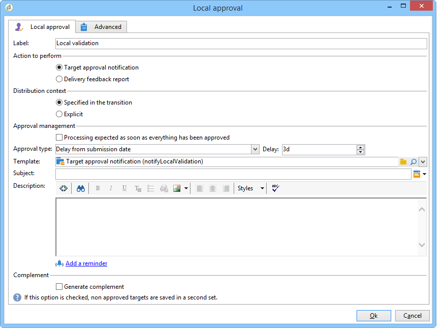
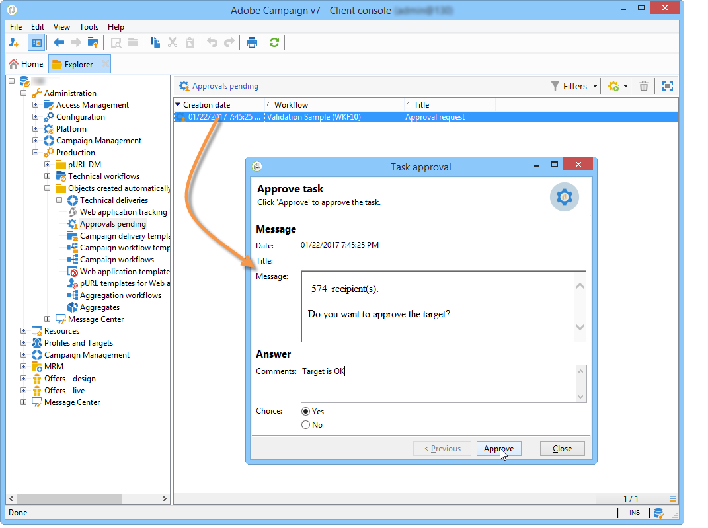

# 로컬 승인{#local-approval}

타깃팅 워크플로우에 통합되면 배달을 보내기 전에 **[!UICONTROL Local approval]** 활동을 통해 수신자 승인 프로세스를 설정할 수 있습니다.

>[!CAUTION]
>
>이 활동을 사용하려면 캠페인 옵션인 분산 마케팅 모듈을 구매해야 합니다. 사용권 계약을 확인하십시오.

배포 템플릿이 있는 **[!UICONTROL Local approval]** 활동의 예를 보려면 [로컬 승인 활동 사용](../../workflow/using/using-the-local-approval-activity.md)을 참조하십시오.

활동 및 **[!UICONTROL Action to execute]** 필드에 대한 레이블을 입력하여 시작합니다.

* 배달 전에 지역 감독관에게 알림 이메일을 전송하고 자신에게 할당된 받는 사람을 승인하도록 요청하려면 **[!UICONTROL Target approval notification]** 옵션을 선택합니다.

   

* **증분 쿼리**:쿼리를 수행하고 실행을 계획할 수 있습니다. [증분 쿼리](../../workflow/using/incremental-query.md) 섹션을 참조하십시오.

   

## Target 승인 알림 {#target-approval-notification}

이 경우 업스트림 타깃팅과 배달 사이에 **[!UICONTROL Local approval]** 활동이 배치됩니다.

대상 승인을 위한 알림의 경우 입력할 필드는 다음과 같습니다.

* **[!UICONTROL Distribution context]**:타깃팅된 인구를  **[!UICONTROL Specified in the transition]** 제한하기 위해  **[!UICONTROL Split]** 유형 활동을 사용하는 경우 옵션을 선택합니다. 이 경우 배포 템플릿이 분할 활동에 입력됩니다. 타깃팅된 인구를 제한하지 않는 경우 여기에서 **[!UICONTROL Explicit]** 옵션을 선택하고 **[!UICONTROL Data distribution]** 필드에 배포 템플릿을 입력합니다.

   데이터 배포 템플릿을 만드는 방법에 대한 자세한 내용은 [데이터 배포당 하위 집합 레코드 수 제한](../../workflow/using/split.md#limiting-the-number-of-subset-records-per-data-distribution)을 참조하십시오.

* **[!UICONTROL Approval management]**

   * 배달 템플릿 및 이메일 알림에 사용할 제목을 선택합니다. 기본 템플릿을 사용할 수 있습니다.**[!UICONTROL Local approval notification]**. 승인 및 피드백 알림에서 수신자 목록 위에 표시되는 설명을 추가할 수도 있습니다.
   * 승인 기한(승인 시작 날짜나 마감일)에 해당하는 **[!UICONTROL Approval type]**&#x200B;을 지정합니다. 이 날짜에 워크플로우가 다시 시작되며 승인되지 않은 수신자는 타깃팅에서 고려되지 않습니다. 알림이 전송되면 로컬 관리자가 연락처를 승인할 수 있도록 활동이 큐에 오르게 됩니다.

      >[!NOTE]
      >
      >기본적으로 승인 프로세스가 시작되면 활동이 3일 동안 보류됩니다.

      또한 한 개 이상의 미리 알림을 추가하여 지역 감독관에게 마감 시간이 다가오고 있음을 알릴 수도 있습니다. 이렇게 하려면 **[!UICONTROL Add a reminder]** 링크를 클릭합니다.

* **[!UICONTROL Complementary set]**:이  **[!UICONTROL Generate complement]** 옵션을 사용하면 승인되지 않은 모든 대상을 포함하는 두 번째 세트를 생성할 수 있습니다.

   >[!NOTE]
   >
   >이 옵션은 기본적으로 비활성화됩니다.

## 배달 피드백 보고서 {#delivery-feedback-report}

이 경우 **[!UICONTROL Local approval]** 활동은 배달 후에 배치됩니다.

배달 피드백 보고서의 경우 다음 필드를 입력해야 합니다.

* 이전 활동 중에 배달을 입력한 경우 **[!UICONTROL Specified in the transition]** 옵션을 선택합니다. **[!UICONTROL Explicit]**&#x200B;을 선택하여 로컬 승인 활동에 배달을 지정합니다.
* 배달 템플릿 및 알림 이메일의 개체를 선택합니다. 기본 템플릿이 있습니다.**[!UICONTROL Local approval notification]**.

## 예:워크플로 배달 승인 {#example--approving-a-workflow-delivery}

이 예에서는 워크플로우 전달에 대한 승인 프로세스를 설정하는 방법을 보여줍니다. 배달 워크플로우 만들기에 대한 자세한 내용은 [예:배달 워크플로](../../workflow/using/delivery.md#example--delivery-workflow) 섹션.

연산자는 다음 두 가지 방법 중 하나로 배달을 승인할 수 있습니다.이메일 메시지에 연결되거나 콘솔을 통해 웹 페이지를 사용하는 것이 좋습니다.

* 웹 승인

   관리자 그룹의 운영자에게 보낸 이메일을 통해 배달 대상을 승인할 수 있습니다. 메시지는 정의된 텍스트를 사용하며 JavaScript 표현식은 계산된 값으로 대체됩니다(이 경우 &#39;574&#39;).

   배달을 승인하려면 관련 링크를 클릭하고 Adobe Campaign 콘솔에 로그온합니다.

   

   선택하고 **[!UICONTROL Submit]** 단추를 클릭합니다.

   

* 콘솔을 통한 승인

   트리 구조에서 **[!UICONTROL Administration > Production > Objects created automatically > Approvals pending]** 노드에는 현재 연결된 연산자가 승인할 작업 목록이 포함되어 있습니다. 목록에 한 줄이 표시됩니다. 응답하려면 이 줄을 두 번 클릭합니다. 다음 창이 표시됩니다.

**예**&#x200B;를 선택한 다음 **[!UICONTROL Approve]**&#x200B;를 클릭합니다. 응답이 기록되었음을 알리는 메시지가 표시됩니다.

워크플로우 화면으로 돌아가기:10초 후 다이어그램이 다음과 같이 표시됩니다.

워크플로우가 **[!UICONTROL Delivery control]** 작업을 실행했으며 이 경우 이전에 만든 배달을 시작하는 것을 의미합니다. 워크플로우가 오류 없이 끝났습니다.
