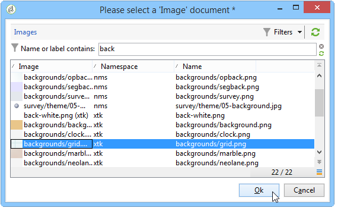

# 활동 이미지 관리{#managing-activity-images}

다양한 워크플로우의 다이어그램에 사용된 이미지를 변경할 수 있습니다. 그러나 특정 제약 조건을 준수해야 합니다. 다음은 구현 단계입니다.

* 배경 이미지를 변경하려면 원하는 타겟팅 워크플로우를 선택하고 **[!UICONTROL Properties]** 탭을 클릭합니다.

   

   사용할 이미지를 선택하려면 **[!UICONTROL Background image]** 필드 오른쪽에 있는 **[!UICONTROL Select link]** 아이콘을 클릭합니다.

   >[!NOTE]
   >
   >배경 이미지의 픽셀 단위 너비는 4의 배수여야 합니다.

   

   **[!UICONTROL Edit link]** 아이콘을 사용하면 선택한 이미지를 볼 수 있습니다.

* 활동과 연관된 이미지를 변경하려면 개체를 두 번 클릭한 다음 **[!UICONTROL Advanced]** 탭을 클릭합니다.

   사용할 이미지를 선택하려면 **[!UICONTROL Image]** 필드 오른쪽에 있는 **[!UICONTROL Select link]** 아이콘을 클릭합니다.

   

   **[!UICONTROL Edit link]** 아이콘을 사용하면 선택한 이미지를 볼 수 있습니다.

   

>[!NOTE]
>
>트리의 **[!UICONTROL Administration > Configuration > Images]** 노드에 저장된 이미지를 선택할 수 있습니다.
>  
>이미지는 48x48픽셀, 1,600만 색상 및 투명한 배경인 PNG 형식이어야 합니다.
