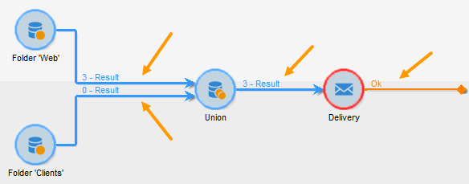
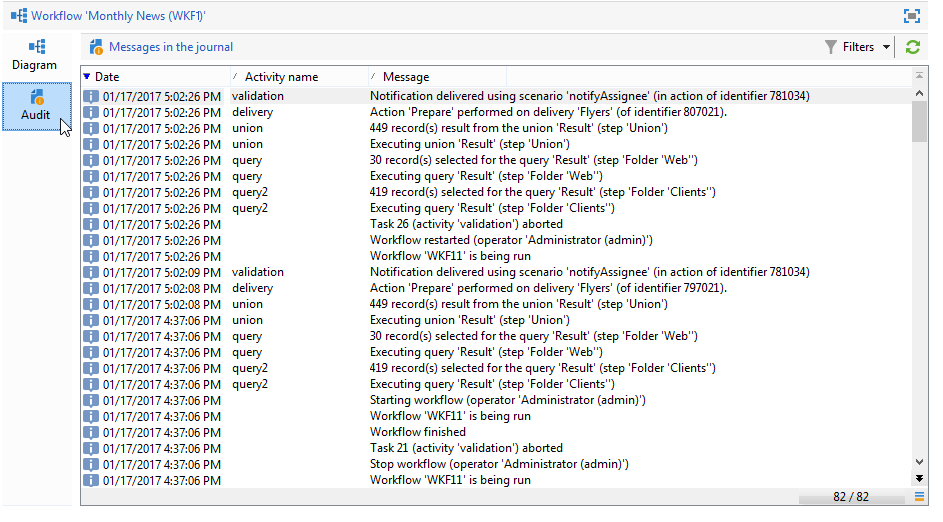

# 워크플로우 실행 모니터링 {#monitoring-workflow-execution}

이 섹션에서는 워크플로우의 실행을 모니터링하는 방법에 대한 정보를 제공합니다.

&quot;일시 중지됨&quot;, &quot;중지됨&quot; 또는 &quot;오류와 함께&quot; 워크플로우 세트의 상태를 모니터링할 수 있는 워크플로우를 만드는 방법에 대한 사용 사례도 [이 섹션에서](../../workflow/using/supervising-workflows.md#supervising-workflows)사용할 수 있습니다.

또한, 인스턴스의 관리자는 감사 추적을 **사용하여** 워크플로우의 상태와 워크플로우에 대한 활동 및 마지막 수정 사항을 확인할 수 있습니다. 자세한 내용은 [전용 섹션을](../../production/using/audit-trail.md)참조하십시오.

다른 캠페인 프로세스를 모니터링하는 추가 방법이 [이 페이지에](https://helpx.adobe.com/campaign/kb/acc-maintenance.html)표시됩니다.

## 진행률 표시 {#displaying-progress}

도구 모음에서 적절한 아이콘을 사용하여 진행 상태를 표시하여 실행을 모니터링할 수 있습니다.

이 **[!UICONTROL Display progress information]** 아이콘을 사용하여 상태 및 활동 결과를 실행 화면에 표시할 수 있습니다.


이 옵션을 선택하면 실행된 활동이 파란색으로 표시되고 보류 중인 활동이 깜박이고 경고가 주황색으로 표시되고 오류는 빨간색으로 표시됩니다. 또한 이 옵션은 활동 속성에 정의된 결과 레이블과 1초를 초과하는 작업의 지속 시간이 뒤에 아웃바운드 전환의 활동 결과도 표시합니다



## 로그 표시 {#displaying-logs}

로그에는 워크플로우의 내역 또는 감사 추적이 포함됩니다. 모든 사용자 작업, 수행된 모든 작업 및 발생한 오류를 등록합니다. 다음 작업을 수행할 수 있습니다.

* 세부 사항에서 **[!UICONTROL Tracking]** 탭을 선택합니다. 이 목록에는 모든 워크플로우 메시지가 포함되어 있습니다.

   

* 활동별로 로그 메시지를 필터링합니다. 이렇게 하려면 다이어그램 **[!UICONTROL Display the tasks and the log]** 위의 도구 모음에서 다이어그램 **[!UICONTROL Log]** 및 **[!UICONTROL Tasks]** 탭을 클릭하여 표시합니다. 모든 관련 메시지를 보려면 활동을 선택합니다. 이 목록에는 활동이 선택되지 않은 경우 모든 메시지가 포함됩니다.

   

   >[!NOTE]
   >
   >다이어그램의 배경을 클릭하여 모든 요소의 선택을 취소합니다.

* 지정된 작업에 연결된 메시지만 표시합니다. 이렇게 하려면 **[!UICONTROL Tasks]** 탭을 선택한 다음 목록에서 활동을 선택합니다. 작업을 두 번 클릭하여 정보를 표시합니다.창의 마지막 탭에는 로그가 포함되어 있습니다.

   

   이 **[!UICONTROL Details...]** 단추를 사용하면 활동 실행에 대한 모든 추가 정보를 표시할 수 있습니다. 예를 들어 다음 예와 같이 유효성 검사 연산자와 승인 중에 입력한 주석을 볼 수 있습니다.

   

>[!NOTE]
>
>워크플로우를 다시 시작하면 로그가 삭제되지 않습니다. 모든 메시지가 유지됩니다. 이전 실행에서 메시지를 삭제하려면 내역을 삭제해야 합니다.

로그는 타깃팅 워크플로우 활동과 관련된 실행 메시지의 시간순 목록을 보여줍니다.

* 타깃팅 캠페인 로그

   타깃팅 캠페인이 실행되면 **[!UICONTROL Tracking]** 탭을 클릭하여 실행 추적을 봅니다.

   

   모든 캠페인 메시지가 표시됩니다.캠페인과 경고 또는 오류가 수행되었습니다.

* 활동 로그

   실행 로그 및 각 활동의 세부 사항을 볼 수도 있습니다. 다음 두 가지 방법으로 이 작업을 수행할 수 있습니다.

   1. 타깃팅된 활동을 선택하고 **[!UICONTROL Display the tasks and the log]** 아이콘을 클릭합니다.

      

      다이어그램의 하단 섹션에는 두 개의 탭이 표시됩니다.로그 및 작업을 참조하십시오.

      다이어그램 내에서 선택한 활동은 로그 및 작업 목록에서 필터로 작동합니다.

      

   1. 타깃팅된 활동을 마우스 오른쪽 단추로 클릭하고 **[!UICONTROL Display logs]**&#x200B;선택합니다.

      

      로그는 별도의 창에 표시됩니다.

## 로그 제거 {#purging-the-logs}

워크플로우 내역은 자동으로 삭제되지 않습니다.모든 메시지는 기본적으로 유지됩니다. 작업 내역은 **[!UICONTROL File > Actions]** 메뉴 또는 목록 위의 도구 모음에 있는 **[!UICONTROL Actions]** 단추를 클릭하여 삭제할 수 있습니다. 을 **[!UICONTROL Purge history]**&#x200B;선택합니다. 메뉴에서 사용할 수 있는 옵션은 작업 도구 모음 **[!UICONTROL Actions]**[](../../workflow/using/executing-a-workflow.md#actions-toolbar) 섹션에 자세히 설명되어 있습니다.


## 작업 테이블 및 워크플로우 스키마 {#worktables-and-workflow-schema}

워크플로우는 특정 활동을 통해 조작할 수 있는 작업표를 전달합니다. Adobe Campaign을 사용하면 데이터 관리 활동을 통해 워크플로우 워크플로우의 열을 수정, 이름 변경 및 보완할 수 있습니다. 예를 들어 클라이언트의 필요에 따라 계약서에 맞게 정렬하고 계약의 공동 수익자에 대한 추가 정보를 수집하는 등 워크플로우 워크플로우의 열을 수정할 수 있습니다.

다양한 작업 차원 간에 링크를 만들고 차원 변경을 정의할 수도 있습니다. 예를 들어 데이터베이스에 기록된 각 계약에 대해 주 보유자에게 주소를 지정하고 추가 정보에 공동 소유자 데이터를 사용합니다.

워크플로우가 수동되면 워크플로우의 작업 테이블이 자동으로 삭제됩니다. 작업 테이블을 유지하려면 **[!UICONTROL List update]** 활동을 통해 목록에 저장합니다(목록 업데이트 [참조](../../workflow/using/list-update.md)).

## 오류 관리 {#managing-errors}

오류가 발생하면 워크플로우가 일시 중지되고 오류가 발생했을 때 실행되는 활동이 빨간색으로 표시됩니다. 워크플로우 개요(**[!UICONTROL Monitoring]** 우주 > **[!UICONTROL Workflows]** 링크)에서는 아래와 같이 오류가 있는 워크플로우만 표시할 수 있습니다.


Adobe Campaign 탐색기에서 기본적으로 워크플로우 목록에 **[!UICONTROL Failed]** 열이 표시됩니다.


워크플로우에 오류가 발생하면 워크플로우 감독 그룹에 속한 운영자에게 이메일 주소가 프로필에 나열되는 한 전자 메일로 알림을 보냅니다. 이 그룹은 워크플로 속성의 **[!UICONTROL Supervisor(s)]** 필드에서 선택됩니다.


알림 컨텐츠는 **[!UICONTROL Workflow manager notification]** 기본 템플릿에서 구성됩니다.이 템플릿은 워크플로 속성의 **[!UICONTROL Execution]** 탭에서 선택됩니다. 알림은 오류 워크플로우의 이름과 관련 작업을 표시합니다.

알림 예:


이 링크를 사용하면 웹 모드에서 Adobe Campaign 콘솔에 액세스하고 로그온한 후 오류 워크플로에서 작업할 수 있습니다.


워크플로우가 일시 중지되지 않고 오류가 발생할 경우 실행을 계속하도록 워크플로우를 구성할 수 있습니다. 이렇게 하려면 워크플로우를 편집하고 **[!UICONTROL Properties]****[!UICONTROL Error management]** 섹션에서 **[!UICONTROL Ignore]** 필드에서 **[!UICONTROL In case of error]** 옵션을 선택합니다. 그런 다음 프로세스를 일시 중지하기 전에 무시할 수 있는 연속 오류 수를 지정할 수 있습니다.

이 경우 오류 작업이 중단됩니다. 이 모드는 캠페인을 나중에 다시 시도하도록 설계된 워크플로우에 특히 적합합니다(주기적 작업).


>[!NOTE]
>
>각 활동에 대해 이 구성을 개별적으로 적용할 수 있습니다. 이렇게 하려면 활동 속성을 편집하고 **[!UICONTROL Advanced]** 탭에서 오류 관리 모드를 선택합니다.

워크플로우의 실행 문제 해결에 대한 자세한 내용은 [전용 섹션을](../../production/using/workflow-execution.md)참조하십시오.

## 처리 오류 {#processing-errors}

활동과 관련하여 이 **[!UICONTROL Process errors]** 옵션은 오류가 생성될 때 활성화되는 특정 전환을 표시합니다. 이 경우 워크플로우는 오류 모드로 전환되지 않고 계속 실행됩니다.

파일 시스템 오류(파일을 이동할 수 없음, 디렉토리에 액세스할 수 없음 등)를 고려하여 발생한 오류입니다.

이 옵션은 활동 구성과 관련된 오류(예: 잘못된 값)를 처리하지 않습니다. 잘못된 구성과 관련된 오류는 이 전환을 활성화하지 않습니다(디렉토리가 존재하지 않음).

워크플로우가 일시 중지되면(수동 또는 오류 후 자동) **[!UICONTROL Start]** 단추가 중지된 위치에서 워크플로우 실행을 다시 시작합니다. 잘못된 활동(또는 일시 중지된 활동)이 다시 실행됩니다. 이전 활동은 다시 실행되지 않습니다.

모든 워크플로우 활동을 다시 실행하려면 **[!UICONTROL Restart]** 단추를 사용합니다.

이미 실행된 활동을 수정하는 경우 워크플로우 실행이 다시 시작될 때 변경 사항이 고려되지 않습니다.

실행되지 않은 활동을 수정하는 경우 워크플로우 실행이 다시 시작될 때 고려됩니다.

일시 중지된 활동을 수정하는 경우 워크플로우를 다시 시작할 때 변경 사항을 올바로 고려할 수 없습니다.

가능하면 수정 작업을 수행한 후 워크플로우를 완전히 다시 시작하는 것이 좋습니다.

## 인스턴스 감독 {#instance-supervision}

이 **[!UICONTROL Instance supervision]** 페이지에서는 Adobe Campaign 서버 활동을 보고 오류가 있는 워크플로우 및 게재 목록을 표시할 수 있습니다.

이 페이지에 액세스하려면 **[!UICONTROL Monitoring]** 우주로 이동하고 **[!UICONTROL General view]** 링크를 클릭합니다.


모든 워크플로우를 표시하려면 **[!UICONTROL Workflows]** 링크를 클릭합니다. 드롭다운 목록을 사용하여 상태에 따라 플랫폼의 워크플로우를 표시합니다.


오류가 있는 워크플로우의 링크를 클릭하여 열고 로그를 확인합니다.


## 동시 다중 실행 방지 {#preventing-simultaneous-multiple-executions}

하나의 워크플로우에서 동시에 여러 개의 실행 작업이 실행될 수 있습니다. 경우에 따라 이러한 문제가 발생하지 않도록 해야 합니다.

예를 들어 스케줄러가 매시간마다 워크플로우 실행을 트리거하도록 할 수 있지만, 전체 워크플로우의 실행은 한 시간 이상 걸립니다. 워크플로우가 이미 실행 중인 경우 실행을 건너뛸 수 있습니다.

워크플로우가 시작될 때 신호 활동이 있는 경우 워크플로우가 실행 중인 경우 신호를 건너뛸 수 있습니다.

일반적인 원칙은 다음과 같습니다.


솔루션은 인스턴스 변수를 사용하는 것입니다. 인스턴스 변수는 워크플로우의 모든 병렬 실행에서 공유됩니다.

다음은 간단한 테스트 워크플로우입니다.


그 **[!UICONTROL Scheduler]** 때문에 매 분 마다 이벤트가 트리거되고 있다. 다음 **[!UICONTROL Test]** 활동은 isRunning **인스턴스 변수를 테스트하여 실행을** 계속할지 여부를 결정합니다.


>[!NOTE]
>
>**isRunning** is a variable name selected for this example. 이 변수는 내장 변수가 아닙니다.

예 **[!UICONTROL Test]** 분기에서 다음 활동 바로 다음에 나오는 **활동은 초기화 스크립트에서** 인스턴스 변수를 ****&#x200B;설정해야 합니다.

```
instance.vars.isRunning = true
```

예 **분기의 마지막 활동은 초기화 스크립트의** 변수를 false로 되돌려야 ****&#x200B;합니다.

```
instance.vars.isRunning = false
```

참고:

* 워크플로우 속성의 변수 탭을 통해 인스턴스 변수의 현재 **값을** 확인할 수 **있습니다**.
* 인스턴스 변수는 워크플로우를 다시 시작하면 재설정됩니다.
* JavaScript에서 undefined 값은 테스트에서 false로 설정되므로 인스턴스 변수를 초기화하기 전에 테스트할 수 있습니다.
* &quot;no&quot; 끝의 초기화 스크립트에 로깅 명령을 추가하여 이 메커니즘으로 인해 처리되지 않은 활동을 모니터링할 수 있습니다.

   ```
   logInfo("Workflow already running, parallel execution not allowed.");
   ```

이 섹션에서는 사용 사례를 제공합니다.데이터 [업데이트](../../workflow/using/coordinating-data-updates.md)조정

## 데이터베이스 유지 관리 {#database-maintenance}

워크플로우에서는 공간을 소모하고 유지 관리하지 않는 경우 전체 플랫폼의 속도가 느려지는 많은 작업 테이블을 사용합니다. 데이터베이스 유지 관리에 대한 자세한 내용은 이 [섹션을](../../production/using/tables-to-maintain.md) 참조하십시오.

관리 **> 프로덕션** > 기술 워크플로우 **노드를 통해 액세스할 수 있는 데이터베이스 정리** 워크플로우를 사용하면 오래된 데이터를 삭제하여 데이터베이스의 기하급수적인 증가를 방지할 수 있습니다. 사용자 개입 없이 워크플로우가 자동으로 트리거됩니다. 이 [섹션을](../../production/using/database-cleanup-workflow.md)참조하십시오.

특정 기술 워크플로우를 만들어 불필요한 데이터 소비 공간을 제거할 수도 있습니다. 이 [섹션](../../production/using/application-objects.md) 및 이 [페이지를](#purging-the-logs)참조하십시오.

## 일시 중지된 워크플로우 처리 {#handling-of-paused-workflows}

기본적으로 워크플로우가 일시 중지되면 작업 테이블은 삭제되지 않습니다. 빌드 8880부터 너무 오랫동안 일시 중지된 워크플로우가 자동으로 중지되고 작업 테이블이 삭제됩니다. 이 동작은 다음과 같이 트리거됩니다.

* 7일 이후에 일시 중지된 워크플로우는 모니터링 대시보드(및 모니터링 API)에 경고로 표시되고, 알림이 수퍼바이저 그룹에 전송됩니다.
* 기술 워크플로우가 트리거되는 매주 **[!UICONTROL cleanupPausedWorkflows]** 이와 동일합니다. 워크플로우에 대한 자세한 내용은 [이 섹션을](../../workflow/using/delivery.md)참조하십시오.
* 4개의 알림 후(즉, 기본적으로 일시 중지된 상태로 1개월) 워크플로우가 조건 없이 중지됩니다. 로그가 중지된 후 워크플로우에 표시됩니다. 다음 실행 **[!UICONTROL cleanup]** 워크플로우에서 테이블이 삭제됩니다

이러한 기간은 NmsServer_PausedWorkflowPeriod 옵션을 통해 구성할 수 있습니다.

워크플로우 감독자에게 알림 메시지가 표시됩니다. 워크플로우를 수정한 작성자 및 마지막 사용자도 알림을 받습니다. 관리자는 알림을 받지 않습니다.

## 상태에 따라 워크플로우 필터링{#filtering-workflows-status}

Campaign Classic 인터페이스를 사용하면 사전 정의된&#x200B;**보기를**&#x200B;사용하여 인스턴스에 있는 모든 워크플로우의 실행 상태를 모니터링할 수 있습니다. 이러한 뷰에 액세스하려면&#x200B;**[!UICONTROL Administration]**/**[!UICONTROL Audit]**/**[!UICONTROL Workflows Status]**&#x200B;노드를 엽니다.

다음 보기를 사용할 수 있습니다.

* **[!UICONTROL Running]**: list all running workflows.
* **[!UICONTROL Paused]**: lists all paused workflows.
* **[!UICONTROL Failed]**: list all failed workflows.
* **[!UICONTROL Start Pending]**: list all workflows that are waiting to be started by the operationMgt process. 이 보기는 마케팅 캠페인&#x200B;**패키지만 사용할 수 있습니다(Campaign 표준**&#x200B;패키지 [](../../installation/using/installing-campaign-standard-packages.md)설치 참조).


기본적으로 이러한 보기는&#x200B;**[!UICONTROL Audit]**&#x200B;폴더에서 액세스할 수 있습니다. 하지만 폴더 트리에서 원하는 위치에 다시 만들 수 있습니다. 이렇게 하면 관리 권한이 없는 표준 사용자가 사용할 수 있습니다.

이렇게 하려면:

1. 보기를 추가할 폴더를 마우스 오른쪽 단추로 클릭합니다.
1. / **[!UICONTROL Add new folder]**&#x200B;에서&#x200B;**[!UICONTROL Administration]**&#x200B;추가할 보기를 선택합니다.
1. 폴더가 트리에 추가되면 원래 폴더가 무엇이든지 모든 워크플로우를 표시하도록 해당 폴더를 보기로 구성해야 합니다.보기를 구성하는 방법에 대한 자세한 내용은 [이 섹션을](../../platform/using/access-management.md#adding-folders-and-creating-views)참조하십시오.

또한 이러한 보기에 따라 워크플로우 목록을 실행 상태에 따라 필터링할 수 있도록 필터 폴더를 설정할 수 있습니다. 이렇게 하려면:

1. 워크플로우 유형 폴더에 액세스한 다음 **[!UICONTROL Filters]** / **[!UICONTROL Advanced filter]** 메뉴를 선택합니다.
1. 워크플로우의 **[!UICONTROL @status]** 필드가 선택한 상태와 같도록 필터를 구성합니다.
1. 필터를 저장하고 이름을 지정합니다. 그런 다음 필터 목록에서 직접 사용할 수 있습니다.


자세한 내용은 다음 섹션을 참조하십시오.

* [고급 필터 만들기](../../platform/using/creating-filters.md#creating-an-advanced-filter)
* [필터 저장](../../platform/using/creating-filters.md#saving-a-filter)
