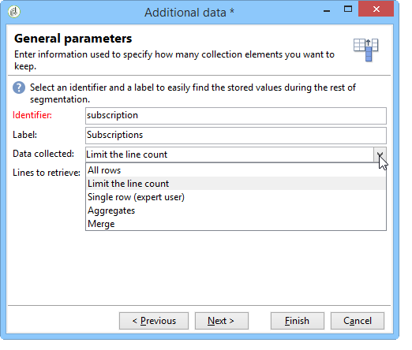

# 쿼리{#query}

## 쿼리 {#creating-a-query} 만들기

쿼리를 사용하면 기준에 따라 대상을 선택할 수 있습니다. 세그먼트 코드를 쿼리 결과에 연결하고 추가 데이터를 여기에 삽입할 수 있습니다.
쿼리 샘플에 대한 자세한 내용은 이 [이 섹션](../../workflow/using/querying-recipient-table.md)을 참조하십시오.

>[!NOTE]
>
>oracle 사용 시 쿼리 활동은 CLOB 필드와 호환되지 않습니다.

추가 데이터 사용 및 관리에 대한 자세한 내용은 [데이터 추가](#adding-data)를 참조하십시오.

**[!UICONTROL Edit query...]** 링크를 사용하면 타깃팅 유형, 제한 사항 및 모집단 선택 기준을 다음과 같이 정의할 수 있습니다.

1. 타깃팅 및 필터링 차원을 선택합니다. 기본적으로 대상은 받는 사람으로부터 선택됩니다. 제한 필터 목록은 배달 타깃팅에 사용되는 필터와 동일합니다.

   타깃팅 차원이 작업 중인 요소 유형과 일치합니다(예: 작업에 의해 타깃팅된 인구).

   필터링 차원을 사용하면 이러한 요소를 수집할 수 있습니다. 예를 들어 타깃팅된 개인(계약, 전체 및 최종 결제 등)과 관련된 정보를 수집할 수 있습니다.

   이에 대한 자세한 내용은 [타깃팅 및 필터링 차원](../../workflow/using/building-a-workflow.md#targeting-and-filtering-dimensions)을 참조하십시오.

   

   필요한 경우 타깃팅 및 필터링 차원을 선택할 때 **[!UICONTROL Temporary schema]**&#x200B;을 선택하면 인바운드 전환의 데이터를 쿼리할 수 있습니다.

   

1. 마법사를 사용하여 모집단을 정의합니다. 입력할 필드는 대상 유형에 따라 다를 수 있습니다. **[!UICONTROL Preview]** 탭을 사용하여 현재 기준으로 대상 모집단을 미리 볼 수 있습니다.

   필터 또는 쿼리를 만들고 사용하는 방법에 대한 자세한 내용은 이 [섹션](../../platform/using/filtering-options.md)을 참조하십시오.

   

1. 1단계에서 **[!UICONTROL Filtering conditions]**&#x200B;을 선택하거나 **[!UICONTROL Filters]** > **[!UICONTROL Advanced filter...]** 옵션을 사용하는 경우 나중에 필터링 기준을 수동으로 추가해야 합니다.

   해당 상자를 선택하여 데이터 그룹화 조건을 추가할 수도 있습니다. 이렇게 하려면 필터링 차원이 쿼리의 타깃팅 차원과 달라야 합니다. 그룹화에 대한 자세한 내용은 이 [섹션](../../workflow/using/querying-using-grouping-management.md)을 참조하십시오.

   표현식 빌더를 사용하여 논리 옵션 AND, OR 및 EXCEPT와 결합하여 기준을 더 추가할 수도 있습니다. 그런 다음 기준 조합에 대해 **[!UICONTROL Corresponding SQL query...]**&#x200B;을(를) 미리 볼 수 있습니다. 자세한 내용은 이 [섹션](../../platform/using/defining-filter-conditions.md#building-expressions)을 참조하십시오.

   나중에 다시 사용하려면 필터를 저장하십시오.

   

## 데이터 {#adding-data} 추가

추가 열을 사용하면 계약 번호, 뉴스레터 구독 또는 원본 등 타깃팅된 모집단에 대한 추가 정보를 수집할 수 있습니다. 이 데이터는 Adobe Campaign 데이터베이스 또는 외부 데이터베이스에 저장할 수 있습니다.

**[!UICONTROL Add data...]** 링크를 사용하면 수집할 추가 데이터를 선택할 수 있습니다.

추가할 데이터 유형을 선택하여 시작합니다.

* Adobe Campaign 데이터베이스의 데이터를 선택하려면 **[!UICONTROL Data linked to the filtering dimension]**&#x200B;을 선택합니다.
* 외부 데이터베이스의 데이터를 추가하려면 **[!UICONTROL External data]**&#x200B;을 선택합니다. 이 옵션은 **통합 데이터 액세스** 옵션을 구입한 경우에만 사용할 수 있습니다. 자세한 내용은 [외부 데이터베이스 액세스(FDA)](../../workflow/using/accessing-an-external-database--fda-.md)를 참조하십시오.
* 오퍼 엔진에서 생성된 최상의 제안을 저장할 수 있는 열 세트를 추가하려면 **[!UICONTROL An offer proposition]** 옵션을 선택합니다. 이 옵션은 **상호 작용** 모듈을 구입한 경우에만 사용할 수 있습니다.

플랫폼에 선택적 모듈이 설치되지 않은 경우 이 단계가 표시되지 않습니다. 다음 단계로 넘어가셔야 합니다.

Adobe Campaign 데이터베이스에서 데이터를 추가하려면:

1. 추가할 데이터 유형을 선택합니다. 필터링 차원에 속하는 데이터이거나 연결된 테이블에 저장된 데이터일 수 있습니다.

   

1. 데이터가 쿼리의 필터링 차원에 속하는 경우 사용 가능한 필드 목록에서 해당 데이터를 선택하여 출력 열에 표시합니다.

   

   다음을 추가할 수 있습니다.

   * 타깃팅된 모집단 또는 집계로부터 얻은 데이터를 기반으로 계산되는 필드(지난 달 동안의 보류 중인 구매 수, 평균 영수증 금액 등). 예를 들어 [데이터 선택](../../workflow/using/targeting-data.md#selecting-data)으로 이동합니다.
   * 출력 열 목록 오른쪽에 있는 **[!UICONTROL Add]** 단추를 사용하여 만든 새 필드입니다.

      계약서 목록, 마지막 5개 납품 등과 같은 정보 모음을 추가할 수도 있습니다. 컬렉션은 동일한 프로필에 대해 여러 값을 가질 수 있는 필드와 일치합니다(1-N 관계). 자세한 내용은 [추가 데이터 편집](../../workflow/using/targeting-data.md#editing-additional-data)을 참조하십시오.

타깃팅된 모집단에 연결된 정보 컬렉션을 추가하려면:

1. 마법사의 첫 번째 단계에서 **[!UICONTROL Data linked to the filtering dimension]** 옵션을 선택합니다.
1. 수집할 정보가 포함된 테이블을 선택하고 **[!UICONTROL Next]**&#x200B;을 클릭합니다.

   

1. 필요한 경우 **[!UICONTROL Data collected]** 필드에서 값 중 하나를 선택하여 유지할 컬렉션의 요소 수를 지정합니다. 기본적으로 컬렉션의 모든 줄이 복구되고 다음 단계에서 지정한 조건에 따라 필터링됩니다.

   * 컬렉션의 단일 요소가 이 컬렉션에 대한 필터링 조건과 일치하는 경우 **[!UICONTROL Data collected]** 필드에서 **[!UICONTROL Single row]**&#x200B;을 선택합니다.

      >[!IMPORTANT]
      >
      >이 모드는 컬렉션 요소의 직접적인 시점 덕분에 생성된 SQL 쿼리를 최적화합니다.
      >
      >초기 조건이 준수하지 않으면 결과에 결함이 있을 수 있습니다(누락 또는 중복 라인).

   * 여러 줄(**[!UICONTROL Limit the line count]**)을 복구하도록 선택하는 경우 수집할 줄 수를 지정할 수 있습니다.
   * 수집된 열에 집계된 실패 수, 사이트의 평균 비용 등 합계가 포함되어 있는 경우 **[!UICONTROL Aggregates]** 값을 사용할 수 있습니다.

   

1. 컬렉션의 하위 선택 항목을 지정합니다. 예:지난 15일 동안의 구매에만 해당됩니다.

   

1. **[!UICONTROL Limit the line count]** 옵션을 선택한 경우 수집된 데이터를 필터링할 순서를 정의합니다. 수집된 라인 수가 유지하도록 지정한 라인 수보다 많으면 필터링 순서를 사용하여 유지할 라인을 지정할 수 있습니다.

## 예:단순 받는 사람 속성 {#example--targeting-on-simple-recipient-attributes}에 대한 타깃팅

다음 예에서는 18세에서 30세 사이의 남자들과 프랑스에 살고 있는 남자를 확인하려고 합니다. 이 쿼리는 예를 들어 배타적 오퍼를 만드는 워크플로우에서 사용됩니다.

>[!NOTE]
>
>추가 쿼리 샘플은 [이 섹션](../../workflow/using/querying-recipient-table.md)에 있습니다.

1. 쿼리 이름을 지정한 다음 **[!UICONTROL Edit query...]** 링크를 선택합니다.
1. 사용 가능한 필터 유형 목록에서 **[!UICONTROL Filtering conditions]**&#x200B;을 선택합니다.
1. 제안된 대상에 대해 다른 기준을 입력합니다. 여기서 기준은 AND 옵션을 사용하여 결합됩니다. 선택 항목에 포함하려면 수신자는 다음 4가지 조건을 충족해야 합니다.

   * 제목이 &quot;Mr.&quot;인 받는 사람(**Gender** 필드와 **Male**&#x200B;을(를) 값으로 선택하여 찾을 수도 있음).
   * 30세 미만의 수혜자.
   * 18세 이상 수령인.
   * 프랑스에 거주하는 수신자.

   

   기준 조합과 일치하는 SQL을 볼 수 있습니다.

   

1. 관련 탭에서 쿼리와 일치하는 수신자를 미리 보면서 기준이 올바른지 확인할 수 있습니다.

   

1. 필터를 저장하여 나중에 **[!UICONTROL Finish]** > **[!UICONTROL OK]**&#x200B;을 클릭하여 다시 사용할 수 있습니다.
1. 다른 활동을 추가하여 워크플로우를 계속 편집합니다. 이전 쿼리 단계를 완료하고 나면 찾은 받는 사람 수가 표시됩니다. 마우스 팝업 메뉴(전환 > **[!UICONTROL Display the target...]** 마우스 오른쪽 단추 클릭)를 사용하여 세부 정보를 표시할 수 있습니다.

   

## 출력 매개 변수 {#output-parameters}

* tableName
* 스키마
* recCount

이 세 값 집합은 쿼리를 기준으로 타게팅된 모집단을 식별합니다. **[!UICONTROL tableName]** 는 대상 식별자를 기록하는 테이블의 이름이며, 채우기 **[!UICONTROL schema]** 의 스키마(일반적으로 nms:recipient) **[!UICONTROL recCount]** 이며 표의 요소 수입니다.

이 값은 작업 테이블의 스키마입니다. 이 매개 변수는 **[!UICONTROL tableName]** 및 **[!UICONTROL schema]**&#x200B;이(가) 있는 모든 전환에서 유효합니다.

## 쿼리 최적화 {#optimizing-queries}

아래 섹션에서는 Adobe Campaign에서 실행되는 쿼리를 최적화하여 데이터베이스의 작업 로드를 제한하고 사용자 경험을 향상시키는 모범 사례를 제공합니다.

### 연결 및 인덱스 {#joins-and-indexes}

* 효율적인 쿼리는 색인에 의존합니다.
* 모든 조인에 대한 인덱스를 사용합니다.
* 스키마에 링크를 정의하면 조인 조건이 결정됩니다. 연결된 테이블에는 기본 키에 고유한 인덱스가 있어야 하며 조인은 이 필드에 있어야 합니다.
* 문자열 필드 대신 숫자 필드에 키를 정의하여 조인을 수행합니다.
* 외부 조인을 수행하지 마십시오. 가능하면 Zero ID 레코드를 사용하여 외부 조인 기능을 달성하십시오.
* 조인에 올바른 데이터 유형을 사용합니다.

   `where` 절이 필드와 같은 유형인지 확인하십시오.

   일반적인 실수는 다음과 같습니다.`iBlacklist='3'` 여기서 `iBlacklist`은 숫자 필드이고 `3`는 텍스트 값을 나타냅니다.

   쿼리의 실행 계획이 어떤 것인지를 확인합니다. 특히 매분마다 실행되는 실시간 쿼리 또는 거의 실시간 쿼리의 경우 전체 테이블 검색을 피합니다.

자세한 내용은 [데이터 모델 모범 사례](https://helpx.adobe.com/kr/campaign/kb/acc-data-model-best-practices.html) 및 [데이터베이스 매핑](../../configuration/using/database-mapping.md) 섹션을 참조하십시오.

### 함수 {#functions}

* `Lower(...)`과 같은 기능을 주의하십시오. Lower 함수를 사용하면 색인은 사용되지 않습니다.
* &quot;좋아요&quot; 지침 또는 &quot;상단&quot; 또는 &quot;하단&quot; 지침을 사용하여 쿼리를 신중하게 확인합니다. 데이터베이스 필드가 아닌 사용자 입력에 &quot;상한&quot;을 적용합니다.

   함수에 대한 자세한 내용은 [이 섹션](../../platform/using/defining-filter-conditions.md#list-of-functions)을 참조하십시오.

### 차원 필터링 {#filtering-dimensions}

&quot;exists such as&quot; 연산자를 사용하는 대신 쿼리의 필터링 차원을 사용합니다.

쿼리에서 필터의 &quot;exists or&quot; 조건이 효율적이지 않습니다. SQL의 하위 쿼리와 같습니다.

`select iRecipientId from nmsRecipient where iRecipientId IN (select iRecipientId from nmsBroadLog where (...))`

쿼리의 필터링 차원을 대신 사용하는 것이 좋습니다.

SQL의 필터링 차원에 해당하는 값은 내부 연결입니다.

`select iRecipientId from nmsRecipient INNER JOIN nmsBroadLog ON (...)`

차원 필터링에 대한 자세한 내용은 [이 섹션](../../workflow/using/building-a-workflow.md#targeting-and-filtering-dimensions)을 참조하십시오.

### 아키텍쳐 {#architecture}

* 프로덕션 플랫폼과 유사한 볼륨, 매개 변수 및 아키텍처로 개발 플랫폼을 구축할 수 있습니다.
* 개발 및 제작 환경에 동일한 값을 사용하십시오. 가능한 한 동일하게 사용하십시오.

   * 운영 체제,
   * 버전,
   * 데이터,
   * 애플리케이션,
   * 볼륨.

   >[!NOTE]
   >
   >개발 환경에서 작동하는 기능은 데이터가 다를 수 있는 프로덕션 환경에서 작동하지 않을 수 있습니다. 위험을 예측하고 솔루션을 준비하기 위해 주요 차이점을 파악하도록 노력하라.

* 대상 볼륨과 일치하는 구성을 만듭니다. 대용량 볼륨에는 특정 구성이 필요합니다. 100,000명의 수신자에게 작동하는 구성은 10,000,000명의 수신자에게 사용할 수 없습니다.

   실시간 시스템이 어떻게 확장되는지 고려하십시오. 작은 규모로 작동한다고 해서 큰 볼륨과 적절하다는 것을 의미하지는 않는다. 테스트는 생산 중인 볼륨과 유사한 볼륨을 사용하여 수행해야 합니다. 볼륨(호출 수, 데이터베이스 크기)의 변경 효과를 피크 시간, 피크 일 수 및 프로젝트 수명 동안 평가해야 합니다.
