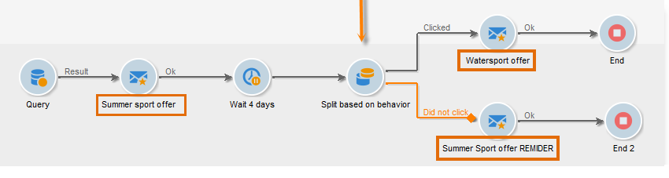

# 게재 정보 쿼리 {#querying-delivery-information}

## 특정 배달 {#number-of-clicks-for-a-specific-delivery} 클릭 수

이 예에서는 특정 전달에 대한 클릭 수를 복구하려고 합니다. 이러한 클릭은 주어진 기간에 수행한 수신자 추적 로그 덕분에 기록됩니다. 수신자는 이메일 주소를 통해 식별됩니다. 이 쿼리는 **[!UICONTROL Recipient tracking logs]** 테이블을 사용합니다.

* 어떤 표를 선택해야 합니까?

   받는 사람 로그 추적 테이블(**[!UICONTROL nms:trackingLogRcp]**)

* 출력 열에 대해 선택할 필드를 선택하십시오.

   기본 키(카운트 포함) 및 이메일

* 어떤 기준을 기반으로 정보를 필터링할 것인가?

   배달 레이블의 특정 기간 및 요소

이 예제를 실행하려면 다음 단계를 수행하십시오.

1. **[!UICONTROL Generic query editor]**&#x200B;을 열고 **[!UICONTROL Recipient tracking logs]** 스키마를 선택합니다.

   

1. **[!UICONTROL Data to extract]** 창에서 정보를 수집하기 위한 집계를 만듭니다. 이렇게 하려면 기본 키(기본 **[!UICONTROL Recipient tracking logs]** 요소 위에 있음)를 추가합니다.추적 로그 수는 이 **[!UICONTROL Primary key]** 필드에서 수행됩니다. 편집된 표현식은 **[!UICONTROL x=count(primary key)]**&#x200B;입니다. 다양한 추적 로그 합계를 단일 이메일 주소로 연결합니다.

   방법은 다음과 같습니다.

   * **[!UICONTROL Output columns]** 필드 오른쪽에 있는 **[!UICONTROL Add]** 아이콘을 클릭합니다. **[!UICONTROL Formula type]** 창에서 **[!UICONTROL Edit the formula using an expression]** 옵션을 선택하고 **[!UICONTROL Next]**&#x200B;를 클릭합니다. **[!UICONTROL Field to select]** 창에서 **[!UICONTROL Advanced selection]**&#x200B;을 클릭합니다.

      

   * **[!UICONTROL Formula type]** 창에서 집계 함수에서 프로세스를 실행합니다. 이 프로세스는 기본 키 카운트가 됩니다.

      **[!UICONTROL Aggregate]** 섹션에서 **[!UICONTROL Process on an aggregate function]**&#x200B;을 선택하고 **[!UICONTROL Count]**&#x200B;를 클릭합니다.

      

      **[!UICONTROL Next]**&#x200B;을(를) 클릭합니다.

   * **[!UICONTROL Primary key (@id)]** 필드를 선택합니다. **[!UICONTROL count (primary key)]** 출력 열이 구성되었습니다.

      

1. 출력 열에 표시할 다른 필드를 선택합니다. **[!UICONTROL Available fields]** 열에서 **[!UICONTROL Recipient]** 노드를 열고 **[!UICONTROL Email]**&#x200B;를 선택합니다. 추적 로그를 이메일 주소로 그룹화하려면 **[!UICONTROL Group]** 상자를 **[!UICONTROL Yes]** 선택합니다.이 그룹은 각 로그를 수신자에게 연결합니다.

   

1. 가장 활성화된 받는 사람(추적 로그가 가장 많은 사람)이 먼저 표시되도록 열 정렬을 구성합니다. **[!UICONTROL Descending sort]** 열에서 **[!UICONTROL Yes]**&#x200B;을 선택합니다.

   

1. 그런 다음 관심 있는 로그(예: 2주 미만이고 영업 관련 게재와 관련된 로그)를 필터링해야 합니다.

   방법은 다음과 같습니다.

   * 데이터 필터링을 구성합니다. 이렇게 하려면 **[!UICONTROL Filter conditions]**&#x200B;을 선택하고 **[!UICONTROL Next]**&#x200B;을 클릭합니다.

      

   * 특정 전달에 대해 지정된 기간 동안 추적 로그를 복구합니다. 3가지 필터링 조건이 필요합니다.현재 날짜 전 2주와 현재 날짜 전 날 사이의 검색 기간을 설정하는 2일 조건및 검색을 특정 게재로 제한할 다른 조건.

      **[!UICONTROL Target element]** 창에서 추적 로그를 고려할 시작 날짜를 구성합니다. **[!UICONTROL Add]**&#x200B;을(를) 클릭합니다. 조건 라인이 표시됩니다. **[!UICONTROL Edit expression]** 함수를 클릭하여 **[!UICONTROL Expression]** 열을 편집합니다. **[!UICONTROL Field to select]** 창에서 **[!UICONTROL Date (@logDate)]**&#x200B;을 선택합니다.

      

      **[!UICONTROL greater than]** 연산자를 선택합니다. **[!UICONTROL Value]** 열에서 **[!UICONTROL Edit expression]**&#x200B;을 클릭하고 **[!UICONTROL Formula type]** 창에서 **[!UICONTROL Process on dates]**&#x200B;을 선택합니다. 마지막으로 **[!UICONTROL Current date minus n days]**&#x200B;에 &quot;15&quot;를 입력합니다.

      **[!UICONTROL Finish]**&#x200B;을(를) 클릭합니다.

      

   * 추적 로그 검색 종료 날짜를 선택하려면 **[!UICONTROL Add]**&#x200B;을 클릭하여 두 번째 조건을 만듭니다. **[!UICONTROL Expression]** 열에서 **[!UICONTROL Date (@logDate)]**&#x200B;을 다시 선택합니다.

      **[!UICONTROL less than]** 연산자를 선택합니다. **[!UICONTROL Value]** 열에서 **[!UICONTROL Edit expression]**&#x200B;을 클릭합니다. 날짜 처리를 위해 **[!UICONTROL Formula type]** 창으로 이동하여 **[!UICONTROL Current date minus n days]**&#x200B;에 &quot;1&quot;을 입력합니다.

      **[!UICONTROL Finish]**&#x200B;을(를) 클릭합니다.

      

      이제 세 번째 필터 조건(예: 쿼리와 관련된 배달 레이블)을 구성합니다.

   * 다른 필터링 조건을 만들려면 **[!UICONTROL Add]** 함수를 클릭합니다. **[!UICONTROL Expression]** 열에서 **[!UICONTROL Edit expression]**&#x200B;을 클릭합니다. **[!UICONTROL Field to select]** 창의 **[!UICONTROL Delivery]** 노드에서 **[!UICONTROL Label]**&#x200B;을 선택합니다.

      **[!UICONTROL Finish]**&#x200B;을(를) 클릭합니다.

      

      &quot;sales&quot;라는 단어가 포함된 배달을 찾습니다. 정확한 레이블을 기억할 수 없으므로 **[!UICONTROL contains]** 연산자를 선택하고 **[!UICONTROL Value]** 열에 &quot;sales&quot;를 입력할 수 있습니다.

      

1. **[!UICONTROL Data preview]** 창으로 이동할 때까지 **[!UICONTROL Next]**&#x200B;을 클릭합니다.여기에 서식을 지정할 필요가 없습니다.
1. **[!UICONTROL Data preview]** 창에서 **[!UICONTROL Start the preview of the data]**&#x200B;을 클릭하여 각 배달 수신자에 대한 추적 로그 수를 확인합니다.

   결과가 내림차순으로 표시됩니다.

   

   사용자의 최대 로그 수는 이 전달에 6개입니다. 5명의 다른 사용자가 이메일 배달 이메일을 열거나 이메일에 있는 링크 중 하나를 클릭했습니다.

## {#recipients-who-did-not-open-any-delivery} 배달을 열지 않은 받는 사람

이 예에서는 지난 7일 동안 이메일을 열지 않은 수신자를 필터링하려고 합니다.

이 예제를 만들려면 다음 단계를 수행하십시오.

1. 워크플로우에서 **[!UICONTROL Query]** 활동을 드래그하여 놓고 활동을 엽니다.
1. **[!UICONTROL Edit query]**&#x200B;을 클릭하고 대상 및 필터링 차원을 **[!UICONTROL Recipients]**&#x200B;으로 설정합니다.

   

1. **[!UICONTROL Filtering conditions]**&#x200B;을 선택하고 **[!UICONTROL Next]**&#x200B;을 클릭합니다.
1. **[!UICONTROL Add]** 단추를 클릭하고 **[!UICONTROL Tracking logs]**&#x200B;을 선택합니다.
1. **[!UICONTROL Tracking logs]** 식의 **[!UICONTROL Operator]**&#x200B;을 **[!UICONTROL Do not exist such as]**&#x200B;로 설정합니다.

   

1. 다른 표현식을 추가합니다. **[!UICONTROL URL]** 범주에서 **[!UICONTROL Type]**&#x200B;을 선택합니다.
1. 그런 다음 **[!UICONTROL Operator]**&#x200B;을 **[!UICONTROL equal to]** 및 그 **[!UICONTROL Value]**&#x200B;를 **[!UICONTROL Open]**&#x200B;으로 설정합니다.

   

1. 다른 표현식을 추가하고 **[!UICONTROL Date]**&#x200B;을 선택합니다. **[!UICONTROL Operator]** 을(를) 로 설정해야 합니다 **[!UICONTROL on or after]**.

   

1. 지난 7일 동안 값을 설정하려면 **[!UICONTROL Value]** 필드에서 **[!UICONTROL Edit expression]** 단추를 클릭합니다.
1. **[!UICONTROL Function]** 범주에서 **[!UICONTROL Current date minus n days]**&#x200B;을 선택하고 타깃팅할 일 수를 추가합니다. 여기, 우리는 지난 7일을 목표로 하고 싶습니다.

   

아웃바운드 전환에는 지난 7일 동안 이메일을 열지 않은 수신자가 포함됩니다.

반대로 하나 이상의 이메일을 연 수신자를 필터링하려면 쿼리는 다음과 같아야 합니다. 이 경우 **[!UICONTROL Filtering dimension]**&#x200B;을(를) **[!UICONTROL Tracking logs (Recipients)]**&#x200B;으로 설정해야 합니다.

## {#recipients-who-have-opened-a-delivery} 배달을 연 받는 사람

다음 예에서는 지난 2주 이내에 배달을 연 프로파일을 타깃팅하는 방법을 보여줍니다.

1. 배달을 연 프로파일을 타깃팅하려면 추적 로그를 사용해야 합니다. 연결된 테이블에 저장됩니다.아래와 같이 **[!UICONTROL Filtering dimension]** 필드의 드롭다운 목록에서 이 테이블을 선택하여 시작합니다.

   

1. 필터링 조건에 대해 추적 로그의 하위 트리 구조에 표시되는 기준의 **[!UICONTROL Edit expression]** 아이콘을 클릭합니다. **[!UICONTROL Date]** 필드를 선택합니다.

   

   **[!UICONTROL Finish]**&#x200B;을 클릭하여 선택을 확인합니다.

   2주 미만의 추적 로그만 복구하려면 **[!UICONTROL Greater than]** 연산자를 선택합니다.

   

   그런 다음 **[!UICONTROL Value]** 열의 **[!UICONTROL Edit expression]** 아이콘을 클릭하여 적용할 계산 공식을 정의합니다. **[!UICONTROL Current date minus n days]** 공식을 선택하고 관련 필드에 15를 입력합니다.

   

   공식 창의 **[!UICONTROL Finish]** 단추를 클릭합니다. 필터링 창에서 **[!UICONTROL Preview]** 탭을 클릭하여 타깃팅 기준을 확인합니다.

   

## {#filtering-recipients--behavior-folllowing-a-delivery} 배달을 따르는 받는 사람의 동작 필터링

워크플로우에서 **[!UICONTROL Query]** 및 **[!UICONTROL Split]** 상자를 사용하여 이전 배달 다음에 오는 동작을 선택할 수 있습니다. 이 선택 사항은 **[!UICONTROL Delivery recipient]** 필터를 통해 수행됩니다.

* 예제의 목표

   배달 워크플로우에서는 첫 번째 이메일 통신을 처리하는 여러 가지 방법이 있습니다. 이 유형의 작업은 **[!UICONTROL Split]** 상자를 사용하는 것과 관련됩니다.

* 컨텍스트

   &quot;여름 스포츠 행사&quot; 배달을 보냅니다. 배달된 지 4일 후에 다른 두 개 배달이 전송됩니다. 그 중 하나는 &quot;수상 스포츠 제안&quot;이고, 다른 하나는 첫 &quot;여름 스포츠 제안&quot;의 후속 단계입니다.

   &quot;Watersports offer&quot; 배달은 첫 번째 배달에서 &quot;watersports&quot; 링크를 클릭한 수신자에게 전송됩니다. 이러한 클릭 수는 수신자가 주제에 관심이 있음을 보여줍니다. 그들을 비슷한 제안으로 유도하는 것이 이치에 맞는다. 그러나 &quot;여름 스포츠 오퍼&quot;에서 클릭하지 않은 수신자는 동일한 컨텐츠를 다시 받게 됩니다.

다음 단계에서는 두 가지 다른 비헤이비어를 통합하여 **[!UICONTROL Split]** 상자를 구성하는 방법을 보여 줍니다.

1. 워크플로우에 **[!UICONTROL Split]** 상자를 삽입합니다. 이 상자는 첫 번째 배달의 수신자를 다음 두 배로 분류합니다. 분류는 첫 번째 배달 중 받는 사람 동작과 연결된 필터링 조건을 기준으로 수행됩니다.

   

1. **[!UICONTROL Split]** 상자를 엽니다. **[!UICONTROL General]** 탭에서 레이블을 입력합니다.예를 들어 **비헤이비어**&#x200B;를 기준으로 분할

   

1. **[!UICONTROL Subsets]** 탭에서 첫 번째 분할 분기를 정의합니다. 예를 들어 이 분기에 대해 **클릭한** 레이블을 입력합니다.
1. **[!UICONTROL Add a filtering condition on the incoming population]** 옵션을 선택합니다. **[!UICONTROL Edit]**&#x200B;을(를) 클릭합니다.
1. **[!UICONTROL Targeting and filtering dimension]** 창에서 **[!UICONTROL Recipients of a delivery]** 필터를 두 번 클릭합니다.

   

1. **[!UICONTROL Target element]** 창에서 이 분기에 적용할 동작을 선택합니다.**[!UICONTROL Recipients having clicked (email)]**.

   아래에서 **[!UICONTROL Delivery specified by the transition]** 옵션을 선택합니다. 이 기능은 첫 번째 전달 동안 타깃팅된 사람을 자동으로 복구합니다.

   이것은 &quot;워터스포츠 행사&quot; 배달입니다.

   

1. 두 번째 분기를 정의합니다. 이 분기에는 첫 번째 배달과 동일한 컨텐츠가 포함된 후속 이메일이 포함됩니다. **[!UICONTROL Subsets]** 탭으로 이동하여 **[!UICONTROL Add]**&#x200B;를 클릭하여 만듭니다.

   

1. 다른 하위 탭이 표시됩니다. 이름을 &quot;**클릭하지 않았습니다.**&quot;.
1. **[!UICONTROL Add a filtering condition for the incoming population]**&#x200B;을(를) 클릭합니다. 그 다음 **[!UICONTROL Edit...]**&#x200B;을(를) 클릭합니다.

   

1. **[!UICONTROL Targeting and filtering dimension]** 창에서 **[!UICONTROL Delivery recipients]**&#x200B;을 클릭합니다.
1. **[!UICONTROL Target element]** 창에서 **[!UICONTROL Recipients who did not click (email)]** 비헤이비어를 선택합니다. 마지막 분기에 대해 표시된 대로 **[!UICONTROL Delivery specified by the transition]** 옵션을 선택합니다.

   이제 **[!UICONTROL Split]** 상자가 완전히 구성됩니다.

   

다음은 기본적으로 구성된 다양한 구성 요소 목록입니다.

* **[!UICONTROL All recipients]**
* **[!UICONTROL Recipients of successfully sent messages,]**
* **[!UICONTROL Recipients who opened or clicked (email),]**
* **[!UICONTROL Recipients who clicked (email),]**
* **[!UICONTROL Recipients of a failed message,]**
* **[!UICONTROL Recipients who didn't open or click (email),]**
* **[!UICONTROL Recipients who didn't click (email).]**

   
