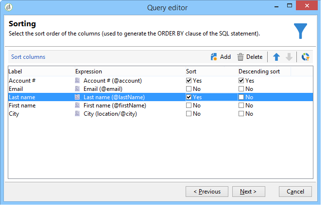

# 수신자 테이블 쿼리 {#querying-recipient-table}

이 예에서는 이메일 도메인이 &quot;orange.co.uk&quot;이고 런던에 살고 있지 않은 수신자의 이름과 이메일을 복구하려고 합니다.

* 어떤 테이블을 선택해야 합니까?

   받는 사람 테이블(nms:recipient)

* 출력 열로 선택할 필드

   이메일, 이름, 구/군/시 및 계정 번호

* 받는 사람의 필터링 조건은 무엇입니까?

   도시 및 이메일 도메인

* 정렬이 구성되어 있습니까?

   예, **[!UICONTROL Account number]** 및 **[!UICONTROL Last name]**

이 예를 만들려면 다음 단계를 적용합니다.

1. 을 **[!UICONTROL Tools > Generic query editor...]** 클릭하고 **수신자** (**nms:recipient**) 테이블을 선택합니다. 그런 다음 을 **[!UICONTROL Next]**&#x200B;클릭합니다.
1. 선택: **[!UICONTROL Last name]**&#x200B;및 **[!UICONTROL First name]****[!UICONTROL Email]**&#x200B;를 **[!UICONTROL City]** 선택합니다 **[!UICONTROL Account number]**. 이러한 필드는 에 추가됩니다 **[!UICONTROL Output columns]**. 그런 다음 을 **[!UICONTROL Next]**&#x200B;클릭합니다.

   

1. 열을 정렬하여 올바른 순서로 표시합니다. 여기서는 계정 번호를 내림차순 및 이름의 알파벳 순으로 정렬하려고 합니다. 그런 다음 을 **[!UICONTROL Next]**&#x200B;클릭합니다.

   

1. 창에서 **[!UICONTROL Data filtering]** 검색을 세분화합니다.을 선택하고 **[!UICONTROL Filtering conditions]** 클릭합니다 **[!UICONTROL Next]**.
1. 이 **[!UICONTROL Target element]** 창에서 필터 설정을 입력할 수 있습니다.

   다음 필터 조건을 정의합니다.받는 사람: &quot;orange.co.uk&quot;과 같은 전자 메일 도메인을 사용합니다. 이렇게 하려면 **열에서 전자 메일 도메인(@email)** 을 **[!UICONTROL Expression]** 선택하고 **열에서 같음을 선택하고** **[!UICONTROL Operator]** **[!UICONTROL Value]** 열에 &quot;orange.co.uk&quot;을 입력합니다.

   

1. 필요한 경우 **[!UICONTROL Distribution of values]** 단추를 클릭하여 잠재 고객의 이메일 도메인을 기반으로 배포를 봅니다. 데이터베이스의 각 이메일 도메인에 대해 백분율을 사용할 수 있습니다. &quot;orange.co.uk&quot;이 아닌 도메인은 필터가 적용될 때까지 표시됩니다.

   질의 요약이 창 하단에 표시됩니다.&#39; **orange.co.uk&#39;과 같은 전자 메일 도메인입니다**.

1. 쿼리 결과에 **[!UICONTROL Preview]** 대한 아이디어를 얻으려면 다음을 클릭합니다.&quot;orange.co.uk&quot; 이메일 도메인만 표시됩니다.

   

1. 우리는 이제 런던에 거주하지 않는 연락처를 찾기 위해 질문을 바꿀 것이다.

   열에서 연산자로 **[!UICONTROL City (location/@city)]** 선택하고 **[!UICONTROL Expression]****[!UICONTROL different from]** **[!UICONTROL London]** **[!UICONTROL Value]** 열에 입력합니다.

   

1. 그러면 **[!UICONTROL Data formatting]** 창가쪽으로 가시면 됩니다 열 순서를 확인합니다. &quot;City&quot; 열을 &quot;Account number&quot; 열 아래로 이동합니다.

   목록에서 제거하려면 &quot;이름&quot; 열의 선택을 취소합니다.

   

1. 창에서 **[!UICONTROL Data preview]** 을 클릭합니다 **[!UICONTROL Start the preview of the data]**. 이 함수는 쿼리 결과를 계산합니다.

   이 **[!UICONTROL Column results]** 탭에는 쿼리 결과가 열에 표시됩니다.

   그 결과 런던에 거주하지 않는 &quot;orange.co.uk&quot; 이메일 도메인이 있는 모든 수신자가 표시됩니다. 이전 단계에서 선택 취소되어 &quot;이름&quot; 열이 표시되지 않습니다. 계정 번호는 내림차순으로 정렬됩니다.

   

   이 **[!UICONTROL XML result]** 탭에는 XML 형식의 결과가 표시됩니다.

   

   이 **[!UICONTROL Generated QSL queries]** 탭에는 쿼리 결과가 SQL 형식으로 표시됩니다.

   
