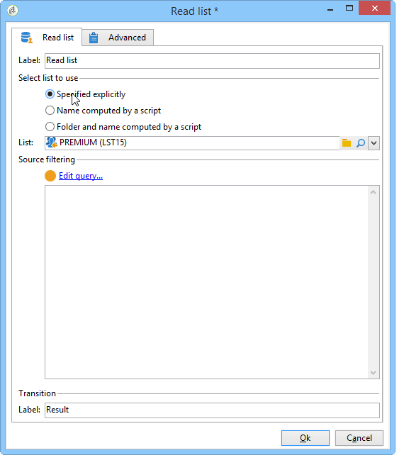

# 목록 읽기{#read-list}

워크플로우에서 처리된 데이터는 이전 세그먼테이션 또는 파일 업로드 후 데이터가 미리 준비되거나 구조화된 목록에서 가져올 수 있습니다.

이 **[!UICONTROL Read list]** 활동을 사용하면 쿼리의 데이터와 같이 워크플로우 작업 테이블의 목록에서 데이터를 복사할 수 있습니다. 그런 다음 워크플로우 전반에서 액세스할 수 있습니다.

처리할 목록은 선택한 옵션 및 **[!UICONTROL Read list]** 활동에 정의된 매개 변수에 따라 스크립트를 통해 계산하거나 동적으로 로컬라이즈되도록 명시적으로 지정할 수 있습니다.

목록이 명시적으로 지정되지 않은 경우 해당 구조를 찾기 위해 템플릿으로 사용할 목록을 제공해야 합니다.

목록 선택이 구성되면 다음 워크플로우에 대해 모집단 중 하나를 유지하는 **[!UICONTROL Edit query]** 옵션을 사용하여 필터를 추가할 수 있습니다.

>[!CAUTION]
>
>읽기 목록 활동에서 필터를 만들려면 관련 목록이 &quot;파일&quot; 유형이어야 합니다.

목록은 홈 페이지의 **[!UICONTROL Profiles and Targets > Lists]** 링크를 통해 Adobe Campaign에서 직접 만들 수 있습니다. 또한 **[!UICONTROL List update]** 활동을 사용하여 워크플로우에서 만들 수도 있습니다.

**예:전송 주소 목록 제외**

다음 예제에서는 이메일 주소 목록을 사용하여 이메일 배달 대상에서 제외할 수 있습니다.

새 연락처 **폴더에 포함된** 프로필은 배달 작업으로 타깃팅해야 합니다. 대상에서 제외할 이메일 주소는 외부 목록에 저장됩니다. 이 예에서는 제외에 이메일 주소에 대한 정보만 필요합니다.

1. 새 **연락처** 폴더 선택 쿼리를 사용하면 선택한 프로필의 이메일 주소를 로드할 수 있어야 목록에 있는 정보와 정렬할 수 있습니다.

   

1. 여기에서 목록은 목록 **폴더에 저장되고** 레이블이 계산됩니다.

   

1. 외부 목록의 이메일 주소를 기본 대상에서 제외하려면 제외 활동을 구성하고 새 연락처 **폴더에 보관할** 데이터가 포함되도록 지정해야 합니다. 이 집합과 제외 활동에서의 다른 인바운드 집합 간의 결합 데이터는 대상에서 삭제됩니다.

   

   제외 규칙은 편집 도구의 중앙 섹션에 구성됩니다. 적용할 제외 유형을 정의하려면 **[!UICONTROL Add]** 단추를 클릭합니다.

   활동의 들어오는 전환 수에 따라 여러 제외를 정의할 수 있습니다.

1. 필드에서 **[!UICONTROL Exclusion set]** **[!UICONTROL Read list]** 활동을 선택합니다.이 활동의 데이터는 기본 집합에서 제외됩니다.

   예제에서 연결 제외는 다음과 같습니다.목록에 들어 있는 데이터는 이메일 주소가 들어 있는 필드를 통해 기본 집합의 데이터와 조정됩니다. 조인을 구성하려면 **[!UICONTROL Joins]** 필드에서 **[!UICONTROL Change dimension]** 선택합니다.

   

1. 그런 다음 두 세트(소스 및 대상)에서 이메일 주소에 해당하는 필드를 선택합니다. 그러면 열이 연결되고 이메일 주소가 가져온 주소 목록에 있는 수신자는 대상에서 제외됩니다.

