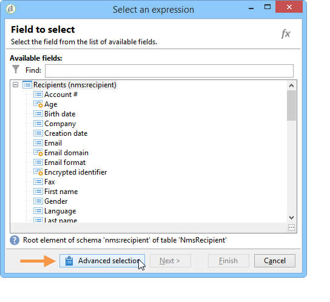
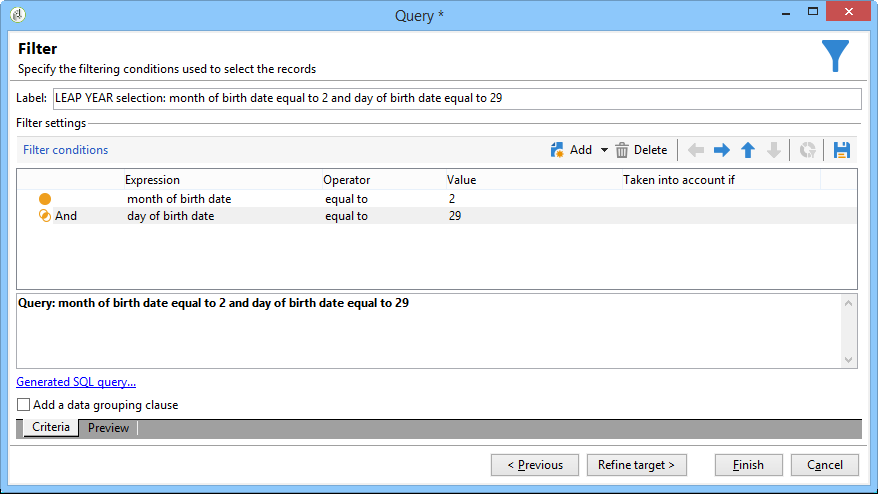

# 생일 이메일 보내기{#sending-a-birthday-email}

## 소개 {#introduction}

이 사용 사례에서는 생일날 수신자 목록에 되풀이되는 이메일을 보내는 방법을 설명합니다.

이 사용 사례를 설정하기 위해 다음 타깃팅 워크플로우를 만들었습니다.


이(일일 실행) 워크플로우는 현재 날짜에 생일이 있는 모든 수신자를 선택합니다.

이 사용 사례는 비디오 형식으로도 찾을 수 있습니다. 자세한 내용은 워크플로우 [](https://docs.campaign.adobe.com/doc/AC/en/Videos/Videos.html) 만들기 비디오를 참조하십시오.

이렇게 하려면 캠페인을 만들고 **[!UICONTROL Targeting and workflows]** 탭을 클릭합니다. 자세한 내용은 Workflow [에서](../../campaign/using/marketing-campaign-deliveries.md#building-the-main-target-in-a-workflow) 기본 타겟 만들기 섹션을 참조하십시오.

그런 다음 다음 단계를 수행합니다.

## 전송 예약 {#configuring-the-scheduler}

1. 먼저 스케줄러를 **추가하여** 매일 배달 전송을 트리거합니다. 아래 예에서는 매일 오전 6시에 배달이 만들어집니다.

   


## 생일이 되는 수신자 식별 {#identifying-recipients-whose-birthday-it-is}

워크플로우가 매일 시작되도록 **[!UICONTROL Scheduler]** 활동을 구성한 후 생년월일이 현재 날짜와 같은 모든 수신자를 식별합니다.

이렇게 하려면 다음 단계를 적용합니다.

1. 작업을 워크플로우로 드래그하여 놓고 두 번 클릭합니다. **[!UICONTROL Query]**
1. 쿼리 **편집** 링크를 클릭하고 선택합니다 **[!UICONTROL Filtering conditions]**.

   

1. 열의 첫 번째 셀을 클릭하고 을 클릭하여 표현식 편집기를 **[!UICONTROL Expression]** **[!UICONTROL Edit expression]** 엽니다.

   

1. 을 **[!UICONTROL Advanced selection]** 클릭하여 필터링 모드를 선택합니다.

   

1. 표현식 편집기를 표시하려면 **[!UICONTROL Edit the formula using an expression]** 선택하고 **[!UICONTROL Next]** 클릭합니다.
1. 함수 목록에서 노드를 통해 액세스할 **[!UICONTROL Day]**&#x200B;수 있는 두 번 클릭합니다 **[!UICONTROL Date]** . 이 함수는 매개 변수로 전달된 날짜에 해당하는 날을 나타내는 숫자를 반환합니다.

   

1. 사용 가능한 필드 목록에서 두 번 클릭합니다 **[!UICONTROL Birth date]**. 그런 다음 편집기의 상단 섹션에 다음 공식이 표시됩니다.

   ```
   Day(@birthDate)
   ```

   을 **[!UICONTROL Finish]** 클릭하여 확인합니다.

1. 쿼리 편집기의 열 첫 번째 셀에서 **[!UICONTROL Operator]** 을 **[!UICONTROL equal to]**&#x200B;선택합니다.

   

1. 그런 다음 두 번째 열(**[!UICONTROL Value]**)의 첫 번째 셀을 클릭하고 을 클릭하여 표현식 편집기를 **[!UICONTROL Edit expression]** 엽니다.
1. 함수 목록에서 노드를 통해 액세스할 **[!UICONTROL Day]**&#x200B;수 있는 두 번 클릭합니다 **[!UICONTROL Date]** .
1. 함수를 두 번 클릭하여 현재 날짜를 검색합니다. **[!UICONTROL GetDate]**

   

   편집기의 위쪽 섹션에는 다음 공식이 표시됩니다.

   ```
   Day(GetDate())
   ```

   을 **[!UICONTROL Finish]** 클릭하여 확인합니다.

1. 이 절차를 반복하여 현재 월에 해당하는 생년월일을 검색합니다. 이렇게 하려면 **[!UICONTROL Add]** 단추를 클릭하고 3-10단계를 반복하여 로 **[!UICONTROL Day]** 바꿉니다 **[!UICONTROL Month]**.

   전체 쿼리는 다음과 같습니다.

   

활동의 결과를 활동에 연결하여 생일에 모든 수신자의 목록에 이메일을 보냅니다. **[!UICONTROL Query]** **[!UICONTROL Email delivery]**

## 2월 29일에 출생한 수신자 포함(선택 사항) {#including-recipients-born-on-february-29th--optional-}

2월 29일에 출생한 모든 수신자를 포함하려는 경우 이 사용 사례에서는 윤년도든 아니든, 생일의 수신자 목록에 반복 이메일을 보내는 방법을 설명합니다.

이 사용 사례에 대한 기본 구현 단계는 다음과 같습니다.

* 받는 사람 선택
* 윤년인지 여부 선택
* 2월 29일에 출생한 모든 수신자 선택

이 사용 사례를 설정하기 위해 다음 타깃팅 워크플로우를 만들었습니다.


현재 연도가 윤년이 **아니고 3월** 1일에 워크플로우가 실행되면 어제(2월 29일)의 생일을 맞는 모든 수신자를 선택하여 수신자 목록에 추가해야 합니다. 다른 경우에는 추가 작업이 필요하지 않습니다.

### 1단계:받는 사람 선택 {#step-1--selecting-the-recipients}

워크플로우가 매일 시작되도록 **[!UICONTROL Scheduler]** 활동을 구성한 후, 멤버십 갱신일이 현재 일인 모든 수신자를 식별합니다.

>[!NOTE]
>
>금년이 윤년도인 경우 2월 29일에 출생한 모든 수령인이 자동으로 포함됩니다.


생일이 현재 날짜에 해당하는 수신자를 선택하면 생일이 [생일인](#identifying-recipients-whose-birthday-it-is) 받는 사람 확인 섹션에 표시됩니다.

### 2단계:윤년인지 여부를 선택합니다. {#step-2--select-whether-or-not-it-is-a-leap-year}

이 **[!UICONTROL Test]** 활동을 통해 윤년인지 여부와 현재 날짜가 3월 1일인지를 확인할 수 있습니다.

테스트가 확인되면(년은 윤년이 아니고 2월 29일은 없으며 현재 날짜는 3월 1일) **[!UICONTROL True]** 전환이 활성화되고 2월 29일에 출생한 수신자는 3월 1일에 추가됩니다. 그렇지 않으면 전환이 **[!UICONTROL False]** 활성화되고 현재 날짜에 태어난 수신자만 배달을 받습니다.

아래 코드를 복사하여 **[!UICONTROL Initialization script]** 탭의 **[!UICONTROL Advanced]** 섹션에 붙여 넣습니다.

```
function isLeapYear(iYear)
{
    if(iYear/4 == Math.floor(iYear/4))
    {
        if(iYear/100 != Math.floor(iYear/100))
        {
            // Divisible by 4 only -> Leap Year
            return 1;
        }
        else
        {
            if(iYear/400 == Math.floor(iYear/400))
            {
                // Divisible by 4, 100 and 400 -> Leap year
                return 1;
            }
        }
    }
    // all others: no leap year
    return 0;
}

// Return today's date and time
var currentTime = new Date()
// returns the month (from 0 to 11)
var month = currentTime.getMonth() + 1
// returns the day of the month (from 1 to 31)
var day = currentTime.getDate()
// returns the year (four digits)
var year = currentTime.getFullYear()

// is current year a leap year?
vars.currentIsALeapYear = isLeapYear(year);

// is current date the first of march?
if(month == 3 && day == 1) {
  // today is 1st of march
vars.firstOfMarch = 1;
}
```


섹션에 다음 조건을 **[!UICONTROL Conditional forks]** 추가합니다.

```
vars.currentIsALeapYear == 0 && vars.firstOfMarch == 1
```


### 3단계:2월 29일에 출생한 모든 수신자 선택 {#step-3--select-any-recipients-born-on-february-29th}

활동을 **[!UICONTROL Fork]** 만들고 아웃바운드 전환 중 하나를 **[!UICONTROL Query]** 활동에 연결합니다.

이 쿼리에서 생년월일이 2월 29일인 모든 받는 사람을 선택합니다.



결과와 **[!UICONTROL Union]** 활동 결합

두 **[!UICONTROL Test]** **[!UICONTROL Email delivery]** 활동 결과를 활동에 연결하여 비윤년 2월 29일에 태어난 사람에게도 생일에 보낸 모든 수신자 목록에 이메일을 보냅니다.

## 반복 배달 만들기 {#creating-a-recurring-delivery-in-a-targeting-workflow}

보내려는 **생일 이메일 템플릿을 기반으로 하는 반복 배달** 활동을 추가합니다.

>[!CAUTION]
>
>워크플로우를 실행하려면 캠페인 프로세스와 관련된 기술 워크플로우를 시작해야 합니다. 자세한 내용은 캠페인 프로세스 워크플로우 [목록](../../workflow/using/campaign.md) 섹션을 참조하십시오.
>
>캠페인에 대해 승인 단계를 활성화하면 이러한 단계가 확인된 경우에만 배달이 전송됩니다. 자세한 내용은 승인할 [프로세스 선택](../../campaign/using/marketing-campaign-approval.md#choosing-the-processes-to-be-approved) 섹션을 참조하십시오.


