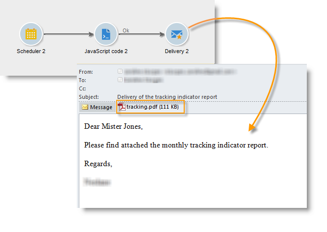
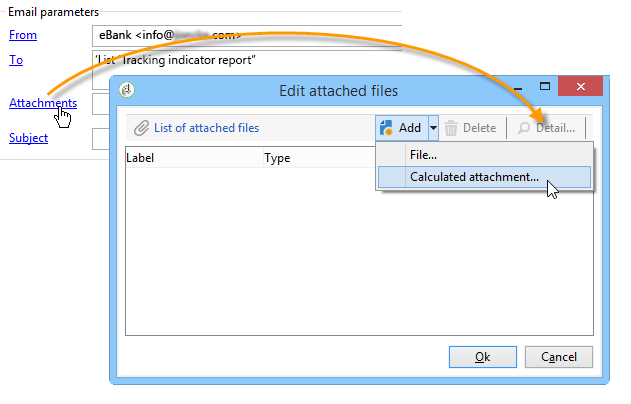
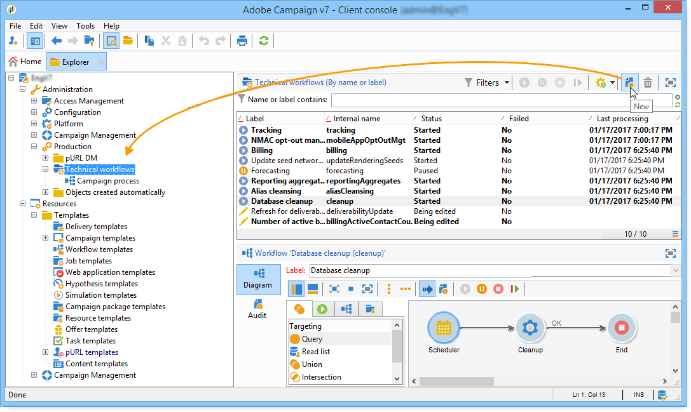

# 목록으로 보고서 보내기{#sending-a-report-to-a-list}

이 사용 사례에서는 월별 즉시 사용 가능한 보고서를 PDF 형식으로 생성하는 방법과 수신자 목록으로 보내는 방법에 대해 자세히 설명합니다. **[!UICONTROL Tracking indicators]**



이 사용 사례에 대한 기본 구현 단계는 다음과 같습니다.

* 배달을 받을 받는 사람 목록 만들기(참조:1단계 [:수신자 목록](#step-1--creating-the-recipient-list)만들기).
* 워크플로우가 실행될 때마다 새 배달을 생성할 수 있는 배달 템플릿 만들기(참조:2 [단계:배달 템플릿](#step-2--creating-the-delivery-template)만들기).
* 보고서를 PDF 형식으로 생성하여 수신자 목록으로 전송할 수 있는 워크플로우 만들기(3단계 [:워크플로우](#step-3--creating-the-workflow)만들기).

## 1단계:수신자 목록 만들기 {#step-1--creating-the-recipient-list}

우주로 **[!UICONTROL Profiles and targets]** 이동하고 **[!UICONTROL Lists]** 링크를 클릭한 다음 **[!UICONTROL Create]** 단추를 클릭합니다. 보고서를 보낼 새 수신자 목록을 **[!UICONTROL New list]** 선택하고 만듭니다.


목록 만들기에 대한 자세한 내용은 이 [섹션을](../../platform/using/creating-and-managing-lists.md)참조하십시오.

## 2단계:배달 템플릿 만들기 {#step-2--creating-the-delivery-template}

1. Adobe Campaign **[!UICONTROL Resources > Templates > Delivery templates]** 탐색기의 노드로 이동하여 **[!UICONTROL Email delivery]** 기본 템플릿을 복제합니다.

   

   배달 템플릿 만들기에 대한 자세한 내용은 이 [섹션을](../../delivery/using/about-templates.md)참조하십시오.

1. 다양한 템플릿 매개 변수를 입력합니다.레이블, 대상(이전에 만든 받는 사람 목록), 제목 및 콘텐트

   

1. 워크플로우가 실행될 때마다 **[!UICONTROL Tracking indicators]** 보고서가 업데이트됩니다(3단계 [참조:워크플로우](#step-3--creating-the-workflow)만들기). 배달에 최신 버전의 보고서를 포함하려면 다음을 추가해야 합니다. **[!UICONTROL Calculated attachment]**

   계산된 첨부 파일 만들기에 대한 자세한 내용은 이 [섹션을](../../delivery/using/attaching-files.md#creating-a-calculated-attachment)참조하십시오.

   * 링크를 클릭하고 **[!UICONTROL Attachments]** 을 클릭한 다음 **[!UICONTROL Add]****[!UICONTROL Calculated attachment]**&#x200B;선택합니다.

      

   * 필드로 이동하여 **[!UICONTROL Type]** 네 번째 옵션을 선택합니다. **[!UICONTROL File name is computed during delivery of each message (it may then depend on the recipient profile)]** Adobe

      

      필드에 입력한 값이 최종 전달에 표시되지 않습니다. **[!UICONTROL Label]**

   * 편집 영역으로 이동하여 파일의 액세스 경로와 이름을 입력합니다.

      

      >[!CAUTION]
      >
      >파일이 서버에 있어야 합니다. 경로 및 이름은 워크플로우의 **[!UICONTROL JavaScript code]** 유형 활동에 입력된 경로와 동일해야 합니다(참조:3단계 [:워크플로우](#step-3--creating-the-workflow)만들기).

   * 탭을 선택하고 **[!UICONTROL Advanced]** 선택합니다 **[!UICONTROL Script the name of the file name displayed in the mails sent]**. 편집 영역으로 이동하여 최종 전달에 첨부할 이름을 입력합니다.

      

## 3단계:워크플로우 만들기 {#step-3--creating-the-workflow}

이 사용 사례에 대해 다음 워크플로우가 만들어졌습니다. 세 가지 활동이 있습니다.

* 한 달에 한 번 워크플로우를 실행할 수 있는 하나의 **[!UICONTROL Scheduler]** 유형 활동
* 보고서를 PDF 형식으로 생성할 수 있는 하나의 **[!UICONTROL JavaScript code]** 유형 활동,
* 이전에 만든 배달 템플릿을 사용하는 하나의 **[!UICONTROL Delivery]** 유형 활동.


1. 이제 **[!UICONTROL Administration > Production > Technical workflows]** 노드로 이동하여 새 워크플로우를 만듭니다.

   

1. 먼저 **[!UICONTROL Scheduler]** 유형 활동을 추가하고 해당 월의 첫 번째 월요일에 워크플로우가 실행되도록 구성합니다.

   

   스케줄러 구성에 대한 자세한 내용은 스케줄러를 [참조하십시오](../../workflow/using/scheduler.md).

1. 그런 다음 **[!UICONTROL JavaScript code]** 유형 활동을 추가합니다.

   

   편집 영역에 다음 코드를 입력합니다.

   ```
   var reportName = "deliveryFeedback";
   var path = "/tmp/deliveryFeedback.pdf";
   var exportFormat = "PDF";
   var reportURL = "<PUT THE URL OF THE REPORT HERE>";
   var _ctx = <ctx _context="global" _reportContext="deliveryFeedback" />
   var isAdhoc = 0;
   
   xtk.report.export(reportName, _ctx, exportFormat, path, isAdhoc);
   ```

   다음 변수가 사용됩니다.

   * **var reportName**:보고서의 내부 이름을 큰따옴표로 입력합니다. 이 경우 추적 표시기 **** 보고서의 내부 이름은 &quot;deliveryFeedback&quot;입니다.
   * **var 경로**:파일의 저장 경로(&quot;tmp/files/&quot;), 파일에 부여할 이름(&quot;deliveryFeedback&quot;) 및 파일 확장명(&quot;.pdf&quot;)을 입력합니다. 이 경우 내부 이름을 파일 이름으로 사용했습니다. 값은 큰 따옴표 사이에 있어야 하며 &quot;+&quot; 문자로 구분해야 합니다.

      >[!CAUTION]
      >
      >파일을 서버에 저장해야 합니다. 계산된 첨부 파일에 대해 편집 창의 **[!UICONTROL General]** 탭에 동일한 경로와 이름을 입력해야 합니다(참조:2 [단계:배달 템플릿](#step-2--creating-the-delivery-template)만들기).

   * **var exportFormat**:파일의 내보내기 형식(&quot;PDF&quot;)을 입력합니다.
   * **var_ctx** (컨텍스트):이 경우 글로벌 컨텍스트에서 보고서를 사용하고 **[!UICONTROL Tracking indicators]** 있습니다.

1. 다음 옵션을 사용하여 **[!UICONTROL Delivery]** 유형 활동을 추가하여 마칩니다.

   * **[!UICONTROL Delivery]**:을 선택하고 **[!UICONTROL New, created from a template]**&#x200B;이전에 만든 배달 템플릿을 선택합니다.
   * 및 **[!UICONTROL Recipients]** 필드에 대해 **[!UICONTROL Content]** 을 선택합니다 **[!UICONTROL Specified in the delivery]**.
   * **[!UICONTROL Action to execute]**:을 **[!UICONTROL Prepare and start]**&#x200B;선택합니다.
   * 확인 **[!UICONTROL Generate an outbound transition]** 취소 및 **[!UICONTROL Process errors]**&#x200B;확인
   

