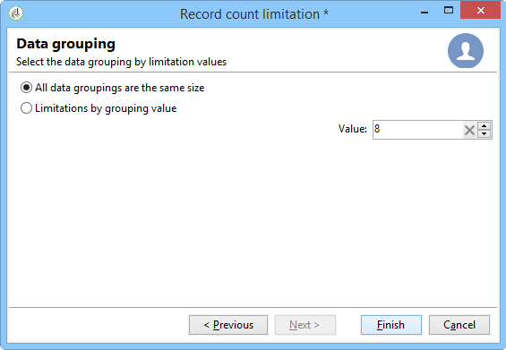
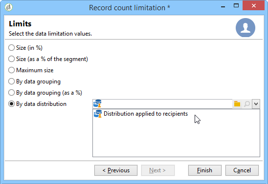
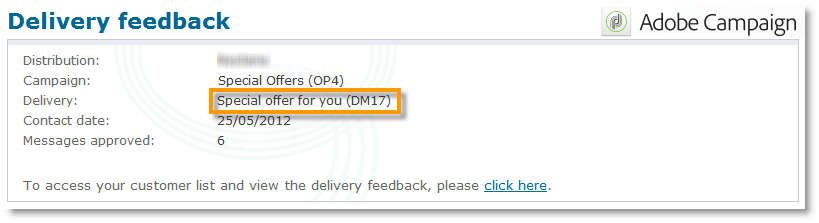

# 분할{#split}

분할 **유형**&#x200B;활동을 사용하면 대상을 여러 하위 세트로 분할할 수 있습니다. 대상이 모든 수신된 결과로 구성됩니다.따라서 이 활동이 실행되려면 모든 이전 활동이 완료되어야 합니다.

이 활동은 인바운드 인구의 결합을 트리거하지 않습니다. 여러 전환 효과가 하나의 분할 활동에 포함되는 경우 그 앞에 **[!UICONTROL Union]** 활동을 삽입하는 것이 좋습니다.

사용 중인 분할 활동의 예는 분할 활동을 [사용하여 하위 세트 만들기를 참조하십시오](../../workflow/using/targeting-data.md#creating-subsets-using-the-split-activity).

필터링 조건을 사용하여 분할 활동을 사용하여 대상을 다른 모집단으로 세그먼트화하는 방법을 설명하는 예는 [이 섹션에](../../workflow/using/cross-channel-delivery-workflow.md)설명되어 있습니다.

분할 활동에서 인스턴스 변수를 사용하는 방법을 보여주는 예는 [이 섹션에서](../../workflow/using/javascript-scripts-and-templates.md)사용할 수 있습니다.

이 활동을 구성하려면 **[!UICONTROL Subsets]** 탭에서 하위 세트 컨텐츠와 레이블을 정의한 다음 **[!UICONTROL General]** 탭에서 대상 차원을 선택합니다.

## 하위 세트 만들기 {#creating-subsets}

하위 집합을 만들려면:

1. 일치하는 필드에서 레이블을 클릭하고 적용할 필터를 선택합니다.
1. 인바운드 모집단을 필터링하려면 **[!UICONTROL Add a filtering condition]** 옵션을 선택하고 **[!UICONTROL Edit...]** 링크를 클릭합니다.

   이 세트에 포함할 데이터에 적용할 필터 유형을 선택합니다.

   이 프로세스는 쿼리 **유형 활동에 대해**&#x200B;동일합니다.

   >[!CAUTION]
   >
   >최대 2개의 외부 데이터베이스(FDA)로 데이터를 필터링할 수 있습니다.

1. 대상에서 추출할 최대 레코드 수를 지정하여 하위 집합을 만들 수 있습니다. 이렇게 하려면 **[!UICONTROL Limit the selected records]** 옵션을 선택하고 **[!UICONTROL Edit...]** 링크를 클릭합니다.

   마법사를 사용하면 이 하위 집합의 레코드에 대한 선택 모드를 선택할 수 있습니다. 하위 집합 레코드 [수](#limiting-the-number-of-subset-records)제한에서 이 단계를 찾을 수 있습니다.

   

1. 원하는 경우 **단추를 사용하여 다른 하위 세트를** **[!UICONTROL Add]** 추가할 수 있습니다.

   

   >[!CAUTION]
   >
   >이 **[!UICONTROL Enable overlapping of output populations]** 옵션을 선택하지 않으면 하위 세트가 탭의 순서로 생성됩니다. 이 창의 오른쪽 상단에 있는 화살표를 사용하여 이동합니다. 예를 들어 첫 번째 하위 세트가 초기 모집단의 70%를 복구하는 경우 다음 하위 세트는 나머지 30%에만 선택 기준을 적용합니다.

   생성된 각 하위 세트에 대해 아웃바운드 전환이 분할 활동에 추가됩니다.

   

   단일 아웃바운드 전환을 생성하도록 선택할 수 있습니다(예: 세그먼트 코드를 사용하여 세트 식별).이렇게 하려면 **[!UICONTROL Generate subsets in the same table]** **[!UICONTROL General]** 탭에서 옵션을 선택합니다.

   완료되면 각 하위 집합의 세그먼트 코드가 추가 열에 자동으로 저장됩니다. 이 열은 배달 수준의 개인화 필드에서 액세스할 수 있습니다.

## 하위 집합 레코드 수 제한 {#limiting-the-number-of-subset-records}

하위 집합에 포함된 전체 모집단을 사용하지 않으려면 포함할 레코드 수를 제한할 수 있습니다.

1. 하위 집합 편집 창에서 **[!UICONTROL Limit the selected records]** 옵션을 선택하고 **[!UICONTROL Edit...]** 링크를 클릭합니다.
1. 원하는 제한 유형을 선택합니다.

   * **[!UICONTROL Activate random sampling]**:이 옵션은 임의의 레코드 샘플을 사용합니다. 적용된 임의 샘플링 유형은 데이터베이스 엔진에 따라 다릅니다.
   * **[!UICONTROL Keep only the first records after sorting]**:이 옵션을 사용하면 하나 이상의 정렬 순서를 기준으로 제한을 정의할 수 있습니다. 필드를 정렬 기준으로 선택하고 **[!UICONTROL Age]** 한계로 100을 선택하면 가장 어린 100명의 수신자만 유지됩니다.
   * **[!UICONTROL Keep the first ones after sorting (criteria, random)]**:이 옵션은 두 가지 이전 옵션을 결합합니다. 하나 이상의 정렬 순서를 기반으로 제한을 정의한 다음, 일부 레코드에 정의된 기준과 동일한 값이 있는 경우 첫 번째 레코드에 임의 선택을 적용할 수 있습니다.

      예를 들어, 필드를 정렬 기준으로 선택한 다음 제한을 100으로 정의하지만, 데이터베이스에 있는 2000명의 가장 어린 받는 사람은 모두 18명이고, 그러면 해당 2000명 중에서 100명의 받는 사람이 임의로 선택됩니다. **[!UICONTROL Age]**
   

1. 정렬 기준을 정의하려면 추가 단계를 통해 열과 정렬 순서를 정의할 수 있습니다.

   

1. 그런 다음 데이터 제한 방법을 선택합니다.

   

   다음과 같은 여러 가지 방법이 있습니다.

   * **[!UICONTROL Size (in %)]**:레코드 백분율. 예를 들어 아래 구성은 전체 인구의 10%를 추출합니다.

      비율은 활동 결과가 아닌 초기 모집단에만 적용됩니다.

   * **[!UICONTROL Size (as a % of the segment)]**:초기 모집단이 아닌 하위 세트에만 관련된 레코드 비율.
   * **[!UICONTROL Maximum size]**:최대 레코드 수
   * **[!UICONTROL By data grouping]**:인바운드 모집단의 지정된 필드에 있는 값에 따라 레코드 수에 제한을 설정할 수 있습니다. 이 주제에 대한 자세한 내용은 데이터 그룹핑별 [하위 집합 레코드 수 제한을](#limiting-the-number-of-subset-records-by-data-grouping)참조하십시오.
   * **[!UICONTROL By data grouping (in %)]**:백분율을 사용하여 인바운드 모집단의 지정된 필드에 있는 값에 따라 레코드 수에 제한을 설정할 수 있습니다. 이 주제에 대한 자세한 내용은 데이터 그룹핑별 [하위 집합 레코드 수 제한을](#limiting-the-number-of-subset-records-by-data-grouping)참조하십시오.
   * **[!UICONTROL By data distribution]**:그룹 필드에 값이 너무 많거나 새 분할 활동에 대해 값을 다시 입력하지 않으려는 경우 Adobe Campaign을 사용하여 **[!UICONTROL By data distribution]** 제한(선택적 배포 마케팅 모듈)을 구성할 수 있습니다. 자세한 내용은 데이터 배포당 [하위 집합 레코드 수 제한을](#limiting-the-number-of-subset-records-per-data-distribution)참조하십시오.

1. 을 **[!UICONTROL Finish]** 클릭하여 레코드 선택 기준을 승인합니다. 그러면 정의된 구성이 편집기의 가운데 창에 표시됩니다.

## 데이터 그룹화별 하위 집합 레코드 수 제한 {#limiting-the-number-of-subset-records-by-data-grouping}

데이터 그룹별로 레코드 수를 제한할 수 있습니다. 이 제한은 고정 값 또는 백분율을 사용하여 수행할 수 있습니다.

예를 들어, **[!UICONTROL Language]** 필드를 그룹 필드로 선택하면 각 언어에 대한 레코드 목록을 정의할 수 있습니다.

1. 데이터 제한 값을 선택한 후 **[!UICONTROL By data grouping]** 선택하거나 **[!UICONTROL By data grouping (as a %)]** 을 **[!UICONTROL Next]**&#x200B;클릭합니다.

   

1. 그런 다음 그룹화 필드(인스턴스의 **[!UICONTROL Language]** 필드)를 선택하고 **[!UICONTROL Next]**&#x200B;클릭합니다.

   

1. 마지막으로, 데이터 그룹화 임계값을 지정합니다(이전에 선택한 그룹화 방법에 따라 고정 값 또는 백분율 사용). 모든 값에 대해 동일한 임계값을 설정하려면(예: 각 언어에 대한 레코드 수를 10으로 설정하려면) **[!UICONTROL All data groupings are the same size]** 옵션을 선택합니다. 모든 값에 대해 다른 제한을 설정하려면 **[!UICONTROL Limitations by grouping value]** 옵션을 선택합니다. 그러면 영어, 프랑스어 등에 대해 다른 제한을 선택할 수 있습니다.

   

1. 제한을 **[!UICONTROL Finish]** 승인하고 분할 활동 편집으로 돌아가려면 을 클릭합니다.

## 데이터 배포당 하위 집합 레코드 수 제한 {#limiting-the-number-of-subset-records-per-data-distribution}

그룹 필드에 값이 너무 많거나 모든 새 분할 활동에 대한 값을 재설정하지 않으려는 경우 Adobe Campaign을 사용하면 데이터 배포당 제한을 만들 수 있습니다. 데이터 제한 값을 선택할 때(이 주제에 대한 자세한 내용은 [하위 세트](#creating-subsets) 만들기 섹션 참조) **[!UICONTROL By data distribution]** 옵션을 선택하고 드롭다운 메뉴에서 템플릿을 선택합니다. 데이터 배포 템플릿 만들기는 아래에 설명되어 있습니다.

배포 템플릿이 있는 **[!UICONTROL Local approval]** 활동의 예는 로컬 승인 활동 [사용을](../../workflow/using/using-the-local-approval-activity.md)참조하십시오.

>[!CAUTION]
>
>이 기능을 사용하려면 캠페인 옵션인 분산 마케팅 모듈을 구입해야 합니다. 사용권 계약을 확인하십시오.

데이터 배포 템플릿을 사용하면 그룹화 값 목록을 사용하여 레코드 수를 제한할 수 있습니다. 데이터 배포 템플릿을 만들려면 다음 단계를 적용합니다.

1. 데이터 배포 템플릿을 만들려면 **[!UICONTROL Resources > Campaign management > Data distribution]** 노드로 이동하고 을 클릭합니다 **[!UICONTROL New]**.

   

1. 이 **[!UICONTROL General]** 탭에서는 분포의 레이블과 실행 컨텍스트를 입력할 수 있습니다(타깃팅 차원, 배포 필드).

   

   다음 필드를 입력해야 합니다.

   * **[!UICONTROL Label]**:레이블을 지정합니다.
   * **[!UICONTROL Targeting dimension]**:데이터 배포를 적용할 타깃팅 차원을 입력합니다 **[!UICONTROL Recipient]** . 이 스키마는 항상 타깃팅 워크플로에서 사용되는 데이터와 호환되어야 합니다.
   * **[!UICONTROL Distribution field]**:타깃팅 차원을 통해 필드를 선택합니다. 예를 들어, **[!UICONTROL Email domain]** 필드를 선택하면 수신자 목록이 도메인으로 분류됩니다.
   * **[!UICONTROL Distribution type]**:탭에서 대상의 제한 값을 분류하는 방법을 **[!UICONTROL Distribution]** 선택합니다. **[!UICONTROL Percentage]** 또는 **[!UICONTROL Set]**.
   * **[!UICONTROL Assignment type]**:데이터 배포 할당 유형을 선택합니다. 그룹 또는 연산자별 지정 또는 로컬 엔티티별 지정 중에서 선택할 수 있습니다. 로컬 엔티티별 할당은 Distributed Marketing에서 **사용됩니다**. 자세한 내용은 이 [섹션을](../../campaign/using/about-distributed-marketing.md)참조하십시오.
   * **[!UICONTROL Approval storage]**:타깃팅 워크플로우에서 **[!UICONTROL Local approval]** 활동을 사용하는 경우( [로컬 승인 참조](../../workflow/using/local-approval.md)) 승인 결과가 저장되는 스키마를 입력합니다. 타깃팅 스키마당 하나의 저장소 스키마를 지정해야 합니다. 타깃팅 스키마를 사용하는 **[!UICONTROL Recipients]** 경우 기본 **[!UICONTROL Local approval of recipients]** 스토리지 스키마를 입력합니다.

      로컬 승인 없이 데이터 그룹화가 간단하게 제한되는 경우 **[!UICONTROL Approvals storage]** 필드에 입력할 필요가 없습니다.

1. 활동을 사용 중인 경우(로컬 승인 참조 **[!UICONTROL Local approval]** ) [배포](../../workflow/using/local-approval.md)템플릿에 **[!UICONTROL Advanced settings]** 대해 다음을 입력합니다.

   

   다음 필드를 입력해야 합니다.

   * **[!UICONTROL Approve targeted messages]**:수신자 목록에서 모든 수신자를 미리 선택하여 승인하려면 이 옵션을 선택합니다. 이 옵션을 선택하지 않으면 미리 선택한 수신자가 없습니다.

      >[!NOTE]
      >
      >이 옵션은 기본적으로 선택되어 있습니다.

      

   * **[!UICONTROL Delivery label]**:반환 알림에 배달 레이블을 표시할 표현식을 정의할 수 있습니다. 기본 표현식은 전달의 표준 레이블(계산 문자열)에 대한 정보를 제공합니다. 이 표현식을 수정할 수 있습니다.

      

   * **[!UICONTROL Grouping field]**:이 필드를 사용하면 승인 및 회신 알림에 수신자를 표시하는 데 사용되는 그룹을 정의할 수 있습니다.

      

   * **[!UICONTROL Web Interface]**:웹 애플리케이션을 수신자 목록에 연결할 수 있습니다. 승인 및 반환 알림에서 각 수신자는 클릭할 수 있으며 선택한 웹 응용 프로그램에 연결됩니다. 필드(예: **[!UICONTROL Parameters]** **[!UICONTROL recipientId]**)를 사용하면 URL 및 웹 응용 프로그램에서 사용할 추가 매개 변수를 구성할 수 있습니다.

      

1. 이 **[!UICONTROL Breakdown]** 탭에서는 배포 값 목록을 정의할 수 있습니다.

   

   * **[!UICONTROL Value]**:배포 값을 입력합니다.
   * **[!UICONTROL Percentage / Set]**:각 값에 연결된 레코드 제한(고정 또는 백분율)을 입력합니다.

      이 열은 탭 내의 **[!UICONTROL Distribution type]** 필드에 의해 **[!UICONTROL General]** 정의됩니다.

   * **[!UICONTROL Label]**:각 값에 연결된 레이블을 입력합니다.
   * **[!UICONTROL Group or operator]**:활동을 사용 중인 경우(로컬 승인 참조) **[!UICONTROL Local approval]** 각 배포 값에 지정된 연산자 또는 연산자 그룹을 선택합니다.

      로컬 승인 없이 데이터 그룹화가 간단하게 제한되는 경우 **[!UICONTROL Group or operator]** 필드에 입력할 필요가 없습니다.

      >[!CAUTION]
      >
      >연산자에게 적절한 권한이 할당되었는지 확인합니다.

   * **[!UICONTROL Local entity]**:각 배포 값에 지정된 로컬 엔티티를 선택합니다. 로컬 엔티티는 Distributed Marketing에서 **사용됩니다**. 자세한 내용은 이 [섹션을](../../campaign/using/about-distributed-marketing.md)참조하십시오.

## 매개 변수 필터링 {#filtering-parameters}

탭을 클릭하여 활동 레이블을 입력합니다. **[!UICONTROL General]** 이 분할에 대한 대상 및 필터 차원을 선택합니다. 필요한 경우 해당 하위 세트에 대해 이러한 차원을 변경할 수 있습니다.

나머지 인구를 이용하려면 **[!UICONTROL Generate complement]** 옵션을 선택합니다. 보수는 인바운드 대상에서 하위 세트의 결합을 뺀 것입니다. 그러면 다음과 같이 활동에 추가 아웃바운드 전환이 추가됩니다.

이 옵션이 올바르게 작동하려면 인바운드 데이터에 기본 키가 있어야 합니다.

예를 들어 **[!UICONTROL Data loading (RDBMS)]** 활동을 통해 Netezza(인덱스 개념을 지원하지 않음)와 같은 외부 데이터베이스에서 직접 데이터를 읽으면 **[!UICONTROL Split]** 활동에 의해 생성된 보정이 잘못됩니다.

이를 방지하려면 활동 바로 전에 **[!UICONTROL Enrichment]** 활동을 드래그하여 놓을 수 **[!UICONTROL Split]** 있습니다. 활동에서 **[!UICONTROL Enrichment]** 을 **[!UICONTROL Keep all additional data from the main set]** 선택하고 추가 데이터에서 **[!UICONTROL Split]** 활동 필터를 구성하는 데 사용할 열을 지정합니다. 그런 다음 활동의 인바운드 전환에서 얻은 데이터는 Adobe Campaign 서버의 임시 테이블에 로컬로 저장되며 보수는 올바르게 생성할 수 있습니다. **[!UICONTROL Split]**

이 **[!UICONTROL Enable overlapping of output populations]** 옵션을 사용하면 여러 하위 세트에 속하는 모집단을 관리할 수 있습니다.

* 이 상자를 선택하지 않으면 여러 하위 세트의 조건을 충족하더라도 분할 작업은 수신자가 여러 출력 전환 시 표시될 수 없도록 합니다. 기준은 일치하는 첫 번째 탭의 대상에 있게 됩니다.
* 이 확인란을 선택하면 수신자가 필터 기준을 충족하는 경우 여러 하위 세트에서 찾을 수 있습니다. Adobe Campaign에서는 전용 기준을 사용하는 것이 좋습니다.

## 입력 매개 변수 {#input-parameters}

* tableName
* 스키마

각 인바운드 이벤트는 이러한 매개 변수에 의해 정의된 대상을 지정해야 합니다.

## 출력 매개 변수 {#output-parameters}

* tableName
* 스키마
* recCount

이 세 값 집합은 제외로 인해 발생한 대상을 식별합니다. **[!UICONTROL tableName]** 는 대상 식별자를 기록하는 테이블의 이름이며 **[!UICONTROL schema]** 모집단(일반적으로 nms:recipient)의 스키마이며 **[!UICONTROL recCount]** 표의 요소 수입니다.

보수와 연결된 전환에는 동일한 매개 변수가 있습니다.
