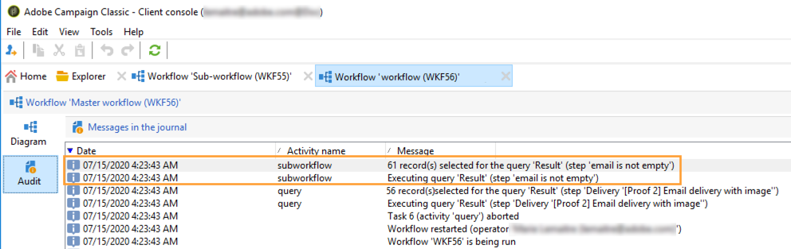

# 하위 워크플로우{#sub-workflow}

이 **[!UICONTROL Sub-workflow]** 활동을 통해 다른 워크플로우의 실행을 트리거하고 결과를 복구할 수 있습니다. 이 활동을 사용하면 간단한 인터페이스를 사용하는 동안 복잡한 워크플로우를 사용할 수 있습니다.

하나의 워크플로우에서 여러 하위 워크플로우를 호출할 수 있습니다. 하위 워크플로우는 동기식으로 실행됩니다.

아래 예에서 기본 워크플로우는 점프를 사용하여 하위 워크플로우를 호출하는 것입니다. 점프형 그래픽 오브젝트에 대한 자세한 내용은 [이 섹션을 참조하십시오](../../workflow/using/jump--start-point-and-end-point-.md).

1. 다른 워크플로우에서 하위 워크플로우로 사용할 워크플로우를 만듭니다.
1. 워크플로가 시작될 때 우선 순위가 1인 활동을 삽입합니다. **[!UICONTROL Jump (end point)]** 여러 개의 &quot;끝점&quot; 문자 이동이 있는 경우 Adobe Campaign은 가장 낮은 수의 &quot;끝점&quot; 점프를 사용합니다.
1. 워크플로가 끝날 때 우선 순위가 2인 활동을 삽입합니다. **[!UICONTROL Jump (start point)]** 여러 개의 &quot;시작점&quot; 문자 이동이 있는 경우 Adobe Campaign은 가장 높은 수의 &quot;시작점&quot; 이동을 사용합니다.

   

   >[!NOTE]
   >
   >하위 워크플로우 활동이 여러 **[!UICONTROL Jump]** 활동이 있는 워크플로우를 참조하는 경우 하위 워크플로우는 가장 낮은 수와 가장 높은 수의 &quot;시작점&quot; 유형이 이동하는 &quot;끝점&quot; 유형 이동 사이에 실행됩니다.
   >
   >하위 워크플로우를 올바르게 실행하려면 가장 낮은 수의 &quot;끝점&quot; 유형만 이동하고 가장 높은 수의 &quot;시작점&quot; 유형은 하나만 있어야 합니다.

1. 이 &quot;하위 워크플로우&quot;를 완료하고 저장합니다.
1. 기본 워크플로우를 만듭니다.
1. 활동을 **[!UICONTROL Sub-workflow]** 삽입하고 엽니다.
1. 드롭다운 목록에서 사용할 워크플로우를 **[!UICONTROL Workflow template]** 선택합니다.

   

1. 구성 스크립트를 추가하여 참조된 워크플로우를 변경할 수도 있습니다.
1. **[!UICONTROL Ok]**&#x200B;을 클릭합니다. 그러면 선택한 워크플로우의 활동 레이블이 있는 아웃바운드 전환이 자동으로 **[!UICONTROL Jump (start point)]** 생성됩니다.

   

1. 워크플로우를 실행합니다.

하위 워크플로우로 호출된 워크플로우가 실행되면 **[!UICONTROL Being edited]** 상태가 유지됩니다. 즉, 다음을 의미합니다.

* 전환을 마우스 오른쪽 단추로 클릭하여 대상을 표시할 수 없습니다.
* 중간 모집단 수를 표시할 수 없습니다.
* 하위 워크플로우 로그는 기본 워크플로우에 표시됩니다.

   

>[!NOTE]
>
>하위 워크플로우에서 오류가 발생하면 기본 워크플로우가 일시 중지되고 하위 워크플로우의 복사본이 만들어집니다.

## 입력 매개 변수(선택 사항) {#input-parameters--optional-}

* tableName
* 스키마

각 인바운드 이벤트는 이러한 매개 변수로 정의된 대상을 지정해야 합니다.

## 출력 매개 변수 {#output-parameters}

* tableName
* 스키마
* recCount

이 세 개의 값 세트는 쿼리를 기준으로 타깃팅된 모집단을 식별합니다. **[!UICONTROL tableName]** 는 대상 식별자를 기록하는 테이블 이름 **[!UICONTROL schema]** 으로, 모집단(일반적으로 nms:recipient)의 스키마이며 표의 요소 **[!UICONTROL recCount]** 수입니다.

* targetSchema: 이 값은 작업 테이블의 스키마입니다. 이 매개 변수는 및 **[!UICONTROL tableName]** 가 있는 모든 전환 효과에 대해 유효합니다 **[!UICONTROL schema]**.
