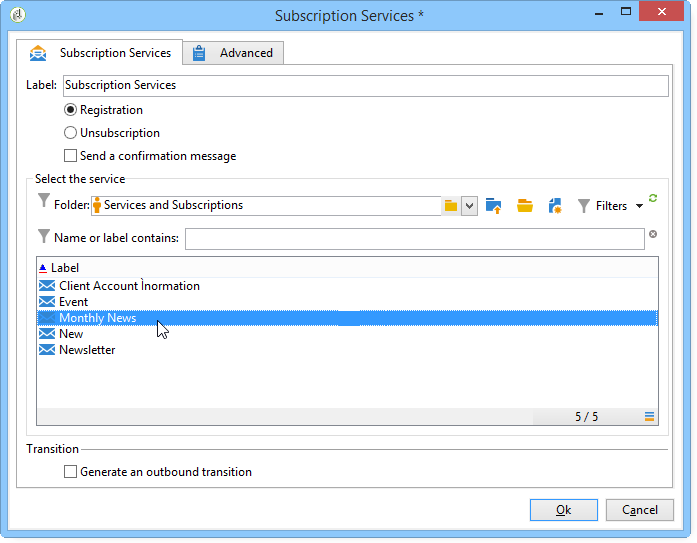

# 구독 서비스{#subscription-services}

구독 **서비스**&#x200B;유형 활동을 사용하면 전환 시 지정된 모집단의 정보 서비스 구독을 만들거나 삭제할 수 있습니다.

구성하려면 활동을 편집하고 레이블을 입력한 다음, 다음 예제와 같이 실행할 작업(가입 또는 가입 해제)과 관련 서비스를 선택합니다.

1. 활동의 레이블을 입력합니다.
1. 실행이 끝날 때 전환을 만들려면 **[!UICONTROL Generate an outbound transition]** 선택합니다.

   일반적으로 정보 서비스에 대한 타겟의 가입은 타깃팅 워크플로우의 끝을 표시하는데, 이것은 기본적으로 옵션이 활성화되지 않는 이유입니다.

1. 선택한 정보 서비스 **[!UICONTROL Subscription]** 에 가입하거나 특정 모집단을 가입 또는 해지하려면 을 **[!UICONTROL Unsubscription]** 클릭합니다.
1. 서비스 **[!UICONTROL Send a confirmation message]** 에 가입되었거나 가입을 해지했음을 수신자에게 알리려면 선택합니다.

   이 메시지의 내용은 정보 서비스와 관련된 배달 템플릿에 지정됩니다. 자세한 정보는 이 [섹션](../../delivery/using/managing-subscriptions.md)을 참조하십시오.

## 예:뉴스레터에 수신자 목록 구독 {#example--subscribe-a-list-of-recipients-to-a-newsletter}

다음 워크플로우는 한 번에 뉴스레터를 발송할 수 있는 수신자 목록을 만들기 위해 파리 지역 근로자들을 대상으로 합니다.

이렇게 하려면 이미 가입한 수신자도 제외해야 합니다.

>[!CAUTION]
>
>수신자에게 서비스에 수동으로 가입하기 전에 이러한 수신자가 귀하로부터 메시지를 수신하도록 허용하는지 확인하십시오.

1. 다음 세 개의 쿼리를 추가합니다.

   * 18~60세 수신자를 타깃으로 합니다.
   * 파리 거주자를 대상으로 한 두 번째 표적.
   * 현재 뉴스레터에 가입되어 있지 않은 세 번째 타게팅 받는 사람.

1. 교차 활동을 추가하여 다른 결과를 상호 참조합니다.
1. 원하는 경우 최신 구독자 목록을 최신 상태로 유지하려면 목록 업데이트를 삽입하십시오.
1. 구독 서비스 활동을 삽입한 다음 이 작업을 두 번 클릭하여 구성합니다.
1. 활동 레이블을 입력하고 선택합니다 **[!UICONTROL Subscription]**.

   원하는 경우 **[!UICONTROL Send a confirmation message]** 상자를 선택하면 수신자에게 뉴스레터 구독을 알릴 수 있습니다.

1. 뉴스레터가 있는 폴더를 선택한 다음 표시되는 목록에서 뉴스레터를 선택합니다.
1. 이 활동이 워크플로우의 끝을 표시하도록 **[!UICONTROL Generate outbound transition]** 하려면 이 확인란을 선택하지 않은 상태로 두었다가 아이콘을 클릭합니다 **[!UICONTROL Ok]**.

워크플로우 실행 중에 세 개의 모든 쿼리에 해당하는 수신자가 목록에 추가되고 뉴스레터에 구독됩니다.

수신자의 탭으로 이동하여 구독이 성공했는지 확인할 수 **[!UICONTROL Subscription]** 있습니다.

## 입력 매개 변수 {#input-parameters}

* tableName
* 스키마

각 인바운드 이벤트는 이러한 매개 변수로 정의된 대상을 지정해야 합니다.
