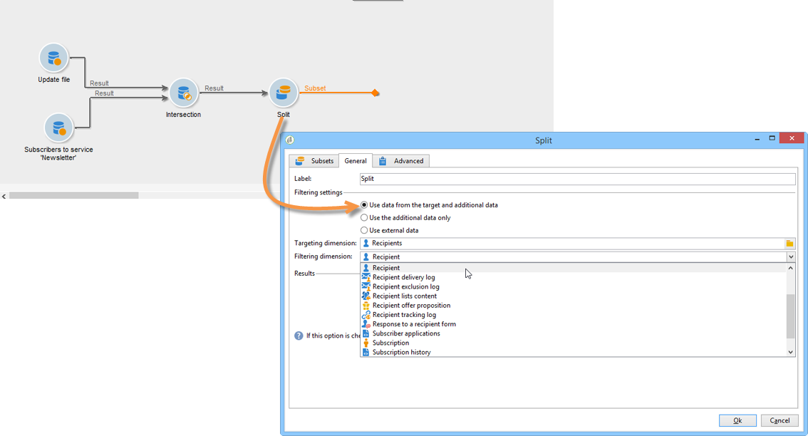

# 데이터 타겟팅{#targeting-data}

## 쿼리 만들기 {#creating-queries}

### 데이터 {#selecting-data} 선택

**[!UICONTROL Query]** 활동을 사용하면 타겟 모집단을 작성할 기본 데이터를 선택할 수 있습니다. 자세한 내용은 [쿼리 만들기](../../workflow/using/query.md#creating-a-query)를 참조하십시오.

다음 활동을 사용하여 데이터베이스에서 데이터를 쿼리하고 세분화할 수도 있습니다.[증분 쿼리](../../workflow/using/incremental-query.md), [목록 읽기](../../workflow/using/read-list.md).

워크플로우의 라이프사이클 동안 전달 및 처리할 추가 데이터를 수집할 수 있습니다. 자세한 내용은 [데이터 추가](../../workflow/using/query.md#adding-data) 및 [추가 데이터 편집](#editing-additional-data)을 참조하십시오.

### 추가 데이터 편집 {#editing-additional-data}

추가 데이터가 추가되면 해당 데이터를 편집하거나 쿼리 활동에 정의된 대상을 세분화하는 데 사용할 수 있습니다.

**[!UICONTROL Edit additional data...]** 링크를 사용하면 추가된 데이터를 보고 수정하거나 추가할 수 있습니다.

이전에 정의한 출력 열에 데이터를 추가하려면 사용 가능한 필드 목록에서 해당 열을 선택합니다. 새 출력 열을 만들려면 **[!UICONTROL Add]** 아이콘을 클릭한 다음 필드를 선택하고 **[!UICONTROL Edit expression]**&#x200B;을 클릭합니다.

예를 들어 합산처럼 추가할 필드의 계산 모드를 정의합니다.

**[!UICONTROL Add a sub-item]** 옵션을 사용하면 계산된 데이터를 컬렉션에 첨부할 수 있습니다. 이를 통해 컬렉션에서 추가 데이터를 선택하거나 수집 요소에 대한 집계 계산을 정의할 수 있습니다.

하위 요소는 매핑된 컬렉션의 하위 트리에 표시됩니다.

컬렉션은 **[!UICONTROL Collections]** 하위 탭에 표시됩니다. 선택한 컬렉션의 **[!UICONTROL Detail]** 아이콘을 클릭하여 수집된 요소를 필터링할 수 있습니다. 필터 마법사를 사용하면 수집된 데이터를 선택하고 컬렉션의 데이터에 적용할 필터링 조건을 지정할 수 있습니다.

### 추가 데이터 {#refining-the-target-using-additional-data}을(를) 사용하여 대상 다듬기

수집된 추가 데이터를 사용하면 데이터베이스에서 데이터 필터링을 구체화할 수 있습니다. 이렇게 하려면 **[!UICONTROL Refine the target using additional data...]** 링크를 클릭합니다.이렇게 하면 추가된 데이터에 대해 지나치게 필터링할 수 있습니다.

### 데이터 분류 {#homogenizing-data}

**[!UICONTROL Union]** 또는 **[!UICONTROL Intersection]** 유형 활동에서 데이터를 일관되게 유지하기 위해 공유 추가 데이터만 유지하도록 선택할 수 있습니다. 이 경우 이 활동의 임시 출력 작업 테이블에는 모든 인바운드 세트에 있는 추가 데이터만 포함됩니다.

### 추가 데이터 {#reconciliation-with-additional-data}와의 조정

데이터 조정 단계 동안(**[!UICONTROL Union]**, **[!UICONTROL Intersection]** 등) 활동)을 선택하면 추가 열에서 데이터 조정에 사용할 열을 선택할 수 있습니다. 이렇게 하려면 선택한 열에 대한 조정을 구성하고 기본 세트를 지정합니다. 다음 예와 같이 창의 아래쪽 열에서 열을 선택합니다.

### 하위 세트 만들기 {#creating-subsets}

**[!UICONTROL Split]** 활동을 사용하면 추출 쿼리를 통해 정의된 조건에 대한 하위 세트를 만들 수 있습니다. 각 하위 세트에 대해 모집단 필터 조건을 편집할 때 타겟 세그멘테이션 조건을 정의할 수 있는 표준 쿼리 활동에 액세스합니다.

필터링 조건으로 추가 데이터만 사용하거나 타겟 데이터 외에 다른 데이터를 사용하여 대상을 여러 하위 세트로 분할할 수 있습니다. **통합 데이터 액세스** 옵션을 구입한 경우 외부 데이터를 사용할 수도 있습니다.

자세한 내용은 분할 활동](#creating-subsets-using-the-split-activity)을 사용하여 하위 세트 만들기를 참조하십시오.[

## 데이터 세그먼트화 {#segmenting-data}

### 여러 대상 결합(조합) {#combining-several-targets--union-}

조합 활동을 사용하면 하나의 전환 내에서 여러 활동의 결과를 결합할 수 있습니다. 집합은 반드시 동질적일 필요는 없다.

다음 데이터 조정 옵션을 사용할 수 있습니다.

* **[!UICONTROL Keys only]**

   입력 모집단이 균일할 경우 이 옵션을 사용할 수 있습니다.

* **[!UICONTROL All columns in common]**

   이 옵션을 사용하면 타겟의 다양한 모집단에서 공통되는 모든 열을 기준으로 데이터를 조정할 수 있습니다.

   Adobe Campaign은 이름에 따라 열을 식별합니다. 허용한도 임계값은 다음과 같습니다.예를 들어 &#39;Email&#39; 열은 &#39;@email&#39; 열과 동일한 것으로 인식될 수 있습니다.

* **[!UICONTROL A selection of columns]**

   데이터 조정을 적용할 열 목록을 정의하려면 이 옵션을 선택합니다.

   먼저 기본 세트(소스 데이터가 포함된 세트)를 선택한 다음 조인에 사용할 열을 선택합니다.

   

   >[!CAUTION]
   >
   >데이터 조정 중에 모집단은 중복 제거되지 않습니다.

   채우기 크기를 지정된 레코드 수로 제한할 수 있습니다. 이렇게 하려면 적절한 옵션을 클릭하고 보관할 레코드 수를 지정합니다.

   또한 인바운드 모집단의 우선 순위를 지정합니다.창의 아래쪽 섹션에서는 결합 활동의 인바운드 전환을 나열하고 창 오른쪽의 파란색 화살표를 사용하여 정렬할 수 있습니다.

   기록들은 목록에서 첫 번째 인바운드 전환의 인구로부터 먼저 얻어진 다음, 최대값에 도달하지 않은 경우 두 번째 인바운드 전환의 인구 등으로부터 가져옵니다.

   

### 결합 데이터 추출(교차) {#extracting-joint-data--intersection-}

교차를 사용하면 인바운드 전환 모집단이 공유하는 라인만 복구할 수 있습니다. 이 활동은 조합 활동처럼 구성됩니다.

또한 선택된 열만 유지하거나 인바운드 모집단에서 공유하는 열만 유지할 수 있습니다.

교차 활동은 [교차](../../workflow/using/intersection.md) 섹션에 자세히 설명되어 있습니다.

### 모집단 제외(제외) {#excluding-a-population--exclusion-}

제외 활동을 사용하면 타겟 요소를 다른 타겟 모집단에서 제외할 수 있습니다. 이 활동의 출력 타깃팅 차원은 기본 세트의 차원이 됩니다.

필요한 경우 인바운드 테이블을 조작할 수 있습니다. 실제로 다른 차원에서 대상을 제외하려면 이 타겟이 기본 타겟과 동일한 타깃팅 차원으로 반환되어야 합니다. 이렇게 하려면 **[!UICONTROL Add]** 단추를 클릭하고 차원 변경 조건을 지정합니다.

데이터 조정은 식별자, 축 변경 또는 조인을 통해 수행됩니다. 예제는 [목록의 데이터 사용에서 사용할 수 있습니다.목록](../../platform/using/import-export-workflows.md#using-data-from-a-list--read-list)을 읽습니다.

### 분할 작업 {#creating-subsets-using-the-split-activity}을(를) 사용하여 하위 세트 만들기

**[!UICONTROL Split]** 활동은 하위 세트당 하나의 출력 전환 또는 고유한 전환을 생성하는 것은 물론 하나 또는 여러 필터링 차원을 통해 필요한 만큼 많은 설정을 만들 수 있는 표준 활동입니다.

인바운드 전환에서 전달된 추가 데이터를 필터링 조건에 사용할 수 있습니다.

구성하려면 먼저 기준을 선택해야 합니다.

1. 워크플로우에서 **[!UICONTROL Split]** 활동을 드래그하여 놓습니다.
1. **[!UICONTROL General]** 탭에서 원하는 옵션을 선택합니다.**[!UICONTROL Use data from the target and additional data]**, **[!UICONTROL Use the additional data only]** 또는 **[!UICONTROL Use external data]**.
1. **[!UICONTROL Use data from the target and additional data]** 옵션이 선택된 경우 타깃팅 차원을 사용하여 인바운드 전환에서 전달한 모든 데이터를 사용할 수 있습니다.

   

   하위 세트가 만들어지면 앞서 언급한 필터링 매개 변수가 사용됩니다.

   필터링 조건을 정의하려면 **[!UICONTROL Add a filtering condition on the inbound population]** 옵션을 선택하고 **[!UICONTROL Edit...]** 링크를 클릭합니다. 그런 다음 이 하위 집합을 만들기 위한 필터링 조건을 지정합니다.

   

   **[!UICONTROL Split]** 활동에서 필터링 조건을 사용하여 대상을 다른 모집단으로 세그먼트화하는 방법을 보여주는 예제는 [이 섹션](../../workflow/using/cross-channel-delivery-workflow.md)에 설명되어 있습니다.

   **[!UICONTROL Label]** 필드를 사용하면 새로 만든 하위 세트에 아웃바운드 전환과 일치하는 이름을 지정할 수 있습니다.

   하위 세트에 세그먼트 코드를 할당하여 이를 식별하고 해당 모집단 타깃팅에 사용할 수도 있습니다.

   필요한 경우 만들려는 각 하위 세트에 대해 타깃팅 및 필터링 차원을 개별적으로 변경할 수 있습니다. 이렇게 하려면 하위 집합의 필터링 조건을 편집하고 **[!UICONTROL Use a specific filtering dimension]** 옵션을 확인하십시오.

   

1. **[!UICONTROL Use the additional data only]** 옵션을 선택하면 하위 집합 필터링에 대해 추가 데이터만 제공됩니다.

   

1. **통합 데이터 액세스** 옵션이 활성화된 경우 **[!UICONTROL Use external data]**&#x200B;를 사용하면 이미 구성된 외부 데이터베이스의 데이터를 처리하거나 데이터베이스에 대한 새 연결을 만들 수 있습니다.

   

   자세한 정보는 이 [섹션](../../installation/using/about-fda.md)을 참조하십시오.

그런 다음 새로운 하위 세트를 추가해야 합니다.

1. **[!UICONTROL Add]** 단추를 클릭하고 필터링 조건을 정의합니다.

   

1. 활동의 **[!UICONTROL General]** 탭에서 필터링 차원을 정의합니다(위 참조). 기본적으로 모든 하위 세트에 적용됩니다.

   

1. 필요한 경우 각 하위 세트에 대한 필터링 차원을 개별적으로 변경할 수 있습니다. 이렇게 하면 동일한 분할 활동을 사용하여 최신 뉴스레터를 클릭한 모든 수신자용 및 최근 30일 이내에 스토어에서 구매한 18~25세 노인에 대한 3번째 골드 카드 보유자를 위한 세트를 만들 수 있습니다. 이렇게 하려면 **[!UICONTROL Use a specific filtering dimension]** 옵션을 선택하고 데이터 필터링 컨텍스트를 선택합니다.

   

   >[!NOTE]
   >
   >**Federated Data Access** 옵션을 구입한 경우 외부 기반 정보를 기반으로 하위 세트를 만들 수 있습니다. 이렇게 하려면 **[!UICONTROL Targeting dimension]** 필드에서 외부 테이블의 스키마를 선택합니다. 자세한 내용은 [외부 데이터베이스 액세스(FDA)](../../workflow/using/accessing-an-external-database--fda-.md)를 참조하십시오.

하위 세트가 만들어지면 기본적으로 분할 활동은 하위 세트가 있는 만큼 많은 출력 전환을 보여줍니다.

이러한 모든 하위 집합을 단일 출력 전환으로 그룹화할 수 있습니다. 이 경우, 예를 들어 각 하위 세트에 대한 링크가 세그먼트 코드에 표시됩니다. 이렇게 하려면 **[!UICONTROL Generate all subsets in the same table]** 옵션을 선택합니다.

예를 들어 단일 전달 활동을 배치하고 각 수신자 세트의 세그먼트 코드를 기반으로 전달 컨텐츠를 개인화할 수 있습니다.

**[!UICONTROL Cells]** 활동을 사용하여 하위 세트를 만들 수도 있습니다. 자세한 내용은 [셀](../../workflow/using/cells.md) 섹션을 참조하십시오.

### 대상 데이터 {#using-targeted-data} 사용

데이터가 식별되고 준비되면 다음 컨텍스트에서 사용할 수 있습니다.

* 다양한 워크플로우 단계에서 데이터 조작에 따라 데이터베이스의 데이터를 업데이트할 수 있습니다.

   이에 대한 자세한 내용은 [데이터 업데이트](../../workflow/using/update-data.md)를 참조하십시오.

* 기존 목록의 컨텐츠를 새로 고칠 수도 있습니다.

   자세한 내용은 [목록 업데이트](../../workflow/using/list-update.md)를 참조하십시오.

* 워크플로우에서 직접 배달을 준비하거나 시작할 수 있습니다.

   자세한 내용은 [배달](../../workflow/using/delivery.md), [배달 컨트롤](../../workflow/using/delivery-control.md) 및 [연속 배달](../../workflow/using/continuous-delivery.md)을 참조하십시오.

## 데이터 관리 {#data-management}

Adobe Campaign에서 데이터 관리는 보다 효율적이고 유연한 툴을 제공하여 복잡한 타깃팅 문제를 해결하기 위한 일련의 활동을 결합합니다. 이를 통해 계약서, 구독, 배송 재활동 등과 관련된 정보를 사용하여 연락처와 모든 의사 소통을 일관된 방식으로 관리할 수 있습니다. 데이터 관리를 사용하면 세분화 작업 중 특히 다음의 데이터 라이프 사이클을 추적할 수 있습니다.

* 데이터 마트에서 모델링되지 않은 데이터를 포함하여 타겟팅 프로세스를 단순화 및 최적화(새 테이블 만들기: 구성에 따라 각 타겟팅 워크플로우에 대한 로컬 확장).
* 특히 타겟 구성 단계 또는 데이터베이스 관리 동안 버퍼 계산 보관 및 전달
* 외부 베이스 액세스(선택 사항): 타겟팅 프로세스 중에 고려된 다른 유형의 데이터베이스

이러한 작업을 구현하기 위해 Adobe Campaign은 다음과 같은 이점을 제공합니다.

* 데이터 수집 활동:[파일 전송](../../workflow/using/file-transfer.md), [데이터 로드(파일)](../../workflow/using/data-loading--file-.md), [데이터 로드(RDBMS)](../../workflow/using/data-loading--rdbms-.md), [데이터 업데이트](../../workflow/using/update-data.md). 데이터를 수집하는 이 첫 번째 단계는 데이터를 다른 활동에서 처리할 수 있도록 준비합니다. 워크플로우가 올바르게 실행되고 예상 결과를 제공하기 위해 여러 매개 변수를 모니터링해야 합니다. 예를 들어 데이터를 가져올 때 이 데이터의 기본 키(Pkey)는 각 레코드에 대해 고유해야 합니다.
* 데이터 관리 옵션을 통해 강화된 타깃팅 활동:[쿼리](../../workflow/using/query.md), [조합](../../workflow/using/union.md), [교차](../../workflow/using/intersection.md), [분할](../../workflow/using/split.md). 데이터 조정이 가능한 한 여러 다른 타깃팅 차원의 데이터 간 결합이나 교차를 구성할 수 있습니다.
* 데이터 변환 활동:[Enrichment](../../workflow/using/enrichment.md), [차원 변경](../../workflow/using/change-dimension.md).

>[!CAUTION]
>
>두 개의 워크플로우가 연결되어 있는 경우 소스 테이블 요소를 삭제해도 여기에 연결된 모든 데이터가 삭제되지 않습니다.
>  
>예를 들어, 워크플로우를 통해 받는 사람을 삭제해도 받는 사람의 전달 내역이 모두 삭제되지 않습니다. 그러나 &#39;받는 사람&#39; 폴더에서 직접 받는 사람을 삭제하면 이 받는 사람과 연결된 모든 데이터가 삭제됩니다.

### 데이터 농축 및 수정 {#enriching-and-modifying-data}

타깃팅 차원 외에도 필터링 차원을 사용하여 수집된 데이터의 특성을 지정할 수 있습니다. [타깃팅 및 필터링 차원](../../workflow/using/building-a-workflow.md#targeting-and-filtering-dimensions)을 참조하십시오.

식별된 데이터와 수집된 데이터를 수집 및 분석하여 대상 구성을 최적화할 수 있습니다. 이렇게 하려면 [데이터 세그먼트화](#segmenting-data) 섹션에 자세히 설명된 데이터 조작 활동 이외에 다음을 사용하십시오.

* **[!UICONTROL Enrichment]** 활동을 사용하면 특정 요소에 정보를 추가하는 것은 물론 스키마에 열을 일시적으로 추가할 수 있습니다. 활동 저장소의 [Enrichment](../../workflow/using/enrichment.md) 섹션에 자세히 설명되어 있습니다.
* **[!UICONTROL Edit schema]** 활동을 사용하면 스키마 구조를 수정할 수 있습니다. 활동 저장소의 [스키마 편집](../../workflow/using/edit-schema.md) 섹션에 자세히 설명되어 있습니다.
* **[!UICONTROL Change dimension]** 활동을 사용하면 대상 구성 주기 동안 타깃팅 차원을 변경할 수 있습니다. [차원](../../workflow/using/change-dimension.md) 변경 섹션에 자세히 설명되어 있습니다.

