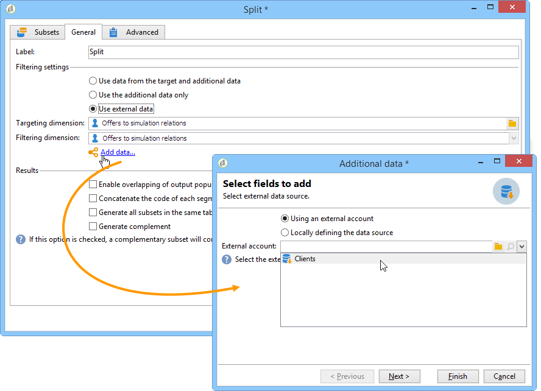
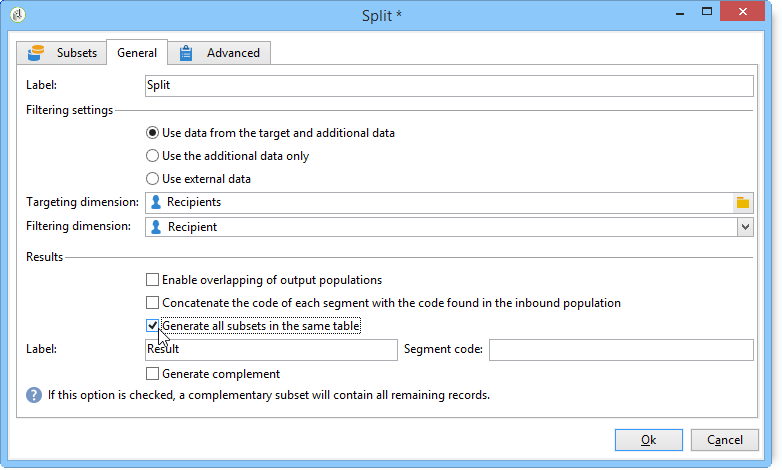

# 타겟 데이터{#targeting-data}

## 쿼리 만들기 {#creating-queries}

### 데이터 선택 {#selecting-data}

A **[!UICONTROL Query]** 활동을 사용하면 기본 데이터를 선택하여 대상 모집단을 작성할 수 있습니다. 자세한 내용은 다음을 참조하십시오. [쿼리 만들기](query.md#creating-a-query).

다음 활동을 사용하여 데이터베이스에서 데이터를 쿼리하고 구체화할 수도 있습니다. [증분 쿼리](incremental-query.md), [목록 읽기](read-list.md).

워크플로우의 수명 주기 전체에 걸쳐 전달 및 처리할 추가 데이터를 수집할 수 있습니다. 자세한 내용은 다음을 참조하십시오. [데이터 추가 중](query.md#adding-data) 및 [추가 데이터 편집](#editing-additional-data).

### 추가 데이터 편집 {#editing-additional-data}

데이터가 추가되면 이를 편집하거나 사용하여 쿼리 활동에 정의된 대상을 세분화할 수 있습니다.

다음 **[!UICONTROL Edit additional data...]** 링크를 통해 추가된 데이터를 보고 수정하거나 추가할 수 있습니다.

이전에 정의한 출력 열에 데이터를 추가하려면 사용 가능한 필드 목록에서 해당 데이터를 선택합니다. 새 출력 열을 만들려면 **[!UICONTROL Add]** 아이콘을 클릭한 다음 필드를 선택하고 **[!UICONTROL Edit expression]**.

추가할 필드(예: 집계)에 대한 계산 모드를 정의합니다.

다음 **[!UICONTROL Add a sub-item]** 옵션을 사용하면 계산된 데이터를 컬렉션에 첨부할 수 있습니다. 이렇게 하면 컬렉션에서 추가 데이터를 선택하거나 컬렉션 요소에 대한 집계 계산을 정의할 수 있습니다.

하위 요소는 매핑된 컬렉션의 하위 트리에 표시됩니다.

컬렉션은에 표시됩니다. **[!UICONTROL Collections]** 하위 탭. 다음을 클릭하여 수집된 요소를 필터링할 수 있습니다. **[!UICONTROL Detail]** 선택한 컬렉션의 아이콘입니다. 필터 마법사를 사용하여 수집된 데이터를 선택하고, 컬렉션의 데이터에 적용할 필터링 조건을 지정할 수 있습니다.

### 추가 데이터를 사용하여 대상 세분화 {#refining-the-target-using-additional-data}

수집된 추가 데이터를 사용하면 데이터베이스에서 데이터 필터링을 세분화할 수 있습니다. 이렇게 하려면 **[!UICONTROL Refine the target using additional data...]** 링크: 추가된 데이터를 오버 필터링할 수 있습니다.

### 데이터 균질화 {#homogenizing-data}

위치 **[!UICONTROL Union]** 또는 **[!UICONTROL Intersection]** 활동을 입력합니다. 데이터를 일관되게 유지하기 위해 공유된 추가 데이터만 유지하도록 선택할 수 있습니다. 이 경우 이 활동의 임시 출력 작업 테이블에는 모든 인바운드 세트에서 찾은 추가 데이터만 포함됩니다.

### 추가 데이터를 사용한 조정 {#reconciliation-with-additional-data}

데이터 조정 단계 동안(**[!UICONTROL Union]**, **[!UICONTROL Intersection]**&#x200B;등 활동)을 추가할 때 데이터 조정에 사용할 열을 선택할 수 있습니다. 이렇게 하려면 열 선택에 대한 조정을 구성하고 기본 세트를 지정합니다. 그런 다음 다음 다음 예와 같이 창의 아래쪽 열에 있는 열을 선택합니다.

### 하위 집합 만들기 {#creating-subsets}

다음 **[!UICONTROL Split]** 활동을 사용하면 추출 쿼리를 통해 정의된 기준에 대한 하위 집합을 만들 수 있습니다. 각 하위 집합에 대해 모집단에서 필터 조건을 편집할 때 대상 세분화 조건을 정의할 수 있는 표준 쿼리 활동에 액세스합니다.

필터링 조건으로 추가 데이터만 사용하거나 대상 데이터 외에 다른 데이터를 사용하여 대상을 여러 하위 집합으로 분할할 수 있습니다. 을(를) 구매한 경우 외부 데이터를 사용할 수도 있습니다. **페더레이션 데이터 액세스** 옵션을 선택합니다.

자세한 내용은 다음을 참조하십시오. [분할 활동을 사용하여 하위 집합 만들기](#creating-subsets-using-the-split-activity).

## 세그먼트 데이터 {#segmenting-data}

### 여러 대상 결합(결합) {#combining-several-targets--union-}

결합 활동을 사용하면 여러 활동의 결과를 하나의 전환 내에서 결합할 수 있습니다. 세트가 반드시 동질적일 필요는 없습니다.

다음 데이터 조정 옵션을 사용할 수 있습니다.

* **[!UICONTROL Keys only]**

   이 옵션은 입력 모집단이 동질적일 경우 사용할 수 있습니다.

* **[!UICONTROL All columns in common]**

   이 옵션을 사용하면 대상의 다양한 모집단에 공통되는 모든 열을 기반으로 데이터를 조정할 수 있습니다.

   Adobe Campaign은 이름을 기반으로 열을 식별합니다. 허용 한도 임계값이 수락됩니다. 예를 들어 &#39;이메일&#39; 열은 &#39;@email&#39; 열과 동일한 것으로 인식될 수 있습니다.

* **[!UICONTROL A selection of columns]**

   데이터 조정을 적용할 열 목록을 정의하려면 이 옵션을 선택합니다.

   기본 세트(소스 데이터가 포함된 세트)를 선택한 다음 가입에 사용할 열을 선택합니다.

   

   >[!CAUTION]
   >
   >데이터 조정 중에 모집단은 중복 제거되지 않습니다.

   주어진 레코드 수로 모집단 크기를 제한할 수 있습니다. 이렇게 하려면 적절한 옵션을 클릭하고 보관할 레코드 수를 지정합니다.

   또한 인바운드 모집단의 우선 순위를 지정합니다. 창의 아래 섹션에는 결합 활동의 인바운드 전환이 나열되며 창 오른쪽에 있는 파란색 화살표를 사용하여 이들을 정렬할 수 있습니다.

   레코드는 목록의 첫 번째 인바운드 전환의 모집단에서 먼저 가져온 다음 최대값에 도달하지 않은 경우 두 번째 인바운드 전환의 모집단에서 가져옵니다.

   

### 관절 데이터 추출(교차) {#extracting-joint-data--intersection-}

교차를 사용하면 인바운드 전환 모집단에서 공유한 줄만 복구할 수 있습니다. 이 활동은 조합 활동과 같이 구성됩니다.

또한 선택한 열만 유지하거나 인바운드 모집단에서 공유한 열만 유지할 수 있습니다.

교차 활동은 다음에 자세히 설명되어 있습니다. [교차](intersection.md) 섹션.

### 모집단 제외(제외) {#excluding-a-population--exclusion-}

제외 활동을 사용하면 다른 대상 모집단에서 대상 요소를 제외할 수 있습니다. 이 활동의 출력 타겟팅 차원은 기본 세트의 차원이 됩니다.

필요한 경우 인바운드 테이블을 조작할 수 있습니다. 실제로 다른 차원에서 대상을 제외하려면 이 대상을 기본 대상과 동일한 타겟팅 차원으로 반환해야 합니다. 이렇게 하려면 다음을 클릭하십시오. **[!UICONTROL Add]** 단추를 누르고 차원 변경 조건을 지정합니다.

데이터 조정은 식별자, 축 변경 또는 조인을 통해 수행됩니다. 예는에서 사용할 수 있습니다. [목록의 데이터 사용: 목록 읽기](../../platform/using/import-export-workflows.md#using-data-from-a-list--read-list).

### 분할 활동을 사용하여 하위 집합 만들기 {#creating-subsets-using-the-split-activity}

다음 **[!UICONTROL Split]** 활동은 하위 집합당 하나의 출력 전환 또는 고유한 전환을 생성할 뿐만 아니라 하나 또는 여러 필터링 차원을 통해 필요한 만큼 세트를 생성할 수 있는 표준 활동입니다.

인바운드 전환에 의해 전달된 추가 데이터를 필터링 기준에 사용할 수 있습니다.

구성하려면 먼저 기준을 선택해야 합니다.

1. 워크플로우에서 을(를) 끌어다 놓습니다. **[!UICONTROL Split]** 활동.
1. 다음에서 **[!UICONTROL General]** 탭에서 원하는 옵션을 선택합니다. **[!UICONTROL Use data from the target and additional data]**, **[!UICONTROL Use the additional data only]** 또는 **[!UICONTROL Use external data]**.
1. 다음과 같은 경우 **[!UICONTROL Use data from the target and additional data]** 옵션을 선택하면 타겟팅 차원을 사용하여 인바운드 전환으로 전달된 모든 데이터를 사용할 수 있습니다.

   

   서브셋이 생성되면 앞서 언급된 필터링 파라미터가 사용된다.

   필터링 조건을 정의하려면 다음을 선택합니다 **[!UICONTROL Add a filtering condition on the inbound population]** 옵션을 클릭하고 **[!UICONTROL Edit...]** 링크를 클릭합니다. 그런 다음 이 하위 집합을 만들기 위한 필터링 조건을 지정합니다.

   

   에서 필터링 조건을 사용하는 방법을 보여 주는 예제 **[!UICONTROL Split]** 타겟을 다른 모집단으로 세분화하는 활동은에 설명되어 있습니다. [이 섹션](cross-channel-delivery-workflow.md).

   다음 **[!UICONTROL Label]** 필드를 사용하면 새로 만든 하위 집합에 아웃바운드 전환과 일치하는 이름을 제공할 수 있습니다.

   또한 세그먼트 코드를 하위 집합에 할당하여 식별하고 이를 사용하여 모집단을 타깃팅할 수도 있습니다.

   필요한 경우 만들려는 각 하위 세트에 대해 개별적으로 타겟팅 및 필터링 차원을 변경할 수 있습니다. 이렇게 하려면 하위 집합의 필터링 조건을 편집하고 **[!UICONTROL Use a specific filtering dimension]** 옵션을 선택합니다.

   

1. 다음과 같은 경우 **[!UICONTROL Use the additional data only]** 옵션을 선택하면 하위 집합 필터링에 추가 데이터만 제공됩니다.

   

1. 다음과 같은 경우 **페더레이션 데이터 액세스** 옵션이 활성화되어 있습니다. **[!UICONTROL Use external data]** 이미 구성된 외부 데이터베이스에서 데이터를 처리하거나 데이터베이스에 대한 새 연결을 만들 수 있습니다.

   

   자세한 내용은 Campaign 버전에 따라 다음 섹션을 참조하십시오.

   [  Campaign v7 설명서](../../installation/using/about-fda.md)

   [  Campaign v8 설명서](https://experienceleague.adobe.com/docs/campaign/campaign-v8/connect/fda.html)

그런 다음 새 하위 집합을 추가해야 합니다.

1. 다음을 클릭합니다. **[!UICONTROL Add]** 버튼을 클릭하고 필터링 조건을 정의합니다.

   

1. 에서 필터링 차원을 정의합니다. **[!UICONTROL General]** 활동의 탭입니다(위 참조). 기본적으로 모든 하위 집합에 적용됩니다.

   

1. 필요한 경우 각 하위 세트에 대한 필터링 차원을 개별적으로 변경할 수 있습니다. 이렇게 하면 모든 골드 카드 소유자에 대한 세트를 작성할 수 있습니다. 하나는 최신 뉴스레터를 클릭한 모든 수신자에 대한 세트이고 다른 하나는 지난 30일 이내에 매장 구매를 한 18~25세의 모든 수신자에 대한 세트로서, 모두 동일한 분할 활동을 사용합니다. 이렇게 하려면 **[!UICONTROL Use a specific filtering dimension]** 옵션을 선택하고 데이터 필터링 컨텍스트를 선택합니다.

   

   >[!NOTE]
   >
   >를 획득한 경우 **페더레이션 데이터 액세스** 옵션을 사용하면 외부 기반의 정보를 기반으로 하위 집합을 만들 수 있습니다. 이렇게 하려면에서 외부 테이블의 스키마를 선택합니다 **[!UICONTROL Targeting dimension]** 필드. 자세한 내용은 다음을 참조하십시오. [외부 데이터베이스 액세스(FDA)](accessing-an-external-database--fda-.md).

하위 집합이 만들어지면 기본적으로 분할 활동은 하위 집합이 있는 수만큼 출력 전환을 표시합니다.

이러한 모든 하위 집합을 단일 출력 전환으로 그룹화할 수 있습니다. 이 경우 각 하위 집합에 대한 링크는 예를 들어 세그먼트 코드에 표시됩니다. 이렇게 하려면 **[!UICONTROL Generate all subsets in the same table]** 옵션을 선택합니다.

예를 들어 단일 게재 활동을 배치하고 각 수신자 세트의 세그먼트 코드를 기반으로 게재 콘텐츠를 개인화할 수 있습니다.

하위 집합은 **[!UICONTROL Cells]** 활동. 자세한 내용은 [셀](cells.md) 섹션.

### 타겟팅된 데이터 사용 {#using-targeted-data}

데이터를 식별하고 준비하면 다음 컨텍스트에서 사용할 수 있습니다.

* 다양한 워크플로우 단계에서 데이터 조작 후 데이터베이스의 데이터를 업데이트할 수 있습니다.

   자세한 내용은, [데이터 업데이트](update-data.md).

* 기존 목록의 콘텐츠를 새로 고칠 수도 있습니다.

   자세한 내용은 다음을 참조하십시오. [목록 업데이트](list-update.md).

* 워크플로우에서 직접 게재를 준비하거나 시작할 수 있습니다.

   자세한 내용은 다음을 참조하십시오. [게재](delivery.md), [게재 제어](delivery-control.md) 및 [연속 게재](continuous-delivery.md).

## 데이터 관리 {#data-management}

Adobe Campaign에서 데이터 관리 는 보다 효율적이고 유연한 도구를 제공하여 복잡한 타겟팅 문제를 해결하기 위한 일련의 활동을 결합합니다. 이를 통해 계약, 구독, 게재 반응성 등과 관련된 정보를 사용하여 연락처와의 모든 커뮤니케이션을 일관성 있게 관리할 수 있습니다. 데이터 관리를 사용하면 세분화 작업 중 특히 다음의 데이터 라이프 사이클을 추적할 수 있습니다.

* 데이터 마트에서 모델링되지 않은 데이터를 포함하여 타겟팅 프로세스를 단순화 및 최적화(새 테이블 만들기: 구성에 따라 각 타겟팅 워크플로우에 대한 로컬 확장).
* 특히 타겟 구성 단계 또는 데이터베이스 관리 동안 버퍼 계산 보관 및 전달
* 외부 베이스 액세스(선택 사항): 타겟팅 프로세스 중에 고려된 다른 유형의 데이터베이스

Adobe Campaign에서는 이러한 작업을 구현하기 위해 다음을 제공합니다.

* 데이터 수집 활동: [파일 전송](file-transfer.md), [데이터 로드 중(파일)](data-loading--file-.md), [데이터 로드(RDBMS)](data-loading--rdbms-.md), [데이터 업데이트](update-data.md). 데이터를 수집하는 이 첫 번째 단계에서는 다른 활동에서 처리할 수 있도록 데이터를 준비합니다. 워크플로우가 올바르게 실행되고 예상 결과가 제공되도록 여러 매개 변수를 모니터링해야 합니다. 예를 들어 데이터를 가져올 때 이 데이터의 기본 키(Pkey)는 각 레코드에 대해 고유해야 합니다.
* 데이터 관리 옵션으로 보강된 타겟팅 활동: [쿼리](query.md), [합집합](union.md), [교차](intersection.md), [분할](split.md). 이를 통해 데이터 조정이 가능한 한 여러 다른 타겟팅 차원의 데이터 간 결합 또는 교차를 구성할 수 있습니다.
* 데이터 변환 활동: [데이터 보강](enrichment.md), [차원 변경](change-dimension.md).

>[!CAUTION]
>
>두 개의 워크플로우가 연결된 경우 소스 테이블 요소를 삭제해도 연결된 모든 데이터가 삭제되지는 않습니다.
>  
>예를 들어 워크플로우를 통해 수신자를 삭제해도 수신자의 게재 내역 일부가 삭제되지 않습니다. 그러나 &#39;수신자&#39; 폴더에서 직접 수신자를 삭제하면 이 수신자와 연결된 모든 데이터가 실제로 삭제됩니다.

### 데이터 강화 및 수정 {#enriching-and-modifying-data}

필터링 차원을 사용하면 타겟팅 차원 외에도 수집된 데이터의 특성을 지정할 수 있습니다. 을(를) 참조하십시오 [차원 타겟팅 및 필터링](building-a-workflow.md#targeting-and-filtering-dimensions).

식별되고 수집된 데이터는 대상 구성을 최적화하기 위해 보강, 집계 및 조작될 수 있다. 이렇게 하려면 다음에 자세히 설명된 데이터 조작 활동 외에도 [데이터 세그먼트화](#segmenting-data) 섹션에서 다음을 사용합니다.

* 다음 **[!UICONTROL Enrichment]** 활동을 사용하면 스키마에 열을 순간적으로 추가할 수 있을 뿐만 아니라 특정 요소에 정보를 추가할 수 있습니다. 자세한 내용은 [데이터 보강](enrichment.md) 활동 저장소의 섹션입니다.
* 다음 **[!UICONTROL Edit schema]** 활동을 사용하면 스키마 구조를 수정할 수 있습니다. 자세한 내용은 [스키마 편집](edit-schema.md) 활동 저장소의 섹션입니다.
* 다음 **[!UICONTROL Change dimension]** 활동을 사용하면 대상 구성 주기 동안 타깃팅 차원을 변경할 수 있습니다. 자세한 내용은 [차원 변경](change-dimension.md) 섹션.
