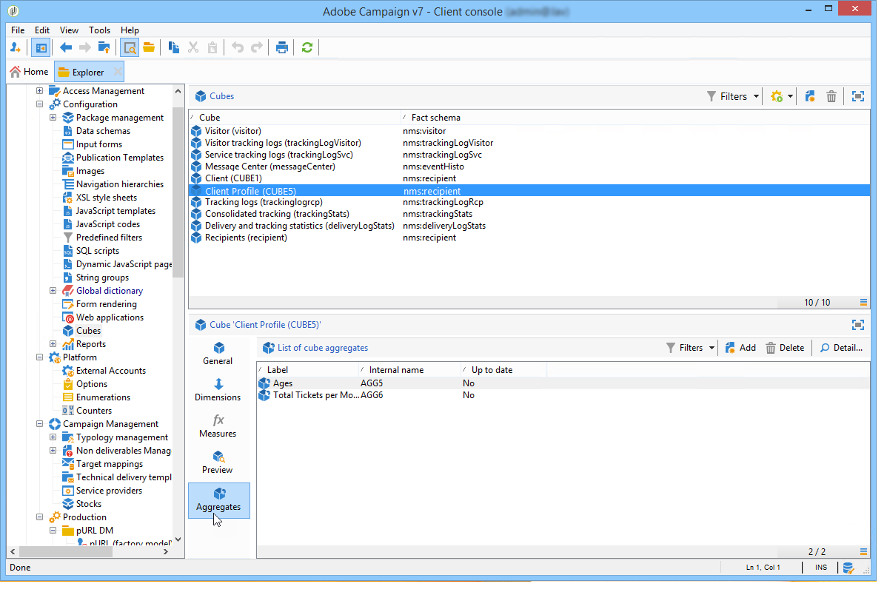

# 집계 업데이트{#update-aggregate}

집계는 보고를 위해 큐브 수준에서 정의됩니다. A **[!UICONTROL Workflow]** 합계를 구성할 때 탭을 사용할 수 있습니다.

집계는 대량의 데이터를 조작할 때 유용합니다. 최신 데이터를 지표에 통합하기 위해 전용 워크플로우 상자에 정의된 설정을 기반으로 자동으로 업데이트됩니다

집계는 각 큐브의 관련 탭에 정의됩니다.

다음 **[!UICONTROL Update aggregate]** 활동을 통해 적용할 업데이트 모드를 선택할 수 있습니다. 전체 또는 일부.

기본적으로 각 계산 중에 전체 업데이트가 수행됩니다. 부분 업데이트를 활성화하려면 관련 옵션을 선택하고 업데이트 조건을 정의합니다.

**모범 사례**: a **[!UICONTROL Scheduler]** 활동을 사용하여 계산 업데이트 빈도를 지정할 수 있습니다.

