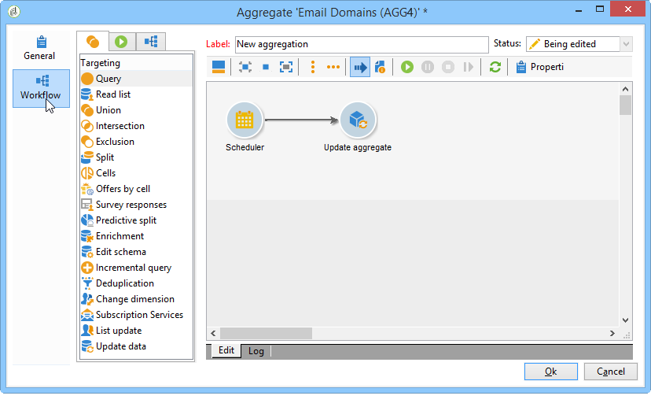

# 업데이트 집계{#update-aggregate}

합계는 보고용으로 큐브 레벨에서 정의됩니다. 집계를 구성할 때 **[!UICONTROL Workflow]** 탭을 사용할 수 있습니다.

큐브 및 Adobe Campaign의 집계를 사용하는 방법에 대한 자세한 내용은 전용 [섹션을 참조하십시오](../../reporting/using/concepts-and-methodology.md#calculating-and-using-aggregates).

이 **[!UICONTROL Update aggregate]** 활동을 통해 적용할 업데이트 모드를 선택할 수 있습니다.전체 또는 부분.

기본적으로 각 계산 중에 전체 업데이트가 수행됩니다. 부분 업데이트를 활성화하려면 관련 옵션을 선택하고 업데이트 조건을 정의합니다.

**모범 사례**:계산 업데이트 빈도를 지정하는 데 **[!UICONTROL Scheduler]** 활동을 사용할 수 있습니다.

