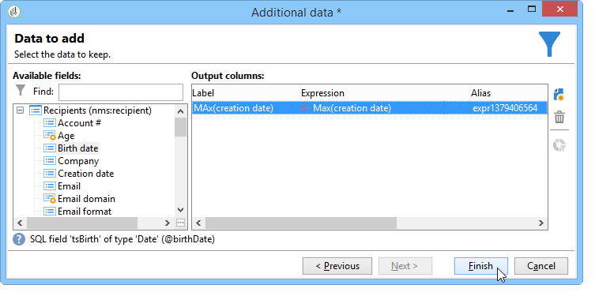
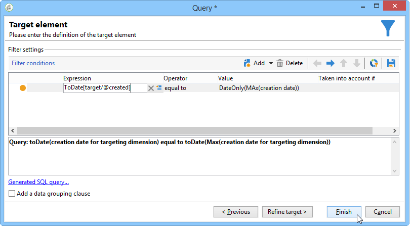

# 집계 사용{#using-aggregates}

이 사용 사례에서는 데이터베이스에 추가된 마지막 받는 사람을 자동으로 식별하는 방법을 자세히 설명합니다.

다음 프로세스를 사용하여 데이터베이스에 있는 받는 사람의 생성 날짜를 집계로 받는 사람을 만든 마지막 알려진 날짜와 비교합니다. 같은 날짜에 만든 모든 받는 사람도 선택됩니다.

수신자에 대해 **작성 날짜 = 최대(작성 날짜)** 유형 필터를 수행하려면 다음 단계를 따라야 합니다.

1. 기본 쿼리를 사용하여 데이터베이스 받는 사람을 검색합니다. 이 단계에 대한 자세한 내용은 [쿼리 만들기](../../workflow/using/query.md#creating-a-query)를 참조하십시오.
1. **최대(생성 날짜)** 집계 함수에서 생성된 결과를 사용하여 수신자가 만든 마지막 알려진 날짜를 계산합니다.
1. 각 수신자를 집계 함수에 연결합니다. 결과는 동일한 스키마입니다.
1. 편집된 스키마를 통해 집계를 사용하여 수신자를 필터링합니다.

## 1단계:집계 결과 {#step-1--calculating-the-aggregate-result} 계산

1. 쿼리를 만듭니다. 여기서 목표는 데이터베이스에 있는 모든 받는 사람 중에서 마지막으로 알려진 생성 날짜를 계산하는 것입니다. 따라서 쿼리에 필터가 없습니다.
1. **[!UICONTROL Add data]**&#x200B;을(를) 선택합니다.
1. 열려 있는 창에서 **[!UICONTROL Data linked to the filtering dimension]**, **[!UICONTROL Filtering dimension data]** 순으로 선택합니다.
1. **[!UICONTROL Data to add]** 창에서 받는 사람 테이블의 **작성 날짜** 필드에 대한 최대 값을 계산하는 열을 추가합니다. 표현식 편집기를 사용하거나 **[!UICONTROL Expression]** 열의 필드에 **max(@created)**&#x200B;를 직접 입력할 수 있습니다. 그런 다음 **[!UICONTROL Finish]** 단추를 클릭합니다.

   

1. **[!UICONTROL Edit additional data]**&#x200B;을(를) 클릭한 뒤 **[!UICONTROL Advanced parameters...]**&#x200B;을(를) 클릭합니다. **[!UICONTROL Disable automatic adding of the primary keys of the targeting dimension]** 옵션을 선택합니다.

   이 옵션을 사용하면 모든 수신자가 결과로 표시되지 않고 명시적으로 추가된 데이터가 유지되지 않습니다. 이 경우 수신자가 마지막으로 만든 날짜를 나타냅니다.

   **[!UICONTROL Remove duplicate rows (DISTINCT)]** 옵션을 선택된 상태로 두십시오.

## 2단계:받는 사람과 집계 함수 결과 {#step-2--linking-the-recipients-and-the-aggregation-function-result} 연결

받는 사람과 거래하는 쿼리를 합산 함수 계산을 수행하는 쿼리에 연결하려면 스키마 편집 활동을 사용해야 합니다.

1. 받는 사람의 쿼리를 기본 세트로 정의합니다.
1. **[!UICONTROL Links]** 탭에서 새 링크를 추가하고 다음과 같이 열리는 창에 정보를 입력합니다.

   * 집계와 관련된 임시 스키마를 선택합니다. 이 스키마에 대한 데이터가 기본 세트의 멤버에 추가됩니다.
   * 집계 결과를 기본 세트의 모든 수신자에게 연결하려면 **[!UICONTROL Use a simple join]**&#x200B;을 선택합니다.
   * 마지막으로 링크가 **[!UICONTROL Type 11 simple link]**&#x200B;임을 지정합니다.

   

따라서 집계 결과는 모든 수신자에게 연결됩니다.

## 3단계:집계로 받는 사람 필터링{#step-3--filtering-recipients-using-the-aggregate-}

링크가 설정되면 집계 결과 및 받는 사람이 동일한 임시 스키마의 일부를 구성합니다. 따라서 스키마에 필터를 만들어 받는 사람의 생성 날짜와 마지막으로 알려진 생성 날짜를 집계 함수로 나타내는 비교할 수 있습니다. 이 필터는 분할 활동을 사용하여 수행됩니다.

1. **[!UICONTROL General]** 탭에서 타깃팅 차원으로 **수신자**&#x200B;를 선택하고 인바운드 전환 스키마 활동에 대해 필터링하려면 **스키마 편집**&#x200B;을 필터링 차원으로 선택합니다.
1. **[!UICONTROL subsets]** 탭에서 **[!UICONTROL Add a filtering condition on the inbound population]**&#x200B;을 선택한 다음 **[!UICONTROL Edit...]**&#x200B;를 클릭합니다.
1. 표현식 편집기를 사용하여 받는 사람의 생성 날짜와 집계로 계산된 작성 날짜 사이의 항등 기준을 추가합니다.

   데이터베이스의 날짜 유형 필드는 일반적으로 밀리 초 단위로 저장됩니다. 따라서 동일한 밀리초 단위로 만든 수신자의 검색을 피하려면 이 값을 하루 종일 연장해야 합니다.

   이렇게 하려면 날짜 및 시간을 간단한 날짜로 변환하는 표현식 편집기에서 사용할 수 있는 **ToDate** 함수를 사용합니다.

   따라서 기준에 사용할 표현식은 다음과 같습니다.

   * **[!UICONTROL Expression]**: `toDate([target/@created])`.
   * **[!UICONTROL Value]**: `toDate([datemax/expr####])`, 여기서 exr###은 집계 함수 쿼리에 지정된 집합과 관련이 있습니다.

   

따라서 분할 활동의 결과는 마지막으로 알려진 작성 날짜와 같은 날에 만든 수신자와 관련이 있습니다.

그런 다음 목록 업데이트나 게재와 같은 다른 활동을 추가하여 워크플로우를 강화할 수 있습니다.
