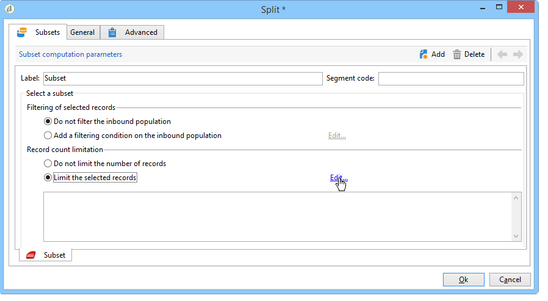
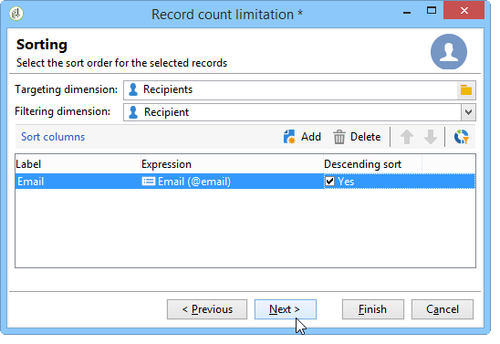
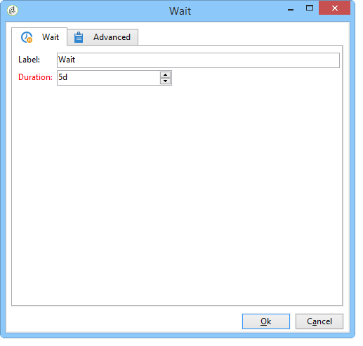

# 로컬 승인 활동 사용{#using-the-local-approval-activity}

타깃팅 워크플로우에 통합된 **[!UICONTROL Local approval]** 활동을 사용하면 게재를 보내기 전에 수신자 승인 프로세스를 설정할 수 있습니다.

>[!CAUTION]
>
>이 기능을 사용하려면 캠페인 옵션인 분산 마케팅 모듈을 구입해야 합니다. 사용권 계약을 확인하십시오.

이 사용 사례를 설정하기 위해 다음 타깃팅 워크플로우를 만들었습니다.

로컬 승인 프로세스의 주요 단계는 다음과 같습니다.

1. 데이터 배포 모델을 사용한 **[!UICONTROL Split]** 유형 활동 덕분에 타깃팅으로 인한 모집단을 제한할 수 있습니다.

   

1. 그런 다음 **[!UICONTROL Local approval]** 활동이 접수되어 각 로컬 감독자에게 알림 이메일을 보냅니다. 해당 활동은 각 지역 관리자가 자신에게 지정된 수신자를 승인할 때까지 보류됩니다.

   

1. 승인 마감일에 도달하면 워크플로우가 다시 시작됩니다. 이 예에서는 **[!UICONTROL Delivery]** 활동이 시작되고 게재가 승인된 타겟으로 전송됩니다.

   >[!NOTE]
   >
   >마감일이 정해지면 승인받지 않은 수신자는 타깃팅에서 제외됩니다.

   

1. 며칠 후 두 번째 **[!UICONTROL Local approval]** 유형 활동은 연락처의 작업(클릭, 열기 등)에 대한 요약 정보가 포함된 알림 이메일을 각 지역 감독자에게 보냅니다.

   

## 1단계:데이터 배포 템플릿 만들기 {#step-1--creating-the-data-distribution-template-}

데이터 배포 템플릿을 사용하면 각 값을 로컬 감독자에게 할당할 수 있도록 하면서 데이터 그룹을 기반으로 하는 타깃팅으로 인해 발생하는 모집단을 제한할 수 있습니다. 이 예에서는 **[!UICONTROL Email address domain]** 필드를 배포 필드로 정의하고 각 로컬 감독자에게 도메인을 할당했습니다

데이터 배포 템플릿 만들기에 대한 자세한 내용은 데이터 [배포당 하위 집합 레코드 수 제한을](../../workflow/using/split.md#limiting-the-number-of-subset-records-per-data-distribution)참조하십시오.

1. 데이터 배포 템플릿을 만들려면 **[!UICONTROL Resources > Campaign management > Data distribution]** 노드로 이동하고 을 클릭합니다 **[!UICONTROL New]**.

   

1. 탭을 **[!UICONTROL General]** 선택합니다.

   

1. 및 **[!UICONTROL Label]** 를 **[!UICONTROL Distribution context]**&#x200B;입력합니다. 이 예에서는 타깃팅 **[!UICONTROL Recipient]** 스키마와 필드를 배포 필드로 선택했습니다 **[!UICONTROL Email domain]** . 받는 사람 목록은 도메인별로 분류됩니다.
1. 필드에서 **[!UICONTROL Distribution type]** 타겟 제한 값이 **[!UICONTROL Distribution]** 탭에 표시되는 방식을 선택합니다. 자, 우리는 선택하였습니다 **[!UICONTROL Percentage]**.
1. 사용 중인 타깃팅 스키마와 일치하는 승인 저장소 스키마를 **[!UICONTROL Approval storage]** 필드에 입력합니다. 여기서는 기본 스토리지 스키마를 사용합니다. **[!UICONTROL Local approval of recipients]** Adobe
1. 그런 다음 **[!UICONTROL Advanced parameters]** 링크를 클릭합니다.

   

1. 모든 수신자가 승인할 수신자 목록에서 미리 선택되도록 **[!UICONTROL Approve the targeted messages]** 옵션을 선택된 상태로 유지합니다.
1. 기본 표현식(배달 문자열 계산)을 **[!UICONTROL Delivery label]** 필드에 남겨 두었습니다. 게재의 표준 레이블은 피드백 알림에 사용됩니다.
1. 이 **[!UICONTROL Grouping field]** 섹션에서는 승인 및 피드백 알림에 수신자를 표시하기 위해 **[!UICONTROL Gender]** 필드를 그룹화 필드로 선택했습니다.
1. 이 **[!UICONTROL Edit targeted messages]** 섹션에서 웹 **[!UICONTROL Edit recipients]** 응용 프로그램과 **[!UICONTROL recipientId]** 매개 변수를 선택했습니다. 승인 및 피드백 알림에서 수신자는 클릭할 수 있으며 웹 애플리케이션의 URL을 가리킵니다. 추가 URL 매개 변수가 **[!UICONTROL recipientId]**&#x200B;됩니다.
1. 그런 다음 **[!UICONTROL Distribution]** 탭을 클릭합니다. 각 도메인에 대해 다음 필드를 입력합니다.

   

   * **[!UICONTROL Value]**:도메인 이름의 값을 입력합니다.
   * **[!UICONTROL Percentage / Fixed]**:각 도메인에 대해 최대 값을 입력합니다. 배달을 보낼 받는 사람 수입니다. 이 예에서는 도메인당 10%로 배달을 제한하려고 합니다.
   * **[!UICONTROL Label]**:승인 및 피드백 알림에 표시할 도메인의 레이블을 입력합니다.
   * **[!UICONTROL Group or operator]**:도메인에 할당된 연산자 또는 연산자 그룹을 선택합니다.

      >[!CAUTION]
      >
      >연산자에게 적절한 권한이 할당되었는지 확인합니다.

## 2단계:타깃팅 워크플로우 만들기 {#step-2--creating-the-targeting-workflow}

이 사용 사례를 설정하기 위해 다음 타깃팅 워크플로우를 만들었습니다.

다음 활동이 추가되었습니다.

* 두 가지 **[!UICONTROL Query]** 활동,
* 하나의 **[!UICONTROL Intersection]** 활동,
* 하나의 **[!UICONTROL Split]** 활동,
* 하나의 **[!UICONTROL Local approval]** 활동,
* 하나의 **[!UICONTROL Delivery]** 활동,
* 하나의 **[!UICONTROL Wait]** 활동,
* 두번째 **[!UICONTROL Local approval]** 활동은
* 하나의 **[!UICONTROL End]** 활동

### 쿼리, 교차 및 분할 {#queries--intersection-and-split}

업스트림 타깃팅은 두 개의 쿼리, 하나의 교차 및 하나의 분할로 구성됩니다. 데이터 배포 템플릿을 사용하는 **[!UICONTROL Split]** 활동을 사용하여 타깃팅으로 인해 발생하는 모집단을 제한할 수 있습니다.

분할 활동 구성에 대한 자세한 내용은 분할을 [참조하십시오](../../workflow/using/split.md). 데이터 배포 템플릿 만들기는 데이터 배포당 하위 [집합 레코드 수](../../workflow/using/split.md#limiting-the-number-of-subset-records-per-data-distribution)제한에 자세히 설명되어 있습니다.

쿼리에서 모집단을 제한하지 않으려면 **[!UICONTROL Query]**, **[!UICONTROL Intersection]**&#x200B;및 **[!UICONTROL Split]** 활동을 사용할 필요가 없습니다. 이 경우 첫 번째 **[!UICONTROL Local approval]** 활동에서 데이터 배포 템플릿을 완료합니다.

1. 섹션에서 **[!UICONTROL Record count limitation]** 옵션을 **[!UICONTROL Limit the selected records]** 선택하고 **[!UICONTROL Edit]** 링크를 클릭합니다.

   

1. 옵션을 **[!UICONTROL Keep only the first records after sorting]** 선택하고 을 클릭합니다 **[!UICONTROL Next]**.

   

1. 섹션에서 정렬이 적용되는 필드를 **[!UICONTROL Sort columns]** 추가합니다. 여기, 우리는 그 **[!UICONTROL Email]** 분야를 선택하였습니다. 클릭 **[!UICONTROL Next]**.

   

1. 옵션을 **[!UICONTROL By data distribution]** 선택하고 이전에 만든 배포 템플릿을 선택합니다(단계 1 [을 참조하십시오.데이터 배포 템플릿](#step-1--creating-the-data-distribution-template-)만들기)를 클릭하고 **[!UICONTROL Finish]**&#x200B;클릭합니다.

   

배포 템플릿에서 그룹핑 값당 모집단을 10%로 제한하도록 선택했는데, 이는 워크플로우에 표시된 값과 일치합니다(입력으로 340개, 출력으로 34개).

### 승인 알림 {#approval-notification}

이 **[!UICONTROL Local approval]** 활동을 통해 각 로컬 감독자에게 알림을 보낼 수 있습니다.

활동 구성에 대한 자세한 내용은 **[!UICONTROL Local approval]** 로컬 승인을 [참조하십시오](../../workflow/using/local-approval.md).

다음 필드를 입력해야 합니다.

1. 섹션에서 **[!UICONTROL Action to execute]** 옵션을 선택합니다 **[!UICONTROL Target approval notification]** .
1. 섹션에서 **[!UICONTROL Distribution context]** 옵션을 선택합니다 **[!UICONTROL Specified in the transition]** .

   타깃팅된 인구를 제한하지 않으려면, 여기에서 **[!UICONTROL Explicit]** 옵션을 선택하고 이전에 **[!UICONTROL Data distribution]** 필드에 생성된 배포 템플릿을 입력합니다.

1. 섹션에서 배달 **[!UICONTROL Notification]** 템플릿과 알림 이메일에 사용할 제목을 선택합니다. 여기에서 기본 템플릿을 선택했습니다. **[!UICONTROL Local approval notification]** Adobe
1. 이 **[!UICONTROL Approval schedule]** 섹션에서는 기본 승인 기한(3일)을 유지하고 미리 알림을 추가했습니다. 배달은 승인 시작 3일 후에 떠날 것입니다. 승인 기한이 지나면, 승인받지 않은 수신자는 타깃팅으로 고려되지 않습니다.

지역 감독관에게 발송된 **[!UICONTROL Local approval]** 알림 이메일은 다음과 같습니다.

### 대기 {#wait}

대기 활동을 사용하면 배달 피드백 알림을 전송할 두 번째 로컬 승인 활동의 시작을 연기할 수 있습니다. 필드에 **[!UICONTROL Duration]** **[!UICONTROL 5d]** 값(5일)을 입력했습니다. 전달 후 5일 동안 수신자가 수행한 작업은 피드백 알림에 포함됩니다.

### 피드백 알림 {#feedback-notification}

두 번째 **[!UICONTROL Local approval]** 활동에서는 각 지역 감독자에게 전달 피드백 알림을 보낼 수 있습니다.

다음 필드를 입력해야 합니다.

1. 섹션에서 **[!UICONTROL Action to execute]** 선택합니다 **[!UICONTROL Delivery feedback report]**.
1. 섹션에서 **[!UICONTROL Delivery]** 선택합니다 **[!UICONTROL Specified in the transition]**.
1. 섹션에서 배달 **[!UICONTROL Notification]** 템플릿과 알림 이메일에 사용할 제목을 선택합니다.

대기 활동에 구성된 마감 시간이 경과하면 두 번째 **[!UICONTROL Local approval]** 유형 활동은 각 로컬 감독자에게 다음 알림 이메일을 보냅니다.

### 관리자의 승인 추적 {#approval-tracking-by-the-administrator}

로컬 승인 활동이 시작될 때마다 승인 작업이 만들어집니다. 관리자는 이러한 각 승인 작업을 제어할 수 있습니다.

캠페인의 타깃팅 워크플로우로 이동하고 **[!UICONTROL Local approval tasks]** 탭을 클릭합니다.

데이터 배포 템플릿의 **[!UICONTROL Approval tasks]** 탭을 통해 로컬 승인 작업 목록에 액세스할 수도 있습니다.

모니터링할 작업을 선택하고 **[!UICONTROL Detail]** 단추를 클릭합니다. 로컬 승인 작업의 **[!UICONTROL General]** 탭에서는 작업에 대한 정보를 볼 수 있습니다. 필요한 경우 승인 및 미리 알림 날짜를 변경할 수 있습니다.

이 탭에는 다음 정보가 표시됩니다.

* 작업 레이블 및 해당 ID
* 사용된 배포 템플릿
* 타깃팅된 메시지 수
* 연결된 워크플로우 및 캠페인
* 작업 일정

작업의 **[!UICONTROL Distribution]** 탭에서는 승인 로그, 상태, 타깃팅된 메시지 수, 승인 날짜 및 배달을 승인한 운영자를 볼 수 있습니다.

승인 로그를 선택하고 **[!UICONTROL Detail]** 단추를 클릭하여 자세한 정보를 표시합니다. 로컬 승인 로그의 **[!UICONTROL General]** 탭에서는 일반 로그 정보를 볼 수 있습니다. 승인 상태를 변경할 수도 있습니다.

이 탭에는 다음 정보가 표시됩니다.

* 연결된 승인 작업
* 승인 상태(**[!UICONTROL Approved]** 또는 **[!UICONTROL Pending]**)
* 사용된 배포 템플릿
* 승인을 받은 지역 관리자 및 승인 날짜
* 타깃팅되고 승인된 메시지 수

승인 로그의 **[!UICONTROL Targeted]** 탭에는 대상 수신자 목록과 승인 상태가 표시됩니다. 필요한 경우 이 상태를 변경할 수 있습니다.

