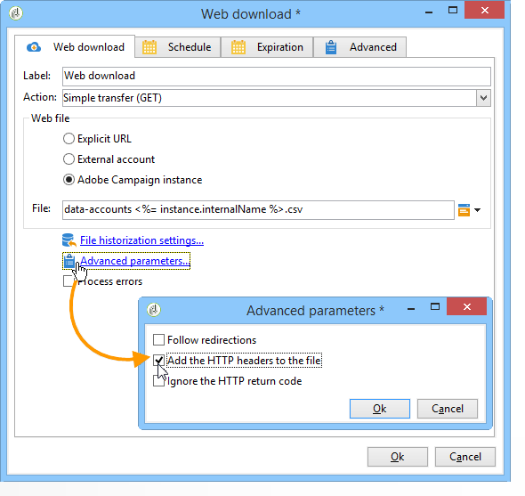

# 웹 다운로드{#web-download}

웹 **다운로드** 활동은 명시적 URL, 외부 계정 또는 Adobe Campaign 인스턴스에 대한 파일 다운로드를 시작합니다. HTTP 프로토콜이 사용됩니다. GET 또는 POST 다운로드일 수 있습니다.

## 속성 {#properties}

1. **웹 파일 선택**

   다운로드할 파일을 지정하려면 파일 URL을 입력하고 파일이 저장되어 있는 외부 HTTP 계정을 사용하거나 Adobe Campaign 인스턴스를 통해 파일을 로드할 수 있습니다. 사용 가능한 매개 변수는 아래에 자세히 설명되어 있습니다.

   * 다운로드할 파일의 URL을 직접 입력하려면 옵션을 선택하고 해당 필드에 URL을 **[!UICONTROL Explicit URL]** 지정합니다. 이 URL은 변수 데이터로 구성할 수 있습니다.

      

   * 을 사용하려면 **[!UICONTROL External account]**&#x200B;드롭다운 목록에서 계정을 선택하고 다운로드할 파일을 지정합니다.

      외부 계정은 Adobe Campaign 트리의 **[!UICONTROL Administration > Platform > External accounts]** 노드에서 구성됩니다. 계정 매개 변수는 **[!UICONTROL Edit link]** 아이콘을 통해 편집할 수 있습니다.

      

   * Adobe Campaign 인스턴스에서 파일을 다운로드하려면 **[!UICONTROL Adobe Campaign Instance]** 옵션을 선택합니다.

      

1. **파일 내역**

   이 **[!UICONTROL File historization settings...]** 링크를 사용하면 파일 저장소 디렉토리와 이 디렉토리의 제거 빈도를 지정할 수 있습니다.

   

   다음 옵션을 사용할 수 있습니다.

   * **[!UICONTROL Use a default storage directory]**: 파일은 처리 전에 항상 이동됩니다. 이 옵션을 선택하면 파일이 기본 저장소 디렉토리(Adobe Campaign 설치 폴더의 **vars** 디렉토리)로 이동합니다. 저장소 디렉토리를 지정하려면 상자의 선택을 취소하고 **[!UICONTROL Storage directory]** 필드에 경로를 입력합니다
   * **[!UICONTROL Number of files]**: 저장소 디렉토리에 보관할 최대 파일 수를 입력합니다.
   * **[!UICONTROL Maximum size (in Mb)]**: 저장소 디렉토리의 최대 용량(MB)을 입력합니다.
   각 파일은 정의된 제거 규칙을 적용하기 전에 24시간 동안 유지됩니다. 제거는 활동이 시작되기 직전에 발생하므로 진행 중인 워크플로우 파일을 고려하지 않습니다.

   파일은 해당 연령(오래된 파일 및 최신 버전)의 기능으로 삭제됩니다. 가장 오래된 파일은 두 제거 규칙이 모두 확인될 때까지 삭제됩니다. 따라서 100개 파일 제한이 정의된 경우, 이는 저장 디렉터리에는 워크플로가 시작되기 전 100개의 최신 파일과 현재 진행 중인 워크플로에서 처리되는 파일이 항상 포함됩니다.

   더 이상 **[!UICONTROL Number of files]** **[!UICONTROL Maximum size (in Mb)]** 및 옵션에 대한 제한을 설정하지 않으려면 값으로 0을 입력합니다.

1. **고급 매개 변수**

   이 **[!UICONTROL Advanced parameters...]** 링크를 사용하면 아래 표시된 추가 옵션을 지정할 수 있습니다.

   

   이 **[!UICONTROL Process errors]** 옵션은 처리 [오류에 자세히 설명되어 있습니다](../../workflow/using/monitoring-workflow-execution.md#processing-errors).

## 출력 매개 변수 {#output-parameters}

* 파일: 다운로드한 파일의 전체 이름입니다.
